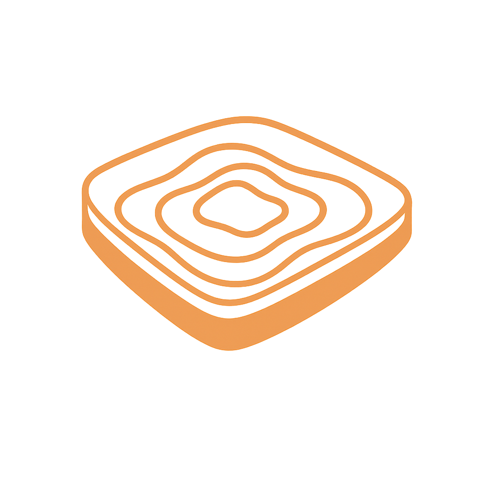

<p align="center">
  
</p>

<h1 align="center">Sandtable</h1>

<p align="center"><strong>A research and scenario simulation environment powered by local LLMs.</strong></p>

Sandtable is a fork of [VS Code](https://github.com/microsoft/vscode) rebuilt as an intelligent workspace for research, roleplay, and scenario experimentation. It connects to [Cortex](https://github.com/AulendurForge/Cortex), a self-hosted OpenAI-compatible inference gateway, giving you direct access to locally hosted LLM models -- fully offline, fully private, fully under your control.

## What Is Sandtable?

In military tradition, a **sand table** is a physical terrain model used for planning, wargaming, and rehearsal. Commanders gather around it to explore scenarios, test strategies, and prepare for what lies ahead.

Sandtable brings that concept into a digital workspace. It's an environment where researchers, analysts, and teams can:

- **Chat with AI agents** backed by powerful open-source models running on your own hardware
- **Upload and analyze documents** -- PDFs, presentations, spreadsheets, reports -- and have AI agents reason over them
- **Create specialized agent personas** -- subject matter experts, roleplaying participants, analysts, facilitators -- each with tailored system prompts and knowledge bases
- **Connect to external data sources** via the Model Context Protocol (MCP) for live database access, API integration, and tool use
- **Write, edit, and generate documents** with AI assistance in a full-featured editor
- **Run autonomous agent workflows** that can read files, execute commands, search across documents, and produce structured outputs

All of this happens locally. No data leaves your network. No cloud API calls. No vendor lock-in.

## Use Cases

### Wargaming and Defense

Sandtable's namesake use case. Design wargames, spin up AI participants and adjudicators, upload doctrine and scenario documents, connect to game databases, and run exercises with AI-powered red teams, blue teams, and analysts.

### Research and Analysis

Upload academic papers, reports, and datasets. Create agent personas that specialize in specific domains. Have agents synthesize findings, identify patterns, and generate structured research outputs.

### Scenario Planning and Tabletop Exercises

Model complex scenarios -- from business continuity planning to crisis response to policy analysis. Create agents representing different stakeholders, run through decision trees, and explore second- and third-order effects.

### Training and Education

Build interactive learning environments where AI agents play roles in simulated scenarios. Students interact with realistic personas, make decisions, and see consequences unfold.

### Creative and Narrative Work

Develop characters, worlds, and storylines with AI collaborators. Use agent personas for dialogue, world-building, and narrative testing.

## Architecture

Sandtable is built on three layers:

```
┌─────────────────────────────────────────────┐
│  Sandtable (VS Code Fork - Electron App)    │
│  ─────────────────────────────────────────── │
│  VS Code Chat Panel · Tool-Calling Agent    │
│  Model Manager · Code Completion (FIM)      │
│  Multi-Provider Model Picker · Settings     │
│  Code Mode · Background Images · Terminal   │
├─────────────────────────────────────────────┤
│  Provider Layer (Multi-Provider)            │
│  ─────────────────────────────────────────── │
│  Cortex Gateway · OpenAI-compatible APIs    │
│  Ollama · vLLM · LM Studio · Cloud APIs    │
│  Unified model routing and health checks    │
├─────────────────────────────────────────────┤
│  Inference Engines                          │
│  ─────────────────────────────────────────── │
│  vLLM (GPU-optimized) · llama.cpp (GGUF)   │
│  Local models · No cloud dependencies       │
└─────────────────────────────────────────────┘
```

- **Sandtable** is where you work -- VS Code's built-in Chat panel with tool-calling agent, model manager, code completion, and research workspace features
- **Provider Layer** routes to multiple LLM backends -- Cortex (primary, with admin capabilities) plus any OpenAI-compatible endpoint
- **Inference engines** (vLLM and llama.cpp) run the actual models on your GPUs

## Key Principles

- **Offline-first.** The entire stack runs on local infrastructure. Air-gapped and classified environments are a first-class use case.
- **No telemetry.** All Microsoft telemetry is stripped. Your data stays on your machines.
- **Open models only.** Designed for open-source and open-weight models served through Cortex. No cloud provider lock-in.
- **Core-level integration.** AI features are built into the IDE platform, not bolted on as extensions. This means lower latency, tighter UX, and capabilities that extensions cannot provide.
- **Self-hosted everything.** You own the models, the infrastructure, the data, and the tool.

## Current Status

Sandtable is in active development. See [docs/project/PROGRESS.md](docs/project/PROGRESS.md) for the latest status.

| Phase | Status | Description |
|-------|--------|-------------|
| 0 - Fork and Build | **Complete** | VS Code forked, rebranded, building from source |
| 1 - Cortex Connection + Chat | **Complete** (IDE) | Platform service, streaming chat integrated into VS Code's built-in Chat panel |
| 2 - Inline Code Completion | **Complete** (IDE) | Ghost text suggestions via Fill-in-the-Middle (awaiting Cortex FIM endpoint) |
| 3 - Model Manager | **Complete** (IDE) | GPU dashboard, model start/stop, system monitoring panel |
| 4 - Agent Mode | **Complete** (IDE) | Tool-calling agent with 22 workspace + persona + COP tools |
| 4.5 - Multi-Provider | **Complete** | Connect Cortex + OpenAI-compatible endpoints (Ollama, vLLM, cloud APIs) |
| 6 - Agent Personas | **Complete** (IDE) | 5 built-in personas, full CRUD, AI-assisted creation, status bar picker |
| UX Overhaul | **Complete** | Research-first identity, Code Mode toggle, settings reorganization |
| COP Phase 1 - Map Panel | **Complete** | MapLibre GL JS in EditorPane, offline tiles, coordinate display, drawing tools |
| COP Phase 2 - Symbology | **Complete** | MIL-STD-2525D via milsymbol, ORBAT tree, unit placement/editing |
| COP Phase 3 - Agent Tools | **Complete** | 7 COP tools for AI-driven map queries, unit placement, spatial analysis |
| COP Phase 4 - Timeline | Planned | Scenario timeline, phase playback, position interpolation |

## Getting Started

### System Requirements

| Requirement | Details |
|-------------|---------|
| **Operating System** | Linux (Arch Linux is the primary dev environment; Ubuntu/Debian should also work) |
| **Node.js** | **v22.21.1** (exact version in `.nvmrc` -- higher versions like v25 may fail on native modules) |
| **Python** | 3.x (required by node-gyp for compiling native Node.js modules) |
| **GCC / G++** | Any recent version (for native module compilation) |
| **Disk Space** | At least 10 GB free (the VS Code source tree + node_modules + compiled output is large) |
| **RAM** | 8 GB minimum, 16 GB recommended (the TypeScript compilation is memory-intensive) |

### Step 1: Install System Dependencies

**Arch Linux:**

```bash
sudo pacman -S base-devel gcc libx11 libxkbfile libsecret krb5 git python
```

**Ubuntu / Debian:**

```bash
sudo apt update
sudo apt install build-essential g++ libx11-dev libxkbfile-dev libsecret-1-dev libkrb5-dev git python3
```

### Step 2: Install Node.js v22

Sandtable requires **Node.js 22.21.1**. Use a version manager to avoid conflicts with your system Node.

**Using [mise](https://mise.jdx.dev/) (recommended):**

```bash
# Install mise if you don't have it
curl https://mise.run | sh

# mise will read .nvmrc and install the correct version
mise install
mise use node@22.21.1
```

**Using [fnm](https://github.com/Schniz/fnm):**

```bash
fnm install 22.21.1
fnm use 22.21.1
```

**Using [nvm](https://github.com/nvm-sh/nvm):**

```bash
nvm install 22.21.1
nvm use 22.21.1
```

Verify:

```bash
node --version
# Should output: v22.21.1
```

### Step 3: Clone and Build

```bash
# Clone the repository
git clone git@github.com:darkhorse-and-bandit/sandtable.git
cd sandtable

# Make sure you're on the right branch
git checkout sandtable/main

# Install npm dependencies (~5-15 minutes on first run)
npm install

# Compile the full project (~2-3 minutes)
npm run compile
```

If the compile finishes with **0 errors**, you're ready to launch.

### Step 4: Increase File Watchers (Linux Only)

VS Code's file watcher needs a higher limit than the Linux default. Without this, you'll get warnings and some features may not work:

```bash
# Check current limit
cat /proc/sys/fs/inotify/max_user_watches

# If it's less than 524288, increase it permanently:
echo "fs.inotify.max_user_watches=524288" | sudo tee -a /etc/sysctl.conf
sudo sysctl -p
```

### Step 5: Launch Sandtable

```bash
./scripts/code.sh
```

Sandtable will open as a desktop application. You should see:

- Title bar says **"Sandtable"**
- Welcome page with sacred geometry background and walkthrough steps
- Status bar at the bottom showing connection status

### Step 6: Connect an LLM Provider

Sandtable needs at least one LLM provider to power the chat and agent features. Open **Sandtable Settings** (`Ctrl+Shift+P` then type "Sandtable Settings") and navigate to the **Providers** section.

**Option A: Cortex (Primary, full-featured)**

If you're running [Cortex](https://github.com/AulendurForge/Cortex) on your local network:

1. Go to Providers and click **"+ Add Provider"**
2. Set Type to `cortex`, enter the endpoint URL (e.g., `http://192.168.1.11:8084`)
3. Enter your Cortex username and password
4. Click **"Test Connection"** to verify

**Option B: Any OpenAI-Compatible Endpoint**

Sandtable works with Ollama, vLLM, LM Studio, OpenAI, or any OpenAI-compatible API:

1. Go to Providers and click **"+ Add Provider"**
2. Set Type to `openai-compatible`
3. Enter the endpoint URL (e.g., `http://localhost:11434/v1` for Ollama, `https://api.openai.com` for OpenAI)
4. Enter an API key if required
5. Click **"Test Connection"** to verify

Once connected, models appear in the Chat panel's model picker.

### Step 7: Open the Common Operating Picture (Optional)

If you want to use the interactive military map:

1. Click the **globe icon** in the Activity Bar (left sidebar)
2. Click **"Open Map"** in the sidebar panel
3. The COP map opens as a tab with a world basemap, coordinate display, and drawing tools

You can right-click the map to place military units, or ask the AI agent to do it:

> "Place a friendly infantry battalion called Alpha at 44.366 East, 33.315 North"

## Developing

### Compile and Run

```bash
# Full compile (first time or after pulling changes)
npm run compile

# Launch (uses the compiled output in out/)
./scripts/code.sh
```

### Useful Commands

| Command | Purpose |
|---------|---------|
| `npm run compile` | Full TypeScript compilation (extensions + core + client) |
| `npm run watch` | Watch mode -- recompiles on file changes (faster iteration) |
| `./scripts/code.sh` | Launch Sandtable in development mode |
| `Ctrl+Shift+I` (inside Sandtable) | Open Chromium DevTools for debugging the renderer process |

### File Structure

Sandtable's custom code lives alongside VS Code's source:

```
src/vs/platform/cortex/           Platform services (ICortexService, providers, types)
src/vs/workbench/contrib/
  sandtableLM/                    Language model provider, chat agent, workspace tools
  sandtableCop/                   Common Operating Picture (map, symbology, ORBAT, COP tools)
  sandtableSettings/              Custom settings page
  sandtableModels/                Model manager panel
  sandtableCompletion/            Inline code completion
  sandtablePersonas/              Agent Portfolio panel
  sandtableAnimations/            Shared geometric animation module
  sandtableAppearance/            Editor background images
  sandtableCodeMode/              Research/Code mode toggle
  sandtableStatus/                Status bar indicator
docs/project/                     All project documentation, architecture, and phase plans
resources/cop-assets/             COP static assets (fonts, sprites, PMTiles basemap)
```

### Key Patterns for Contributors

- **Module loading:** npm packages in the browser layer must use `importAMDNodeModule()` from `amdX.ts`. Never use `require()` or bare `import` specifiers. UMD packages need `loadUmdModule()` (see `sandtableCopMapRenderer.ts`).
- **Trusted Types:** VS Code enforces `require-trusted-types-for 'script'`. Use DOM APIs (`createElement`, `createElementNS`) instead of `innerHTML`. If you must add a TrustedTypes policy, add it to **both** `workbench.html` and `workbench-dev.html`.
- **Local file access:** Use `vscode-file://vscode-app/` protocol, not `file://`, for loading resources in the Electron renderer.
- **CSS selectors:** Use `ThemeIcon.asCSSSelector()` not `asClassName()` for codicon icons in `$()` DOM helpers.
- **Service injection:** Follow VS Code's `createDecorator` + `registerSingleton` DI pattern. See any existing service for examples.
- **Tool registration:** Chat agent tools follow the `IToolData` + `IToolImpl` pattern in `sandtableTools.ts` (workspace tools) and `sandtableCopTools.ts` (COP tools).

For detailed architecture docs, see [docs/project/ARCHITECTURE.md](docs/project/ARCHITECTURE.md).

## Project Documentation

Detailed planning and architecture documents live in [`docs/project/`](docs/project/README.md):

| Document | Description |
|----------|-------------|
| [Project Charter](docs/project/PROJECT-CHARTER.md) | Vision, scope, goals, and constraints |
| [Architecture](docs/project/ARCHITECTURE.md) | Technical architecture, interfaces, data flows |
| [COP Architecture](docs/project/funspace/integrated_map_cop/ARCHITECTURE.md) | Common Operating Picture map system design |
| [Milestones](docs/project/MILESTONES.md) | Phase overview with deliverables and timelines |
| [Progress](docs/project/PROGRESS.md) | Living checklist -- single source of truth for status |
| [Phase Plans](docs/project/phases/) | Detailed task breakdowns for each implementation phase |

## Technology

| Layer | Technology | License |
|-------|-----------|---------|
| Editor | [VS Code](https://github.com/microsoft/vscode) (Electron + TypeScript) | MIT |
| LLM Backend | [Cortex](https://github.com/AulendurForge/Cortex) (FastAPI + PostgreSQL + Redis) | Apache 2.0 |
| Inference | [vLLM](https://github.com/vllm-project/vllm), [llama.cpp](https://github.com/ggerganov/llama.cpp) | Apache 2.0, MIT |
| Map Renderer | [MapLibre GL JS](https://github.com/maplibre/maplibre-gl-js) | BSD-3-Clause |
| Offline Tiles | [PMTiles](https://github.com/protomaps/PMTiles) + [Protomaps Basemaps](https://github.com/protomaps/basemaps) | BSD-3-Clause |
| Military Symbology | [milsymbol](https://github.com/spatialillusions/milsymbol) | MIT |
| Coordinates | [mgrs](https://www.npmjs.com/package/mgrs) | MIT |
| Protocol | [Model Context Protocol (MCP)](https://modelcontextprotocol.io/) | -- |

## License

Copyright (c) Microsoft Corporation. All rights reserved.

Licensed under the [MIT](LICENSE.txt) license.

Sandtable modifications are also MIT licensed. Cortex is licensed under Apache 2.0.
