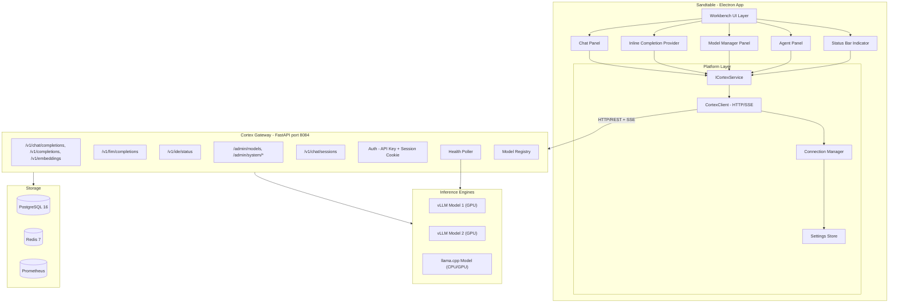
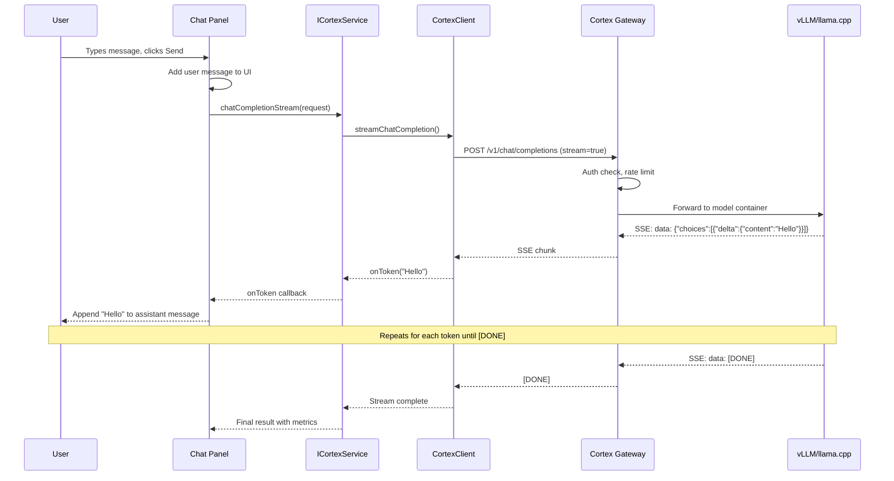
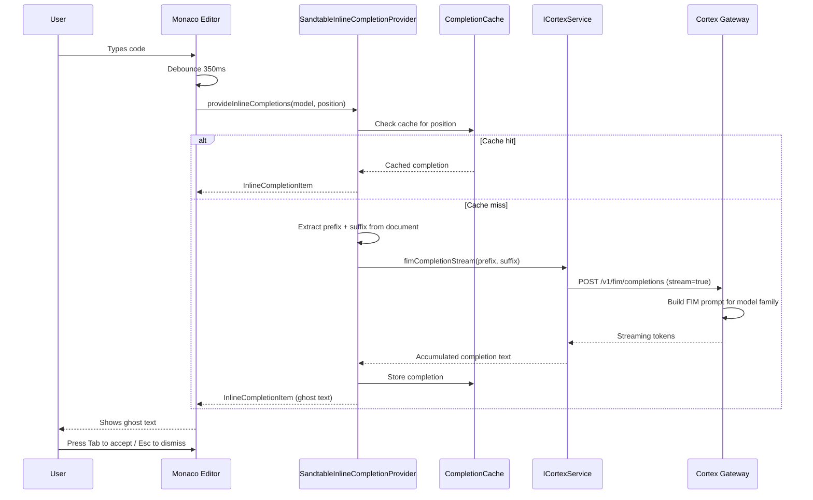
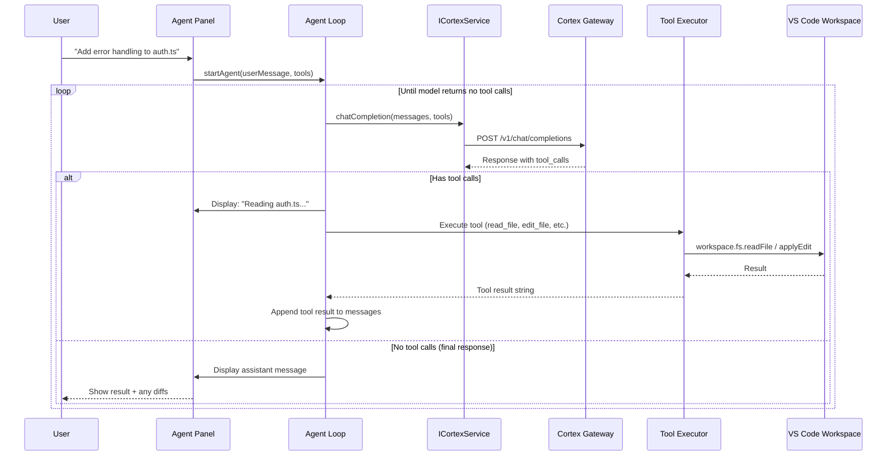

# Sandtable -- Technical Architecture

## System Architecture Overview

Sandtable is a desktop application built on Electron (via the VS Code fork) that communicates with one or more LLM providers over HTTP/REST. The primary provider is Cortex, which manages inference engines (vLLM and llama.cpp containers) and provides an OpenAI-compatible API plus admin capabilities. Additional OpenAI-compatible providers (Ollama, vLLM direct, cloud APIs) can be configured as secondary inference-only endpoints. The `IProviderRegistryService` manages all providers, while `ICortexService` serves as a backward-compatible routing facade.



## VS Code Source Code Organization

VS Code's codebase lives under `src/vs/` and is organized into layers. Each layer can only depend on layers above it (never below).

```
src/vs/
  base/          General utilities and UI building blocks (used everywhere)
  platform/      Service injection, base services (shared across workbench + code)
    cortex/      ** NEW: Our Cortex service layer **
  editor/        Monaco Editor core
  workbench/     Full IDE shell -- panels, activity bar, sidebar, status bar
    contrib/     Feature contributions (extensions, git, terminal, etc.)
      sandtableLM/         ** NEW: Cortex LM provider + chat agent + tools (integrates with VS Code's built-in chat panel) **
      sandtableCompletion/ ** NEW: Inline code completion (Phase 2) **
      sandtableModels/     ** NEW: Model manager panel (Phase 3) **
      sandtableCodeMode/   ** NEW: Code Mode toggle (research vs coding UX) **
      sandtableSettings/   ** NEW: Custom settings page **
      sandtableStatus/     ** NEW: Status bar indicator **
      sandtableAppearance/ ** NEW: Editor background images **
      sandtablePersonas/   ** NEW: Agent Portfolio panel + persona picker + AI creation tool (Phase 6) **
      sandtableAnimations/ ** NEW: Shared geometric animation module (CSS keyframes + SVG generator) **
      sandtableCop/        ** NEW: Common Operating Picture map panel **
      sandtableChat/       ** DEPRECATED: Custom chat panel (replaced by sandtableLM) **
      sandtableAgent/      ** DEPRECATED: Custom agent panel (replaced by sandtableLM) **
  code/          Electron desktop app entry point
  server/        Remote development server entry point
```

### Target Environments

Code within each layer is further organized by runtime target:

| Subdirectory | Runtime | APIs Available |
|-------------|---------|---------------|
| `common/` | All environments | Basic JavaScript APIs only |
| `browser/` | Browser/renderer | DOM APIs, Web APIs |
| `node/` | Node.js | Node.js APIs |
| `electron-browser/` | Electron renderer | Browser APIs + Electron IPC |
| `electron-main/` | Electron main process | Full Node.js + Electron APIs |

Our code uses `common/` for interfaces and types, and `browser/` for UI implementations. The `CortexClient` uses the standard `fetch` API (available in both browser and node targets).

## New Platform Service: ICortexService

The core abstraction layer between the IDE and Cortex. Registered as a platform service using VS Code's dependency injection system.

### Interface Definition

```typescript
// src/vs/platform/cortex/common/cortex.ts

import { createDecorator } from 'vs/platform/instantiation/common/instantiation';

export const ICortexService = createDecorator<ICortexService>('cortexService');

export interface ICortexService {
    readonly _serviceBrand: undefined;

    // --- Connection ---
    readonly onConnectionStatusChanged: Event<CortexConnectionStatus>;
    checkHealth(): Promise<CortexHealthResult>;
    getConnectionStatus(): CortexConnectionStatus;

    // --- Inference ---
    chatCompletion(request: ICortexChatRequest): Promise<ICortexChatResponse>;
    chatCompletionStream(
        request: ICortexChatRequest,
        onToken: (chunk: ICortexStreamChunk) => void,
        cancellation?: CancellationToken
    ): Promise<ICortexStreamResult>;

    textCompletion(request: ICortexCompletionRequest): Promise<ICortexCompletionResponse>;
    textCompletionStream(
        request: ICortexCompletionRequest,
        onToken: (text: string) => void,
        cancellation?: CancellationToken
    ): Promise<ICortexStreamResult>;

    fimCompletion(request: ICortexFimRequest): Promise<ICortexCompletionResponse>;
    fimCompletionStream(
        request: ICortexFimRequest,
        onToken: (text: string) => void,
        cancellation?: CancellationToken
    ): Promise<ICortexStreamResult>;

    // --- Model Discovery ---
    listRunningModels(): Promise<ICortexModel[]>;
    getModelConstraints(modelName: string): Promise<ICortexModelConstraints>;

    // --- IDE Status (combined endpoint) ---
    getIDEStatus(): Promise<ICortexIDEStatus>;

    // --- Admin (Model Management) ---
    listAllModels(): Promise<ICortexModelDetail[]>;
    startModel(modelId: number): Promise<void>;
    stopModel(modelId: number): Promise<void>;
    getModelLogs(modelId: number, diagnose?: boolean): Promise<string>;
    dryRunModel(modelId: number): Promise<ICortexDryRunResult>;

    // --- System Monitoring ---
    getSystemSummary(): Promise<ICortexSystemSummary>;
    getGPUMetrics(): Promise<ICortexGPUMetric[]>;
    getThroughputMetrics(): Promise<ICortexThroughput>;

    // --- Chat Sessions ---
    listChatSessions(): Promise<ICortexChatSession[]>;
    getChatSession(sessionId: string): Promise<ICortexChatSessionDetail>;
    createChatSession(request: ICortexCreateSessionRequest): Promise<ICortexChatSession>;
    addMessageToSession(sessionId: string, message: ICortexSessionMessage): Promise<void>;
    deleteChatSession(sessionId: string): Promise<void>;
}
```

### Key Types

```typescript
// src/vs/platform/cortex/common/cortex.ts (continued)

export interface ICortexChatRequest {
    model: string;
    messages: ICortexMessage[];
    temperature?: number;
    max_tokens?: number;
    stream?: boolean;
    tools?: ICortexToolDefinition[];
    stop?: string[];
}

export interface ICortexFimRequest {
    model: string;
    prefix: string;
    suffix: string;
    max_tokens?: number;
    temperature?: number;
    stop?: string[];
    stream?: boolean;
}

export interface ICortexMessage {
    role: 'system' | 'user' | 'assistant' | 'tool';
    content: string;
    tool_calls?: ICortexToolCall[];
    tool_call_id?: string;
}

export interface ICortexModel {
    served_model_name: string;
    task: string;
    engine_type: 'vllm' | 'llamacpp';
    state: 'running' | 'stopped' | 'starting' | 'loading' | 'failed';
}

export interface ICortexModelConstraints {
    served_model_name: string;
    engine_type: string;
    task: string;
    context_size: number | null;
    max_model_len: number;
    max_tokens_default: number;
    supports_streaming: boolean;
    supports_system_prompt: boolean;
    supports_tool_calling?: boolean;
}

export interface ICortexStreamChunk {
    content: string;
    finish_reason: string | null;
    metrics?: {
        tokens_per_second?: number;
        ttft_ms?: number;
    };
}

export interface ICortexGPUMetric {
    index: number;
    name: string;
    mem_total_mb: number;
    mem_used_mb: number;
    compute_capability: string;
    architecture: string;
    flash_attention_supported: boolean;
    utilization_pct?: number;
    temperature_c?: number;
}

export interface ICortexIDEStatus {
    running_models: ICortexModel[];
    system: {
        cpu_pct: number;
        ram_pct: number;
        disk_pct: number;
    };
    gpus: ICortexGPUMetric[];
    gateway_healthy: boolean;
}

export type CortexConnectionStatus = 'connected' | 'disconnected' | 'connecting';

export interface CortexHealthResult {
    healthy: boolean;
    modelCount: number;
    latencyMs: number;
}

export interface ICortexToolDefinition {
    type: 'function';
    function: {
        name: string;
        description: string;
        parameters: Record<string, unknown>;
    };
}

export interface ICortexToolCall {
    id: string;
    type: 'function';
    function: {
        name: string;
        arguments: string;
    };
}
```

### Service Registration Pattern

VS Code uses a decorator-based dependency injection system. The service is registered in the workbench's service collection:

```typescript
// Registration in workbench startup
import { ICortexService } from 'vs/platform/cortex/common/cortex';
import { CortexService } from 'vs/platform/cortex/browser/cortexService';

registerSingleton(ICortexService, CortexService, InstantiationType.Delayed);
```

Any workbench contribution can then inject it:

```typescript
class SandtableChatViewPane extends ViewPane {
    constructor(
        @ICortexService private readonly cortexService: ICortexService,
        // ... other injected services
    ) {
        super(/* ... */);
    }
}
```

## Multi-Provider Architecture (Phase 4.5)

### Provider Layer

Below `ICortexService`, a provider abstraction layer handles the details of communicating with different LLM backends:

- **`ILLMProvider`** -- Base interface for all providers. Covers health checking, model listing, and chat inference. Every provider (Cortex and external) implements this.
- **`ICortexLLMProvider`** -- Extended interface for Cortex-specific capabilities: admin APIs, GPU monitoring, model lifecycle, FIM completion, chat sessions.
- **`IProviderRegistryService`** -- Manages the provider collection, reads configuration, handles per-provider health polling, and provides unified model listing.

### Provider Types

| Type | Interface | Capabilities | Examples |
|------|-----------|-------------|----------|
| `cortex` | `ICortexLLMProvider` | Inference + Admin + Monitoring + FIM + Sessions | Cortex gateway |
| `openai-compatible` | `ILLMProvider` | Inference only (chat completions + model listing) | Ollama, vLLM, LM Studio, DeepSeek API, Together AI |

### Model Identity

Models are identified by compound names: `"providerId::modelName"`. The `::` separator distinguishes the provider prefix from the model name. Bare model names (without `::`) are resolved against the default provider for backward compatibility.

### Routing

`ICortexService` acts as a routing facade:
1. Receives an inference request with a model name
2. Parses the model name to extract provider ID (or uses default)
3. Looks up the provider via `IProviderRegistryService`
4. Delegates the inference call to the correct provider
5. Returns the result to the consumer

Admin and monitoring methods are always delegated to the Cortex provider specifically.

### Parameter Compatibility

Different LLM models reject parameters that others require (e.g., GPT-5 rejects `temperature` and `max_tokens`, requiring `max_completion_tokens` instead). Sandtable handles this with a two-layer system:

**Layer 1 -- Automatic Detection:** `OpenAICompatibleClient.normalizeChatBody()` auto-detects known reasoning model patterns (`gpt-5*`, `o1*`, `o3*`) and strips unsupported sampling parameters. `max_tokens` is renamed to `max_completion_tokens` for all external providers. No configuration needed.

**Layer 2 -- Admin Overrides:** Each provider can have a `modelOverrides` map in its config, keyed by model name or glob pattern. Each curated model can also have its own overrides (`dropParameters`, `renameParameters`, `forceParameters`, `extraParameters`). Both levels support:
- `dropParams` / `dropParameters` -- parameters to remove from the request
- `renameParams` / `renameParameters` -- parameters to rename
- `forceParams` / `forceParameters` -- parameters to force to specific values
- `extraParams` / `extraParameters` -- additional parameters to inject if not already present

Override chain: consumer defaults -> curated model overrides -> provider auto-detection -> provider-level admin overrides (admin always wins).

### Model Testing

The Models settings section includes a "Test Model" button on each curated model's configuration panel. When clicked, it sends a minimal `chatCompletion()` request ("Say hello in one sentence") through the full routing and normalization pipeline. The result is displayed inline:
- **Success:** Shows the model's response text, token usage stats (green box)
- **Failure:** Shows the exact API error message, including parameter incompatibility details (red box)

This creates a fast configure-test-fix loop: the admin can see which parameter is rejected, adjust overrides, save, and re-test without leaving the settings page.

### Provider Connectivity

Providers are included in model queries optimistically: enabled providers that haven't completed their first health check are included alongside connected providers. This prevents a timing gap at startup where the chat panel shows "No models available" while health polls are still in flight. After the first health check completes, only connected providers are included.

## CortexClient Implementation

The HTTP client that talks to Cortex's gateway. Uses the standard `fetch` API with `ReadableStream` for SSE parsing -- no external dependencies.

### SSE Streaming Pattern

```typescript
// src/vs/platform/cortex/common/cortexClient.ts (key method)

async streamChatCompletion(
    endpoint: string,
    apiKey: string,
    request: ICortexChatRequest,
    onToken: (chunk: ICortexStreamChunk) => void,
    abortSignal?: AbortSignal
): Promise<ICortexStreamResult> {
    const response = await fetch(`${endpoint}/v1/chat/completions`, {
        method: 'POST',
        headers: {
            'Content-Type': 'application/json',
            'Authorization': `Bearer ${apiKey}`,
        },
        body: JSON.stringify({ ...request, stream: true }),
        signal: abortSignal,
    });

    if (!response.ok) {
        throw new Error(`Cortex returned ${response.status}: ${await response.text()}`);
    }

    const reader = response.body!.getReader();
    const decoder = new TextDecoder();
    let buffer = '';
    let totalTokens = 0;

    while (true) {
        const { done, value } = await reader.read();
        if (done) break;

        buffer += decoder.decode(value, { stream: true });
        const lines = buffer.split('\n');
        buffer = lines.pop() || '';

        for (const line of lines) {
            if (line.startsWith('data: ')) {
                const data = line.slice(6).trim();
                if (data === '[DONE]') continue;

                const parsed = JSON.parse(data);
                const delta = parsed.choices?.[0]?.delta;
                if (delta?.content) {
                    totalTokens++;
                    onToken({
                        content: delta.content,
                        finish_reason: parsed.choices[0].finish_reason,
                    });
                }
            }
        }
    }

    return { totalTokens };
}
```

## Data Flow Diagrams

### Chat Flow



### Inline Completion Flow



### Agent Loop Flow



## Cortex API Contract

Every endpoint the IDE calls, organized by feature.

### Inference Endpoints (API Key Authentication)

| Method | Endpoint | Used By | Purpose |
|--------|----------|---------|---------|
| POST | `/v1/chat/completions` | Chat, Agent | Chat-style inference with streaming |
| POST | `/v1/completions` | Completion (fallback) | Text completion |
| POST | `/v1/fim/completions` | Completion | **NEW** -- Fill-in-the-middle for code completion |
| POST | `/v1/embeddings` | Future (RAG) | Vector embeddings |

### Model Discovery (API Key Authentication)

| Method | Endpoint | Used By | Purpose |
|--------|----------|---------|---------|
| GET | `/v1/models/running` | Chat, Completion, Agent | List healthy running models |
| GET | `/v1/models/{name}/constraints` | Chat, Completion | Context limits, max tokens, capabilities |

### IDE-Specific Endpoints (API Key Authentication)

| Method | Endpoint | Used By | Purpose |
|--------|----------|---------|---------|
| GET | `/v1/ide/status` | **NEW** -- Status Bar, Model Manager | Combined status (models + system + GPUs) |

### Admin Endpoints (Session Cookie Authentication)

| Method | Endpoint | Used By | Purpose |
|--------|----------|---------|---------|
| GET | `/admin/models` | Model Manager | List all models with full details |
| POST | `/admin/models/{id}/start` | Model Manager | Start a model container |
| POST | `/admin/models/{id}/stop` | Model Manager | Stop a model container |
| POST | `/admin/models/{id}/dry-run` | Model Manager | Validate config + VRAM estimation |
| GET | `/admin/models/{id}/logs` | Model Manager | Container logs with optional diagnostics |
| GET | `/admin/system/summary` | Model Manager | CPU/mem/disk overview |
| GET | `/admin/system/gpus` | Model Manager | Per-GPU metrics |
| GET | `/admin/system/throughput` | Model Manager | Tokens/sec, RPS, latency |
| GET | `/admin/models/metrics` | Model Manager | Per-model inference metrics |

### Chat Session Endpoints (Session Cookie Authentication)

| Method | Endpoint | Used By | Purpose |
|--------|----------|---------|---------|
| GET | `/v1/chat/sessions` | Chat | List user's sessions |
| POST | `/v1/chat/sessions` | Chat | Create new session |
| GET | `/v1/chat/sessions/{id}` | Chat | Get session with messages |
| POST | `/v1/chat/sessions/{id}/messages` | Chat | Add message to session |
| DELETE | `/v1/chat/sessions/{id}` | Chat | Delete session |

## Authentication Model

### Cortex Provider

Cortex uses **session cookie authentication** for all endpoints (model discovery, inference, admin, system monitoring). The `CortexLLMProvider` calls `CortexClient.login(username, password)` to obtain a `cortex_session` cookie before making any API requests. The session cookie takes priority over the API key Bearer token when both are available. Auth priority in `CortexClient._setAuthHeaders()`: session cookie > Bearer API key > none.

### External Providers (OpenAI-Compatible)

External OpenAI-compatible providers use standard **Bearer token authentication** via the `Authorization: Bearer <key>` header. The API key is configured per-provider in the `sandtable.providers` settings array.

### Content Security Policy

The Electron workbench HTML (`workbench.html`, `workbench-dev.html`) includes a CSP `connect-src` directive that allows `'self'`, `https:`, `http:`, and `ws:` protocols. The `http:` allowance is required for connecting to local network servers (Cortex, Ollama, etc.) that don't use HTTPS.

**Trusted Types:** Both HTML files include `require-trusted-types-for 'script'` and a `trusted-types` allowlist. This means `innerHTML` cannot be used with raw strings -- it requires a registered TrustedTypes policy, or better yet, use DOM APIs (`createElement`, `createElementNS`, `appendChild`). When adding a new policy name, it **must** be added to **both** `workbench.html` (production) **and** `workbench-dev.html` (development). Forgetting `workbench-dev.html` will cause runtime crashes when using `./scripts/code.sh` while production builds work fine. See `docs/project/funspace/geometric_animations/GEOMETRIC-ANIMATIONS.md` for detailed guidance.

## Settings Schema

All new settings registered under the `sandtable` namespace:

```typescript
// src/vs/platform/cortex/common/cortexConfiguration.ts

// Connection
'sandtable.cortex.endpoint'               // type: string,  default: 'http://localhost:8084'
'sandtable.cortex.apiKey'                  // type: string,  default: ''
'sandtable.cortex.username'                // type: string,  default: 'admin'
'sandtable.cortex.password'                // type: string,  default: '' (for session auth)
'sandtable.cortex.healthCheckIntervalMs'   // type: number,  default: 15000

// Chat
'sandtable.chat.defaultModel'             // type: string,  default: '' (auto-detect)
'sandtable.chat.streamingEnabled'         // type: boolean, default: true
'sandtable.chat.systemPrompt'             // type: string,  default: 'You are a helpful coding assistant.'
'sandtable.chat.maxTokens'                // type: number,  default: 2048
'sandtable.chat.temperature'              // type: number,  default: 0.7

// Inline Completion
'sandtable.completion.enabled'            // type: boolean, default: true
'sandtable.completion.model'              // type: string,  default: '' (auto-detect)
'sandtable.completion.debounceMs'         // type: number,  default: 350
'sandtable.completion.maxTokens'          // type: number,  default: 128
'sandtable.completion.temperature'        // type: number,  default: 0.2
'sandtable.completion.contextLines'       // type: number,  default: 50 (lines of prefix/suffix)

// Agent
'sandtable.agent.enabled'                 // type: boolean, default: true
'sandtable.agent.model'                   // type: string,  default: '' (auto-detect)
'sandtable.agent.confirmDestructive'      // type: boolean, default: true
'sandtable.agent.maxIterations'           // type: number,  default: 25
'sandtable.agent.maxTokens'              // type: number,  default: 4096

// Model Manager
'sandtable.models.showInActivityBar'      // type: boolean, default: true
'sandtable.models.gpuPollIntervalMs'      // type: number,  default: 5000
'sandtable.models.curated'               // type: array,   default: [] (curated model list with per-model overrides)

// Appearance
'sandtable.appearance.backgroundImage'    // type: string,  default: '' (bundled: or file path)
'sandtable.appearance.backgroundOpacity'  // type: number,  default: 0.08
'sandtable.appearance.backgroundOverlayColor' // type: string, default: '' (auto from theme)
'sandtable.appearance.backgroundBlur'     // type: number,  default: 0
'sandtable.appearance.backgroundSize'     // type: string,  default: 'cover'
'sandtable.appearance.backgroundPosition' // type: string,  default: 'center'

// Providers (Phase 4.5)
'sandtable.providers'                    // type: array,   default: [] (auto-created from legacy settings)
'sandtable.defaultProvider'              // type: string,  default: '' (first enabled provider)
// Each provider entry: { id, displayName, type, endpoint, apiKey, enabled, priority,
//   username?, password?, modelOverrides?: { "pattern*": { dropParams, renameParams, forceParams, extraParams } } }
// Each curated model entry: { qualifiedName, displayName?, enabled, overrides?:
//   { dropParameters?, renameParameters?, forceParameters?, extraParameters? } }

// Personas (Phase 6)
'sandtable.personas'                     // type: array,   default: [] (built-in templates loaded when empty)
'sandtable.activePersona'                // type: string,  default: '' (no persona active)

// Each curated model entry also supports (added for token tracking):
//   contextWindowTokens?: number  -- actual serving context window in tokens
//   maxOutputTokens?: number      -- max output tokens for this model
```

## New File Structure Map

Every new file created in `src/vs/`, organized by phase:

### Phase 1 Files

```
src/vs/platform/cortex/
  common/
    cortex.ts                         # ICortexService interface + all types
    cortexClient.ts                   # HTTP client with fetch + SSE streaming
    cortexConfiguration.ts            # Settings schema registration

  browser/
    cortexService.ts                  # Browser-side service implementation

src/vs/workbench/contrib/sandtableChat/
  browser/
    sandtableChat.contribution.ts          # Registers view container, panel, commands
    sandtableChatViewPane.ts               # Main chat view pane (extends ViewPane)
    sandtableChatInput.ts                  # Message input widget with send button
    sandtableChatMessageList.ts            # Scrollable message list with markdown
    sandtableChatModelSelector.ts          # Model dropdown (queries running models)
    sandtableChat.css                      # Chat panel styling

src/vs/workbench/contrib/sandtableStatus/
  browser/
    sandtableStatus.contribution.ts        # Status bar item registration
    sandtableStatusBarItem.ts              # Connection status indicator

src/vs/workbench/contrib/sandtableSettings/
  browser/
    sandtableSettings.contribution.ts      # EditorPane + EditorInput + menu entry + resolver
    sandtableSettingsPage.ts               # Custom settings page (EditorPane, DOM-based UI)
    sandtableSettingsInput.ts              # Singleton EditorInput with sandtable:// URI
    sandtableSettings.css                  # Two-column settings layout styling
```

### Phase 2 Files

```
src/vs/workbench/contrib/sandtableCompletion/
  browser/
    sandtableCompletion.contribution.ts    # Registers InlineCompletionItemProvider
    sandtableInlineCompletionProvider.ts   # Core provider implementation
    sandtableFimPromptBuilder.ts           # Prefix/suffix extraction from editor
    sandtableCompletionCache.ts            # LRU cache for recent completions
```

### Phase 3 Files

```
src/vs/workbench/contrib/sandtableModels/
  browser/
    sandtableModels.contribution.ts        # Registers model manager panel
    sandtableModelsPanel.ts                # Main panel with tabs/sections
    sandtableModelsList.ts                 # Model list with state indicators
    sandtableGpuDashboard.ts              # GPU cards with utilization bars
    sandtableModelLogs.ts                  # Log viewer for selected model
    sandtableSystemSummary.ts              # CPU/RAM/disk overview
    sandtableModels.css                    # Styling
```

### Appearance Files (Bonus)

```
src/vs/workbench/contrib/sandtableAppearance/
  browser/
    sandtableAppearance.contribution.ts    # Editor background image/watermark overlay
    media/backgrounds/                     # Bundled SVG background images
```

### Phase 4 Files

```
src/vs/workbench/contrib/sandtableAgent/
  browser/
    sandtableAgent.contribution.ts         # Registers agent panel and commands
    sandtableAgentPanel.ts                 # Agent conversation UI + tool executors
    sandtableAgentDiffView.ts              # Inline diff display for proposed changes
    sandtableAgent.css                     # Agent panel styling

  common/
    sandtableAgentLoop.ts                  # Core agent loop (message -> tool -> repeat)
    sandtableAgentTools.ts                 # Tool definitions and executors
    sandtableAgentSafety.ts                # Confirmation logic for destructive ops
    sandtableAgentContext.ts               # Token budget and context management
```

### Phase 4.5 Files

```
src/vs/platform/cortex/
  common/
    cortexProviderTypes.ts             # Provider config types, IUnifiedModel, IModelCapabilities
    llmProvider.ts                     # ILLMProvider base interface
    cortexLLMProvider.ts               # ICortexLLMProvider extended interface (Cortex-specific)
    providerRegistry.ts                # IProviderRegistryService interface + DI decorator
    openAICompatibleClient.ts          # HTTP client for OpenAI-compatible endpoints (+ stream_options usage capture)
    modelResolver.ts                   # Compound model ID parsing and resolution
    knownModelContextWindows.ts        # Known model context window reference table (60+ model families)

  browser/
    providerRegistryService.ts         # ProviderRegistryService implementation
    cortexLLMProviderImpl.ts           # CortexLLMProvider wrapping existing CortexClient
    openAICompatibleProviderImpl.ts    # OpenAICompatibleProvider implementation

src/vs/workbench/contrib/sandtableSettings/
  browser/
    sandtableProviderEditor.ts         # Provider add/edit dialog
```

### Phase 6 Files

```
src/vs/platform/cortex/
  common/
    personaTypes.ts                    # ICuratedPersona interface, BUILTIN_PERSONAS, generatePersonaId()
    cortexConfiguration.ts             # + PersonaConfigKeys enum, sandtable.personas + sandtable.activePersona settings

src/vs/workbench/contrib/sandtablePersonas/
  browser/
    sandtablePersonas.contribution.ts  # ViewContainer (Activity Bar), status bar, quick-pick, chat input picker
    sandtablePersonasPanel.ts          # Agent Portfolio panel (ViewPane with full CRUD)
    sandtablePersonas.css              # Panel styles

src/vs/workbench/contrib/sandtableSettings/
  browser/
    sandtableSettingsPage.ts           # + _renderToolsSection() (auto-discovery, categorized tool cards)
    sandtableSettings.css              # + Tool card, badge, parameter table, and category styles

src/vs/workbench/contrib/sandtableLM/
  browser/
    sandtableChatAgent.ts              # + resolveActivePersona(), persona system prompt/model/params integration
    sandtableTools.ts                  # 15 tools: 6 workspace + 9 persona CRUD/import/export/duplicate
```

### Visual Animations & Branding Files

```
src/vs/workbench/contrib/sandtableAnimations/
  browser/
    sandtableAnimations.css              # @keyframes (rotate-cw/ccw, drift, sweep, pulse), composition positioning
    sandtableAnimations.ts               # createGeometricBackground(), createCenteredComposition(), utilities
    sandtableAnimations.contribution.ts  # Global CSS import

src/vs/workbench/contrib/welcomeGettingStarted/browser/media/
    sandtableLogo.png                    # Sandtable logo for welcome page header
    sandtableDesertFloor.png             # Night desert panorama for welcome/walkthrough backgrounds

src/vs/workbench/browser/parts/editor/media/
    sandtableLogo.png                    # Greyscale logo for "no files open" watermark
    sandtableDesertFloor.png             # Desert panorama for watermark background
```

**Critical notes for future developers:**

1. **Never use `innerHTML`** for SVG -- use `document.createElementNS()`. VS Code's CSP blocks raw HTML assignment.
2. **Always wrap animation injection in try-catch** -- decorative failures in constructors like `EditorGroupWatermark` will crash the entire workbench.
3. **Elements injected into `.editor-group-container` must include `:not(.empty)` hiding rules** -- otherwise they appear behind open files. See `editorgroupview.css`.
4. **Chat tool call selectors must target `.chat-thinking-box` containers** (not `.value > .chat-tool-invocation-part`). Tool invocations are nested inside the thinking box in VS Code 1.109+.
5. **SVG `<g>` transform-origin defaults to 0,0** -- set explicit pixel coordinates for centered rotation.

See `docs/project/funspace/geometric_animations/GEOMETRIC-ANIMATIONS.md` for complete guidance.

### Code Mode Architecture

The Code Mode toggle (`sandtable.codeMode.enabled`, default: `false`) controls the visibility of all coding-centric UI elements. The implementation uses two complementary patterns:

**Declarative gating** via the `sandtable.codeModeEnabled` context key in `when` clauses:
- Menu bar items (Go, Terminal menus)
- Menu items (Go to Symbol, Go to Bracket, Open in Terminal)
- View registrations (Outline panel, Timeline panel)
- Editor watermark entries (Start Debugging, Toggle Terminal)

**Imperative gating** via `configurationService.getValue(CodeModeConfigKeys.Enabled)`:
- Status bar items (Copilot, OVR, Remote Window indicator)
- Chat panel text (welcome titles, placeholders, suggested prompts)
- Editor hints (empty editor, inline chat placeholders)
- Command center (help entry filtering, label overrides, research-specific entries)

**Files involved in Code Mode gating (beyond the core `sandtableCodeMode.contribution.ts`):**

| Area | Files |
|------|-------|
| Chat panel text | `chatWidget.ts`, `chatInputEditorContrib.ts`, `agentTitleBarStatusWidget.ts` |
| Status bar | `chatStatusEntry.ts`, `editorStatus.ts`, `remoteIndicator.ts` |
| Editor hints | `emptyTextEditorHint.ts`, `inlineChatOverlayWidget.ts`, `inlineChatController.ts` |
| Panels/views | `outline.contribution.ts`, `timeline.contribution.ts`, `paneCompositeBar.ts` |
| Menus | `menubarControl.ts`, `gotoSymbolQuickAccess.ts`, `searchActionsSymbol.ts`, `bracketMatching.ts` |
| Command center | `anythingQuickAccess.ts` |
| Context menus | `externalTerminal.contribution.ts` |
| Editor watermark | `editorGroupWatermark.ts` |
| File defaults | `fileCommands.ts` |

### Registration Entry Points

All contributions are registered by importing them in `src/vs/workbench/workbench.common.main.ts`:

```typescript
// Sandtable -- Platform services + LM integration + contributions
import '../platform/cortex/browser/cortexService.js';
import '../platform/cortex/browser/providerRegistryService.js';   // Phase 4.5
import './contrib/sandtableCodeMode/browser/sandtableCodeMode.contribution.js';
import './contrib/sandtableLM/browser/sandtableLM.contribution.js';       // Cortex language model provider
import './contrib/sandtableLM/browser/sandtableChatAgent.js';             // Default chat agent
import './contrib/sandtableLM/browser/sandtableTools.js';                 // Workspace tools
import './contrib/sandtableStatus/browser/sandtableStatus.contribution.js';
import './contrib/sandtableSettings/browser/sandtableSettings.contribution.js';
import './contrib/sandtableCompletion/browser/sandtableCompletion.contribution.js';
import './contrib/sandtableModels/browser/sandtableModels.contribution.js';
import './contrib/sandtableAppearance/browser/sandtableAppearance.contribution.js';
import './contrib/sandtablePersonas/browser/sandtablePersonas.contribution.js';   // Phase 6: Agent Portfolio + persona picker + AI creation tool
// COP -- Common Operating Picture (Map Panel)
import './contrib/sandtableCop/browser/sandtableCopService.js';                    // ISandtableCopService singleton
import './contrib/sandtableCop/browser/sandtableCop.contribution.js';              // EditorPane, Activity Bar, commands
// DEPRECATED (replaced by sandtableLM integration with VS Code's built-in chat panel):
// import './contrib/sandtableChat/browser/sandtableChat.contribution.js';
// import './contrib/sandtableAgent/browser/sandtableAgent.contribution.js';
```

The `cortexService.js` import triggers the `registerSingleton()` call that registers `ICortexService` with the DI system. The `sandtableLM` imports register Cortex as a language model provider with VS Code's `ILanguageModelsService`, register the Sandtable default chat agent via `IChatAgentService`, and register 15 workspace tools via `ILanguageModelToolsService`. This integrates Cortex models into VS Code's built-in Chat panel (right-side Auxiliary Bar) rather than using custom sidebar panels. The `sandtableCop` imports register the Common Operating Picture map panel with `ISandtableCopService` for map state management and the EditorPane with MapLibre GL JS for rendering.

### Loading npm Packages in the Browser Layer

VS Code's browser layer (`browser/` subdirectories) runs as ESM in the Electron renderer. npm packages cannot be loaded via `require()` (not available in ESM) or static `import` (bare specifiers don't resolve). The correct pattern is `importAMDNodeModule()` from `src/vs/amdX.ts`, which loads scripts via `<script>` tags with an AMD `define()` shim.

**Critical Electron caveat:** UMD modules detect Electron's Node.js globals (`module`, `exports`) and take the CJS path instead of AMD, causing `importAMDNodeModule` to return `undefined`. The workaround is to temporarily nullify these globals before loading -- see `loadUmdModule()` in `sandtableCopMapRenderer.ts`.

**IIFE modules** (like `pmtiles`, `@protomaps/basemaps`) don't call `define()` at all. After `importAMDNodeModule` loads the script, access the module via `(globalThis as any).packageName`.

**Local file access:** Use `vscode-file://vscode-app/` protocol (not `file://`) for loading resources from the local filesystem in the Electron renderer.
