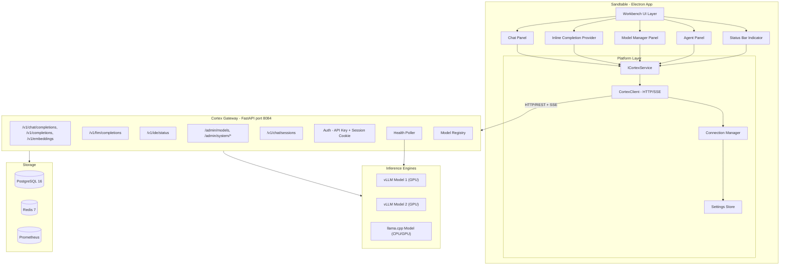
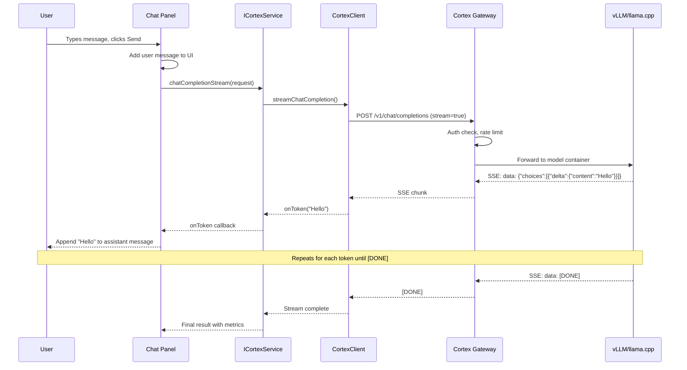
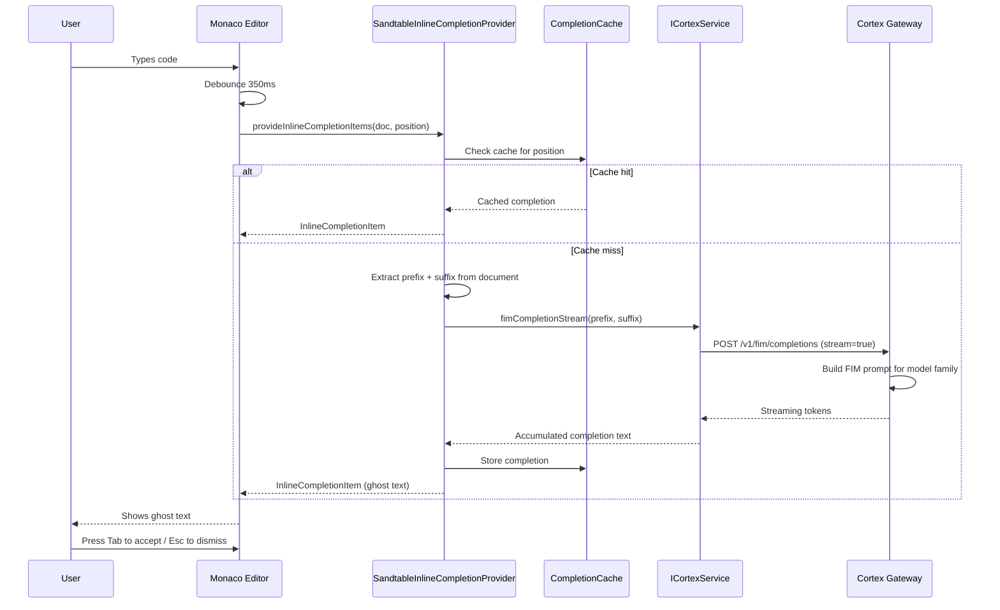
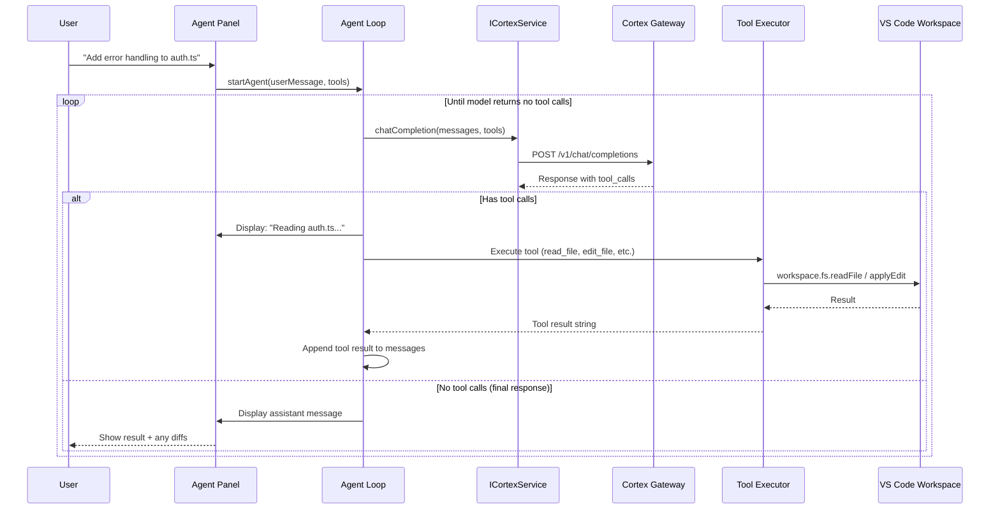

# Sandtable -- Technical Architecture

## System Architecture Overview

Sandtable is a desktop application built on Electron (via the VS Code fork) that communicates with Cortex over HTTP/REST on the local network. Cortex manages the LLM inference engines (vLLM and llama.cpp containers) and provides an OpenAI-compatible API.



## VS Code Source Code Organization

VS Code's codebase lives under `src/vs/` and is organized into layers. Each layer can only depend on layers above it (never below).

```
src/vs/
  base/          General utilities and UI building blocks (used everywhere)
  platform/      Service injection, base services (shared across workbench + code)
    cortex/      ** NEW: Our Cortex service layer **
  editor/        Monaco Editor core
  workbench/     Full IDE shell -- panels, activity bar, sidebar, status bar
    contrib/     Feature contributions (extensions, git, terminal, etc.)
      sandtableChat/       ** NEW: Chat panel **
      sandtableCompletion/ ** NEW: Inline code completion **
      sandtableModels/     ** NEW: Model manager panel **
      sandtableAgent/      ** NEW: Agent mode **
      sandtableStatus/     ** NEW: Status bar indicator **
  code/          Electron desktop app entry point
  server/        Remote development server entry point
```

### Target Environments

Code within each layer is further organized by runtime target:

| Subdirectory | Runtime | APIs Available |
|-------------|---------|---------------|
| `common/` | All environments | Basic JavaScript APIs only |
| `browser/` | Browser/renderer | DOM APIs, Web APIs |
| `node/` | Node.js | Node.js APIs |
| `electron-browser/` | Electron renderer | Browser APIs + Electron IPC |
| `electron-main/` | Electron main process | Full Node.js + Electron APIs |

Our code uses `common/` for interfaces and types, and `browser/` for UI implementations. The `CortexClient` uses the standard `fetch` API (available in both browser and node targets).

## New Platform Service: ICortexService

The core abstraction layer between the IDE and Cortex. Registered as a platform service using VS Code's dependency injection system.

### Interface Definition

```typescript
// src/vs/platform/cortex/common/cortex.ts

import { createDecorator } from 'vs/platform/instantiation/common/instantiation';

export const ICortexService = createDecorator<ICortexService>('cortexService');

export interface ICortexService {
    readonly _serviceBrand: undefined;

    // --- Connection ---
    readonly onConnectionStatusChanged: Event<CortexConnectionStatus>;
    checkHealth(): Promise<CortexHealthResult>;
    getConnectionStatus(): CortexConnectionStatus;

    // --- Inference ---
    chatCompletion(request: ICortexChatRequest): Promise<ICortexChatResponse>;
    chatCompletionStream(
        request: ICortexChatRequest,
        onToken: (chunk: ICortexStreamChunk) => void,
        cancellation?: CancellationToken
    ): Promise<ICortexStreamResult>;

    textCompletion(request: ICortexCompletionRequest): Promise<ICortexCompletionResponse>;
    textCompletionStream(
        request: ICortexCompletionRequest,
        onToken: (text: string) => void,
        cancellation?: CancellationToken
    ): Promise<ICortexStreamResult>;

    fimCompletion(request: ICortexFimRequest): Promise<ICortexCompletionResponse>;
    fimCompletionStream(
        request: ICortexFimRequest,
        onToken: (text: string) => void,
        cancellation?: CancellationToken
    ): Promise<ICortexStreamResult>;

    // --- Model Discovery ---
    listRunningModels(): Promise<ICortexModel[]>;
    getModelConstraints(modelName: string): Promise<ICortexModelConstraints>;

    // --- IDE Status (combined endpoint) ---
    getIDEStatus(): Promise<ICortexIDEStatus>;

    // --- Admin (Model Management) ---
    listAllModels(): Promise<ICortexModelDetail[]>;
    startModel(modelId: number): Promise<void>;
    stopModel(modelId: number): Promise<void>;
    getModelLogs(modelId: number, diagnose?: boolean): Promise<string>;
    dryRunModel(modelId: number): Promise<ICortexDryRunResult>;

    // --- System Monitoring ---
    getSystemSummary(): Promise<ICortexSystemSummary>;
    getGPUMetrics(): Promise<ICortexGPUMetric[]>;
    getThroughputMetrics(): Promise<ICortexThroughput>;

    // --- Chat Sessions ---
    listChatSessions(): Promise<ICortexChatSession[]>;
    getChatSession(sessionId: string): Promise<ICortexChatSessionDetail>;
    createChatSession(request: ICortexCreateSessionRequest): Promise<ICortexChatSession>;
    addMessageToSession(sessionId: string, message: ICortexSessionMessage): Promise<void>;
    deleteChatSession(sessionId: string): Promise<void>;
}
```

### Key Types

```typescript
// src/vs/platform/cortex/common/cortex.ts (continued)

export interface ICortexChatRequest {
    model: string;
    messages: ICortexMessage[];
    temperature?: number;
    max_tokens?: number;
    stream?: boolean;
    tools?: ICortexToolDefinition[];
    stop?: string[];
}

export interface ICortexFimRequest {
    model: string;
    prefix: string;
    suffix: string;
    max_tokens?: number;
    temperature?: number;
    stop?: string[];
    stream?: boolean;
}

export interface ICortexMessage {
    role: 'system' | 'user' | 'assistant' | 'tool';
    content: string;
    tool_calls?: ICortexToolCall[];
    tool_call_id?: string;
}

export interface ICortexModel {
    served_model_name: string;
    task: string;
    engine_type: 'vllm' | 'llamacpp';
    state: 'running' | 'stopped' | 'starting' | 'loading' | 'failed';
}

export interface ICortexModelConstraints {
    served_model_name: string;
    engine_type: string;
    task: string;
    context_size: number | null;
    max_model_len: number;
    max_tokens_default: number;
    supports_streaming: boolean;
    supports_system_prompt: boolean;
    supports_tool_calling?: boolean;
}

export interface ICortexStreamChunk {
    content: string;
    finish_reason: string | null;
    metrics?: {
        tokens_per_second?: number;
        ttft_ms?: number;
    };
}

export interface ICortexGPUMetric {
    index: number;
    name: string;
    mem_total_mb: number;
    mem_used_mb: number;
    compute_capability: string;
    architecture: string;
    flash_attention_supported: boolean;
    utilization_pct?: number;
    temperature_c?: number;
}

export interface ICortexIDEStatus {
    running_models: ICortexModel[];
    system: {
        cpu_pct: number;
        ram_pct: number;
        disk_pct: number;
    };
    gpus: ICortexGPUMetric[];
    gateway_healthy: boolean;
}

export type CortexConnectionStatus = 'connected' | 'disconnected' | 'connecting';

export interface CortexHealthResult {
    healthy: boolean;
    modelCount: number;
    latencyMs: number;
}

export interface ICortexToolDefinition {
    type: 'function';
    function: {
        name: string;
        description: string;
        parameters: Record<string, unknown>;
    };
}

export interface ICortexToolCall {
    id: string;
    type: 'function';
    function: {
        name: string;
        arguments: string;
    };
}
```

### Service Registration Pattern

VS Code uses a decorator-based dependency injection system. The service is registered in the workbench's service collection:

```typescript
// Registration in workbench startup
import { ICortexService } from 'vs/platform/cortex/common/cortex';
import { CortexService } from 'vs/platform/cortex/browser/cortexService';

registerSingleton(ICortexService, CortexService, InstantiationType.Delayed);
```

Any workbench contribution can then inject it:

```typescript
class SandtableChatViewPane extends ViewPane {
    constructor(
        @ICortexService private readonly cortexService: ICortexService,
        // ... other injected services
    ) {
        super(/* ... */);
    }
}
```

## CortexClient Implementation

The HTTP client that talks to Cortex's gateway. Uses the standard `fetch` API with `ReadableStream` for SSE parsing -- no external dependencies.

### SSE Streaming Pattern

```typescript
// src/vs/platform/cortex/common/cortexClient.ts (key method)

async streamChatCompletion(
    endpoint: string,
    apiKey: string,
    request: ICortexChatRequest,
    onToken: (chunk: ICortexStreamChunk) => void,
    abortSignal?: AbortSignal
): Promise<ICortexStreamResult> {
    const response = await fetch(`${endpoint}/v1/chat/completions`, {
        method: 'POST',
        headers: {
            'Content-Type': 'application/json',
            'Authorization': `Bearer ${apiKey}`,
        },
        body: JSON.stringify({ ...request, stream: true }),
        signal: abortSignal,
    });

    if (!response.ok) {
        throw new Error(`Cortex returned ${response.status}: ${await response.text()}`);
    }

    const reader = response.body!.getReader();
    const decoder = new TextDecoder();
    let buffer = '';
    let totalTokens = 0;

    while (true) {
        const { done, value } = await reader.read();
        if (done) break;

        buffer += decoder.decode(value, { stream: true });
        const lines = buffer.split('\n');
        buffer = lines.pop() || '';

        for (const line of lines) {
            if (line.startsWith('data: ')) {
                const data = line.slice(6).trim();
                if (data === '[DONE]') continue;

                const parsed = JSON.parse(data);
                const delta = parsed.choices?.[0]?.delta;
                if (delta?.content) {
                    totalTokens++;
                    onToken({
                        content: delta.content,
                        finish_reason: parsed.choices[0].finish_reason,
                    });
                }
            }
        }
    }

    return { totalTokens };
}
```

## Data Flow Diagrams

### Chat Flow



### Inline Completion Flow



### Agent Loop Flow



## Cortex API Contract

Every endpoint the IDE calls, organized by feature.

### Inference Endpoints (API Key Authentication)

| Method | Endpoint | Used By | Purpose |
|--------|----------|---------|---------|
| POST | `/v1/chat/completions` | Chat, Agent | Chat-style inference with streaming |
| POST | `/v1/completions` | Completion (fallback) | Text completion |
| POST | `/v1/fim/completions` | Completion | **NEW** -- Fill-in-the-middle for code completion |
| POST | `/v1/embeddings` | Future (RAG) | Vector embeddings |

### Model Discovery (API Key Authentication)

| Method | Endpoint | Used By | Purpose |
|--------|----------|---------|---------|
| GET | `/v1/models/running` | Chat, Completion, Agent | List healthy running models |
| GET | `/v1/models/{name}/constraints` | Chat, Completion | Context limits, max tokens, capabilities |

### IDE-Specific Endpoints (API Key Authentication)

| Method | Endpoint | Used By | Purpose |
|--------|----------|---------|---------|
| GET | `/v1/ide/status` | **NEW** -- Status Bar, Model Manager | Combined status (models + system + GPUs) |

### Admin Endpoints (Session Cookie Authentication)

| Method | Endpoint | Used By | Purpose |
|--------|----------|---------|---------|
| GET | `/admin/models` | Model Manager | List all models with full details |
| POST | `/admin/models/{id}/start` | Model Manager | Start a model container |
| POST | `/admin/models/{id}/stop` | Model Manager | Stop a model container |
| POST | `/admin/models/{id}/dry-run` | Model Manager | Validate config + VRAM estimation |
| GET | `/admin/models/{id}/logs` | Model Manager | Container logs with optional diagnostics |
| GET | `/admin/system/summary` | Model Manager | CPU/mem/disk overview |
| GET | `/admin/system/gpus` | Model Manager | Per-GPU metrics |
| GET | `/admin/system/throughput` | Model Manager | Tokens/sec, RPS, latency |
| GET | `/admin/models/metrics` | Model Manager | Per-model inference metrics |

### Chat Session Endpoints (Session Cookie Authentication)

| Method | Endpoint | Used By | Purpose |
|--------|----------|---------|---------|
| GET | `/v1/chat/sessions` | Chat | List user's sessions |
| POST | `/v1/chat/sessions` | Chat | Create new session |
| GET | `/v1/chat/sessions/{id}` | Chat | Get session with messages |
| POST | `/v1/chat/sessions/{id}/messages` | Chat | Add message to session |
| DELETE | `/v1/chat/sessions/{id}` | Chat | Delete session |

## Authentication Model

The IDE uses two authentication mechanisms to match Cortex's existing auth model:

1. **API Key** -- For inference endpoints (`/v1/*`). Stored in VS Code settings (`sandtable.cortex.apiKey`). Sent as `Authorization: Bearer <key>` header.

2. **Session Cookie** -- For admin endpoints (`/admin/*`) and chat session endpoints. The IDE performs a login request to get a `cortex_session` cookie, then includes it in subsequent admin requests.

The `ConnectionManager` handles:
- Storing credentials (API key in settings, session cookie in memory)
- Automatic session refresh when cookie expires
- Health check polling (every 15 seconds)
- Connection state management (`connected` / `disconnected` / `connecting`)
- Event emission when connection status changes

## Settings Schema

All new settings registered under the `sandtable` namespace:

```typescript
// src/vs/platform/cortex/common/cortexConfiguration.ts

// Connection
'sandtable.cortex.endpoint'               // type: string,  default: 'http://localhost:8084'
'sandtable.cortex.apiKey'                  // type: string,  default: ''
'sandtable.cortex.username'                // type: string,  default: 'admin'
'sandtable.cortex.password'                // type: string,  default: '' (for session auth)
'sandtable.cortex.healthCheckIntervalMs'   // type: number,  default: 15000

// Chat
'sandtable.chat.defaultModel'             // type: string,  default: '' (auto-detect)
'sandtable.chat.streamingEnabled'         // type: boolean, default: true
'sandtable.chat.systemPrompt'             // type: string,  default: 'You are a helpful coding assistant.'
'sandtable.chat.maxTokens'                // type: number,  default: 2048
'sandtable.chat.temperature'              // type: number,  default: 0.7

// Inline Completion
'sandtable.completion.enabled'            // type: boolean, default: true
'sandtable.completion.model'              // type: string,  default: '' (auto-detect)
'sandtable.completion.debounceMs'         // type: number,  default: 350
'sandtable.completion.maxTokens'          // type: number,  default: 128
'sandtable.completion.temperature'        // type: number,  default: 0.2
'sandtable.completion.contextLines'       // type: number,  default: 50 (lines of prefix/suffix)

// Agent
'sandtable.agent.enabled'                 // type: boolean, default: true
'sandtable.agent.model'                   // type: string,  default: '' (auto-detect)
'sandtable.agent.confirmDestructive'      // type: boolean, default: true
'sandtable.agent.maxIterations'           // type: number,  default: 25
'sandtable.agent.maxTokens'              // type: number,  default: 4096

// Model Manager
'sandtable.models.showInActivityBar'      // type: boolean, default: true
'sandtable.models.gpuPollIntervalMs'      // type: number,  default: 5000
```

## New File Structure Map

Every new file created in `src/vs/`, organized by phase:

### Phase 1 Files

```
src/vs/platform/cortex/
  common/
    cortex.ts                         # ICortexService interface + all types
    cortexClient.ts                   # HTTP client with fetch + SSE streaming
    cortexConfiguration.ts            # Settings schema registration

  browser/
    cortexService.ts                  # Browser-side service implementation

src/vs/workbench/contrib/sandtableChat/
  browser/
    sandtableChat.contribution.ts          # Registers view container, panel, commands
    sandtableChatViewPane.ts               # Main chat view pane (extends ViewPane)
    sandtableChatInput.ts                  # Message input widget with send button
    sandtableChatMessageList.ts            # Scrollable message list with markdown
    sandtableChatModelSelector.ts          # Model dropdown (queries running models)
    sandtableChat.css                      # Chat panel styling

src/vs/workbench/contrib/sandtableStatus/
  browser/
    sandtableStatus.contribution.ts        # Status bar item registration
    sandtableStatusBarItem.ts              # Connection status indicator
```

### Phase 2 Files

```
src/vs/workbench/contrib/sandtableCompletion/
  browser/
    sandtableCompletion.contribution.ts    # Registers InlineCompletionItemProvider
    mageInlineCompletionProvider.ts   # Core provider implementation
    mageFimPromptBuilder.ts           # Prefix/suffix extraction from editor
    sandtableCompletionCache.ts            # LRU cache for recent completions
```

### Phase 3 Files

```
src/vs/workbench/contrib/sandtableModels/
  browser/
    sandtableModels.contribution.ts        # Registers model manager panel
    sandtableModelsPanel.ts                # Main panel with tabs/sections
    sandtableModelsList.ts                 # Model list with state indicators
    sandtableGpuDashboard.ts              # GPU cards with utilization bars
    sandtableModelLogs.ts                  # Log viewer for selected model
    sandtableSystemSummary.ts              # CPU/RAM/disk overview
    sandtableModels.css                    # Styling
```

### Phase 4 Files

```
src/vs/workbench/contrib/sandtableAgent/
  browser/
    sandtableAgent.contribution.ts         # Registers agent panel and commands
    sandtableAgentPanel.ts                 # Agent conversation UI
    sandtableAgentDiffView.ts              # Inline diff display for proposed changes

  common/
    sandtableAgentLoop.ts                  # Core agent loop (message -> tool -> repeat)
    sandtableAgentTools.ts                 # Tool definitions and executors
    sandtableAgentSafety.ts                # Confirmation logic for destructive ops
    sandtableAgentContext.ts               # Token budget and context management
```

### Registration Entry Points

All contributions are registered by importing them in `src/vs/workbench/workbench.common.main.ts`:

```typescript
// Sandtable contributions
import './contrib/sandtableChat/browser/sandtableChat.contribution';
import './contrib/sandtableStatus/browser/sandtableStatus.contribution';
import './contrib/sandtableCompletion/browser/sandtableCompletion.contribution';
import './contrib/sandtableModels/browser/sandtableModels.contribution';
import './contrib/sandtableAgent/browser/sandtableAgent.contribution';
```

The platform service is registered in the workbench's service initialization.
