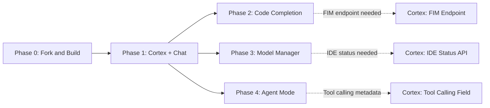

# Sandtable -- Milestones

## Phase Overview

| Phase | Name | Duration | Days | Key Deliverable | Cortex Changes | Risk |
|-------|------|----------|------|----------------|----------------|------|
| 0 | Fork and Build | 1-3 days | 1-3 | Sandtable builds and launches from source | None | Low |
| 1 | Cortex Connection + Chat | 10-14 days | 4-17 | Streaming chat with GPT-OSS models | CORS for Electron | Low |
| 2 | Inline Code Completion | 10-14 days | 18-31 | Ghost text suggestions while typing | FIM endpoint | Medium |
| 3 | Model Manager Panel | 10-14 days | 32-45 | GPU dashboard, start/stop models | IDE status endpoint | Low |
| 4 | Agent Mode | 14-21 days | 46-66 | Autonomous file editing and terminal execution | Tool calling metadata | Medium |

**Total estimated duration:** 45-66 working days (~10-14 weeks)

## Dependency Chain

Note: Phases 2, 3, and 4 all depend on Phase 1 (the platform service layer) but are independent of each other. They could theoretically be developed in parallel by different team members. The recommended serial order prioritizes the most impactful features first.

## Detailed Milestones

### Phase 0: Fork and Build

**Duration:** 1-3 days
**Dependencies:** None
**Cortex changes:** None

| Milestone | Definition of Done |
|-----------|-------------------|
| Build prerequisites installed | `node --version` shows v20+, `gcc --version` works, all system libs present |
| VS Code source cloned | `git log --oneline -1` shows latest VS Code commit in Sandtable workspace |
| `product.json` rebranded | All Sandtable fields updated (nameShort, applicationName, dataFolderName, etc.) |
| First successful build | `npm install` and `npm run watch` complete without errors |
| Sandtable launches | `./scripts/code.sh` opens the application with "Sandtable" in title bar |
| Standard features verified | File editing, terminal, git, extensions panel all functional |

**Risk assessment:** LOW -- well-documented process, multiple reference implementations (VSCodium build scripts).

---

### Phase 1: Cortex Connection + Chat

**Duration:** 10-14 days
**Dependencies:** Phase 0 complete
**Cortex changes:** CORS configuration for Electron origin (`file://` or app protocol)

| Milestone | Definition of Done |
|-----------|-------------------|
| `ICortexService` interface defined | All types and interface methods in `src/vs/platform/cortex/common/cortex.ts` |
| `CortexClient` HTTP client working | Can make requests to Cortex gateway and parse SSE streaming responses |
| Settings schema registered | `sandtable.cortex.*` settings appear in VS Code Settings UI |
| Connection status polling | Status bar item shows connected/disconnected with model count |
| Chat panel renders | Chat panel appears in Activity Bar sidebar, opens on click |
| Model selector works | Dropdown populated from `GET /v1/models/running` |
| Streaming chat works | Full streaming conversation with GPT-OSS 120B via Cortex |
| Markdown rendering | Assistant responses render with syntax-highlighted code blocks |
| Chat sessions persist | Sessions stored server-side in Cortex, survive IDE restart |

**Risk assessment:** LOW -- Cortex's OpenAI-compatible API is mature, SSE streaming is well-understood.

---

### Phase 2: Inline Code Completion

**Duration:** 10-14 days
**Dependencies:** Phase 1 complete (needs `ICortexService`)
**Cortex changes:** `POST /v1/fim/completions` endpoint with per-model FIM templating

| Milestone | Definition of Done |
|-----------|-------------------|
| Cortex FIM endpoint deployed | `POST /v1/fim/completions` returns completions with model-specific FIM templates |
| FIM prompt builder working | Correctly extracts prefix/suffix from editor context |
| `InlineCompletionItemProvider` registered | Provider triggers on typing pause |
| Ghost text appears | Completion suggestions shown as dimmed inline text |
| Tab/Escape handling | Tab accepts, Escape dismisses, typing continues to refine |
| Debounce and cancellation | Previous request cancelled when new keystroke arrives |
| Completion caching | Moving cursor within a cached completion reuses it |
| TTFT under 200ms | Measured on localhost connection to Cortex |
| Multiple languages tested | Verified with Python, TypeScript, and shell scripts |

**Risk assessment:** MEDIUM -- FIM support depends on model capabilities. Codestral and DeepSeek Coder have native FIM support. GPT-OSS Harmony models may need testing to confirm FIM works well via llama.cpp's `/infill` endpoint.

---

### Phase 3: Model Manager Panel

**Duration:** 10-14 days
**Dependencies:** Phase 1 complete (needs `ICortexService`)
**Cortex changes:** `GET /v1/ide/status` combined endpoint

| Milestone | Definition of Done |
|-----------|-------------------|
| Cortex IDE status endpoint deployed | Single endpoint returns models + system + GPU data |
| Model Manager panel opens | Accessible from Activity Bar with dedicated icon |
| Models list with state | All models shown with running/stopped/failed indicators |
| Start/stop buttons work | Can start and stop models from within the IDE |
| GPU dashboard renders | Per-GPU cards showing VRAM usage, utilization, temperature |
| System summary shows | CPU, RAM, disk usage overview |
| Model logs viewer | Select a model to see its container logs |
| Auto-refresh working | GPU metrics refresh every 5 seconds, model state refreshes on change |

**Risk assessment:** LOW -- All underlying Cortex admin API endpoints already exist. This is primarily UI work.

---

### Phase 4: Agent Mode

**Duration:** 14-21 days
**Dependencies:** Phase 1 complete (needs `ICortexService`)
**Cortex changes:** `supports_tool_calling` field on model constraints

| Milestone | Definition of Done |
|-----------|-------------------|
| Tool definitions complete | read_file, edit_file, create_file, run_command, search_files, list_directory |
| Agent loop implemented | Correctly handles message -> tool_call -> execute -> repeat cycle |
| File reading works | Agent can read files from the workspace |
| File editing works | Agent can propose and apply edits (with diff view) |
| Terminal execution works | Agent can run commands and see output |
| Safety confirmations | Destructive actions (edit, delete, terminal) require user approval |
| Diff view for changes | Proposed edits shown as inline diffs before applying |
| Max iteration guard | Agent stops after configurable max iterations (default: 25) |
| Agent tested with GPT-OSS | Verified that GPT-OSS models handle tool calling correctly |
| Fallback for non-tool models | Graceful behavior when model doesn't support tool calling |

**Risk assessment:** MEDIUM -- Tool calling quality depends heavily on the model. GPT-OSS 120B (Harmony architecture) may not have been trained for tool calling. DeepSeek V3 and Qwen3-Coder are more reliable for this. Plan for model-specific testing and possible prompt engineering for tool use.

## Post-MVP Roadmap (Future Phases)

Phases 5+ extend Sandtable from a developer tool into a full research and scenario simulation platform. These phases are where the wargaming, research, and roleplay capabilities come to life. They build on the foundation of Phases 1-4 (Cortex connectivity, chat, agent mode).

### Phase 5: Document Ingestion and Knowledge Base

| Milestone | Description |
|-----------|-------------|
| Document upload panel | Drag-and-drop or file picker for PDF, PPTX, XLSX, DOCX, and plain text files |
| Document parsing pipeline | Extract text content from uploaded documents using server-side parsers via Cortex |
| RAG / embedding indexing | Index document content as vector embeddings via Cortex's `/v1/embeddings` for semantic search |
| Context-aware chat | Chat agents can reference and cite uploaded documents when answering questions |
| Document viewer | In-editor preview for uploaded documents with AI-annotated highlights |

### Phase 6: Agent Personas and Roleplay System

| Milestone | Description |
|-----------|-------------|
| Persona configuration schema | Define agent personas with name, role, system prompt, knowledge sources, and behavioral parameters |
| Persona manager panel | Create, edit, save, and organize agent persona configurations |
| Persona-bound chat sessions | Start chat sessions with a specific persona active (system prompt, temperature, model selection) |
| Persona templates | Pre-built templates for common roles: researcher, analyst, red team, blue team, facilitator, subject matter expert |
| Multi-agent conversations | Multiple personas interacting in a single session -- useful for wargaming exercises and structured debates |
| Persona sharing | Export/import persona configurations as JSON files for team collaboration |

### Phase 7: MCP Integration and External Data

| Milestone | Description |
|-----------|-------------|
| MCP client implementation | Model Context Protocol client for connecting to external tool servers |
| Database connectors | Connect agents to wargame databases, research repositories, and structured data sources via MCP |
| Live data access | Agents can query external systems in real-time during conversations and analysis |
| Custom tool registration | Users can register custom MCP tool servers for domain-specific integrations |

### Phase 8: Workspace Templates and Structured Workflows

| Milestone | Description |
|-----------|-------------|
| Workspace templates | Pre-configured project layouts for common use cases: wargame exercise, research analysis, scenario planning |
| Structured output generation | Agents produce formatted deliverables: after-action reports, research summaries, decision matrices |
| Multi-file agent workflows | Agent can work across multiple documents, cross-reference sources, and maintain coherent analysis |
| Session recording and playback | Record scenario sessions for review, training, and after-action analysis |

### Phase 9: Collaboration and Distribution

| Milestone | Description |
|-----------|-------------|
| Multi-user sessions | Multiple users sharing a Cortex instance with isolated or collaborative chat sessions |
| Role-based access | Different permissions for participants, facilitators, observers, and administrators |
| Custom branding and packaging | Proper installer, custom icons, splash screen, about dialog |
| Cross-platform builds | macOS and Windows support alongside Linux |

### Example Use Cases by Phase

| Use Case | Required Phases |
|----------|----------------|
| Chat with AI about code or documents | Phase 1 |
| AI-assisted code completion while writing scripts | Phase 2 |
| Monitor and manage running models from within the workspace | Phase 3 |
| Have an AI agent edit files and run commands autonomously | Phase 4 |
| Upload a PDF doctrine document and ask questions about it | Phase 5 |
| Create a "Red Team Commander" persona with specific doctrine knowledge | Phase 5 + 6 |
| Run a tabletop exercise with multiple AI personas debating a scenario | Phase 6 |
| Connect an agent to a wargame database to pull live game state | Phase 7 |
| Generate a structured after-action report from a completed exercise | Phase 8 |
| Run a multi-user wargame with AI adjudicators and human participants | Phase 9 |
