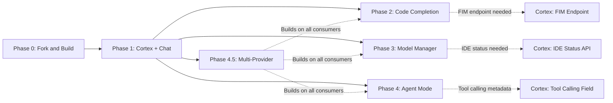

# Sandtable -- Milestones

## Phase Overview

| Phase | Name | Duration | Days | Key Deliverable | Cortex Changes | Risk |
|-------|------|----------|------|----------------|----------------|------|
| 0 | Fork and Build | 1-3 days | 1-3 | Sandtable builds and launches from source | None | Low |
| 1 | Cortex Connection + Chat | 10-14 days | 4-17 | Streaming chat with GPT-OSS models | CORS for Electron | Low |
| 2 | Inline Code Completion | 10-14 days | 18-31 | Ghost text suggestions while typing | FIM endpoint | Medium |
| 3 | Model Manager Panel | 10-14 days | 32-45 | GPU dashboard, start/stop models | IDE status endpoint | Low |
| 4 | Agent Mode | 14-21 days | 46-66 | Autonomous file editing and terminal execution | Tool calling metadata | Medium |
| 4.5 | Multi-Provider LLM System | 14-21 days | 64-84 | Multi-provider routing, unified model list, provider management UI | None (Cortex already exposes OpenAI-compatible API) | Low |

**Total estimated duration:** 45-84 working days (~10-17 weeks)

## Dependency Chain

Note: Phases 2, 3, and 4 all depend on Phase 1 (the platform service layer) but are independent of each other. Phase 4.5 depends on Phase 1 and benefits from having Phases 2-4 complete (so all consumers can be updated together), but does not require the Cortex-side changes from Phases 2-4. It is recommended to implement Phase 4.5 after the IDE-side work of Phases 2-4 is complete to minimize rework.

## Detailed Milestones

### Phase 0: Fork and Build

**Duration:** 1-3 days
**Dependencies:** None
**Cortex changes:** None

| Milestone | Definition of Done |
|-----------|-------------------|
| Build prerequisites installed | `node --version` shows v20+, `gcc --version` works, all system libs present |
| VS Code source cloned | `git log --oneline -1` shows latest VS Code commit in Sandtable workspace |
| `product.json` rebranded | All Sandtable fields updated (nameShort, applicationName, dataFolderName, etc.) |
| First successful build | `npm install` and `npm run watch` complete without errors |
| Sandtable launches | `./scripts/code.sh` opens the application with "Sandtable" in title bar |
| Standard features verified | File editing, terminal, git, extensions panel all functional |

**Risk assessment:** LOW -- well-documented process, multiple reference implementations (VSCodium build scripts).

---

### Phase 1: Cortex Connection + Chat

**Duration:** 10-14 days
**Dependencies:** Phase 0 complete
**Cortex changes:** CORS configuration for Electron origin (`file://` or app protocol)

| Milestone | Definition of Done |
|-----------|-------------------|
| `ICortexService` interface defined | All types and interface methods in `src/vs/platform/cortex/common/cortex.ts` |
| `CortexClient` HTTP client working | Can make requests to Cortex gateway and parse SSE streaming responses |
| Settings schema registered | `sandtable.cortex.*` settings appear in VS Code Settings UI |
| Connection status polling | Status bar item shows connected/disconnected with model count |
| Chat panel renders | Chat panel appears in Activity Bar sidebar, opens on click |
| Model selector works | Dropdown populated from `GET /v1/models/running` |
| Streaming chat works | Full streaming conversation with GPT-OSS 120B via Cortex |
| Markdown rendering | Assistant responses render with syntax-highlighted code blocks |
| Chat sessions persist | Sessions stored server-side in Cortex, survive IDE restart |

**Risk assessment:** LOW -- Cortex's OpenAI-compatible API is mature, SSE streaming is well-understood.

---

### Phase 2: Inline Code Completion

**Duration:** 10-14 days
**Dependencies:** Phase 1 complete (needs `ICortexService`)
**Cortex changes:** `POST /v1/fim/completions` endpoint with per-model FIM templating

| Milestone | Definition of Done |
|-----------|-------------------|
| Cortex FIM endpoint deployed | `POST /v1/fim/completions` returns completions with model-specific FIM templates |
| FIM prompt builder working | Correctly extracts prefix/suffix from editor context |
| `InlineCompletionItemProvider` registered | Provider triggers on typing pause |
| Ghost text appears | Completion suggestions shown as dimmed inline text |
| Tab/Escape handling | Tab accepts, Escape dismisses, typing continues to refine |
| Debounce and cancellation | Previous request cancelled when new keystroke arrives |
| Completion caching | Moving cursor within a cached completion reuses it |
| TTFT under 200ms | Measured on localhost connection to Cortex |
| Multiple languages tested | Verified with Python, TypeScript, and shell scripts |

**Risk assessment:** MEDIUM -- FIM support depends on model capabilities. Codestral and DeepSeek Coder have native FIM support. GPT-OSS Harmony models may need testing to confirm FIM works well via llama.cpp's `/infill` endpoint.

---

### Phase 3: Model Manager Panel

**Duration:** 10-14 days
**Dependencies:** Phase 1 complete (needs `ICortexService`)
**Cortex changes:** `GET /v1/ide/status` combined endpoint

| Milestone | Definition of Done |
|-----------|-------------------|
| Cortex IDE status endpoint deployed | Single endpoint returns models + system + GPU data |
| Model Manager panel opens | Accessible from Activity Bar with dedicated icon |
| Models list with state | All models shown with running/stopped/failed indicators |
| Start/stop buttons work | Can start and stop models from within the IDE |
| GPU dashboard renders | Per-GPU cards showing VRAM usage, utilization, temperature |
| System summary shows | CPU, RAM, disk usage overview |
| Model logs viewer | Select a model to see its container logs |
| Auto-refresh working | GPU metrics refresh every 5 seconds, model state refreshes on change |

**Risk assessment:** LOW -- All underlying Cortex admin API endpoints already exist. This is primarily UI work.

---

### Phase 4: Agent Mode

**Duration:** 14-21 days
**Dependencies:** Phase 1 complete (needs `ICortexService`)
**Cortex changes:** `supports_tool_calling` field on model constraints

| Milestone | Definition of Done |
|-----------|-------------------|
| Tool definitions complete | read_file, edit_file, create_file, run_command, search_files, list_directory |
| Agent loop implemented | Correctly handles message -> tool_call -> execute -> repeat cycle |
| File reading works | Agent can read files from the workspace |
| File editing works | Agent can propose and apply edits (with diff view) |
| Terminal execution works | Agent can run commands and see output |
| Safety confirmations | Destructive actions (edit, delete, terminal) require user approval |
| Diff view for changes | Proposed edits shown as inline diffs before applying |
| Max iteration guard | Agent stops after configurable max iterations (default: 25) |
| Agent tested with GPT-OSS | Verified that GPT-OSS models handle tool calling correctly |
| Fallback for non-tool models | Graceful behavior when model doesn't support tool calling |

**Risk assessment:** MEDIUM -- Tool calling quality depends heavily on the model. GPT-OSS 120B (Harmony architecture) may not have been trained for tool calling. DeepSeek V3 and Qwen3-Coder are more reliable for this. Plan for model-specific testing and possible prompt engineering for tool use.

### Phase 4.5: Multi-Provider LLM Connection System

**Duration:** 14-21 days
**Dependencies:** Phase 1 complete (needs `ICortexService`), Phases 2-4 IDE-side complete (recommended)
**Cortex changes:** None

| Milestone | Definition of Done |
|-----------|-------------------|
| `ILLMProvider` interface defined | Base provider interface with health, model listing, and inference methods |
| `OpenAICompatibleProvider` working | Can connect to Ollama and list its models |
| `CortexLLMProvider` working | Wraps existing CortexClient, implements both base and admin interfaces |
| `IProviderRegistryService` working | Manages multiple providers, aggregates models, independent health checking |
| `CortexService` routes correctly | Inference requests dispatched to correct provider based on model identity |
| Model selectors show grouped models | Chat, completion, and agent model selectors show provider-grouped dropdowns |
| Status bar shows aggregate info | "N providers, M models" with per-provider health awareness |
| Settings page has Providers section | Add/edit/remove providers with test-connection and model discovery |
| Model Manager shows external models | Read-only section for external provider models alongside Cortex admin controls |
| Backward compatibility verified | Single Cortex provider works identically to pre-4.5 behavior |
| Legacy settings migration works | `sandtable.cortex.*` settings auto-create default Cortex provider |
| Parameter compatibility system | Automatic reasoning model detection + per-model admin overrides for drop/rename/force/inject params |
| CSP and auth fixes verified | `http://` allowed in connect-src, Cortex session auth works for all endpoints |
| Test Model button working | Admin can test a curated model with one click; shows response or detailed API error inline |
| Curated model overrides applied | Parameter overrides from `sandtable.models.curated` are plumbed through to `normalizeChatBody()` during inference |
| Provider connectivity timing fixed | Providers optimistically included in model queries before first health check completes |
| `npm run compile` passes | Zero TypeScript compilation errors |

**Risk assessment:** LOW -- The facade pattern ensures all existing consumers work unchanged. The OpenAI chat completions API is a well-established standard, and most target servers (Ollama, vLLM, LM Studio) implement it reliably. No Cortex-side changes are required.

---

## Post-MVP Roadmap (Future Phases)

Phases 5+ extend Sandtable from a developer tool into a full research and scenario simulation platform. These phases are where the wargaming, research, and roleplay capabilities come to life. They build on the foundation of Phases 1-4 (Cortex connectivity, chat, agent mode).

### Phase 5: Document Ingestion and Knowledge Base

| Milestone | Description |
|-----------|-------------|
| Document upload panel | Drag-and-drop or file picker for PDF, PPTX, XLSX, DOCX, and plain text files |
| Document parsing pipeline | Extract text content from uploaded documents using server-side parsers via Cortex |
| RAG / embedding indexing | Index document content as vector embeddings via Cortex's `/v1/embeddings` for semantic search |
| Context-aware chat | Chat agents can reference and cite uploaded documents when answering questions |
| Document viewer | In-editor preview for uploaded documents with AI-annotated highlights |

### Phase 6: Agent Personas and Roleplay System

**Status:** Complete (IDE-side implementation)
**Completed:** 2026-02-08
**Docs:** [PHASE-6-PERSONAS.md](phases/PHASE-6-PERSONAS.md)

| Milestone | Status | Description |
|-----------|--------|-------------|
| Persona configuration schema | Done | `ICuratedPersona` interface with name, role, system prompt, model, temperature, topP, maxTokens, guidelines, icon |
| Persona settings | Done | `sandtable.personas` array + `sandtable.activePersona` string settings registered |
| Persona manager UI | Done | Full CRUD in Settings page: card list, create/edit form, duplicate, delete, import/export JSON |
| Persona templates | Done | 5 built-in personas: Research Analyst, Red Team Commander, Blue Team Defender, Exercise Facilitator, Subject Matter Expert |
| Persona status bar | Done | Status bar indicator showing active persona, click opens quick-pick selector |
| Persona-bound chat | Done | Agent uses persona's system prompt, model preference, and temperature/topP/maxTokens overrides |
| Persona sharing | Done | Export all personas to JSON, import from JSON file |
| Multi-agent conversations | Future | Multiple personas interacting in a single session (Phase 6+) |

### UX Cleanup: Code Mode Comprehensive Audit

**Status:** Complete
**Completed:** 2026-02-08
**Docs:** [SANDTABLE-UX-OVERHAUL.md](funspace/sandtable_ux_overhaul/SANDTABLE-UX-OVERHAUL.md)

| Milestone | Status | Description |
|-----------|--------|-------------|
| Chat panel text cleanup | Done | Welcome titles, placeholders, suggested prompts, and hover labels adapted for Research Mode |
| Copilot branding removal | Done | Copilot status bar icon hidden when Code Mode is OFF |
| Editor empty state / hints | Done | Empty editor hint, inline chat placeholders, and watermark shortcuts adapted for Research Mode |
| Explorer panels gating | Done | Outline and Timeline panels hidden when Code Mode is OFF |
| Status bar cleanup | Done | OVR indicator, Remote Window button hidden when Code Mode is OFF |
| File explorer context menu | Done | "Open in Terminal" entries gated behind Code Mode |
| Command center overhaul | Done | Code-centric entries filtered, labels renamed, research entries added (Browse Personas, Open Settings) |
| Menu bar gating | Done | Go and Terminal menus hidden at top level when Code Mode is OFF |
| Go menu item gating | Done | Go to Symbol, Go to Bracket gated behind Code Mode |

### Phase 6.1: Full Persona CRUD Tools

**Status:** Complete
**Completed:** 2026-02-09
**Docs:** [PHASE-6.1-PERSONA-TOOLS.md](phases/PHASE-6.1-PERSONA-TOOLS.md)

| Milestone | Status | Description |
|-----------|--------|-------------|
| List personas tool | Done | `sandtable_list_personas` -- enumerate all personas with active indicator |
| Get persona tool | Done | `sandtable_get_persona` -- full details by ID or fuzzy name match |
| Edit persona tool | Done | `sandtable_edit_persona` -- partial update with validation and change summary |
| Delete persona tool | Done | `sandtable_delete_persona` -- remove custom personas, guard built-ins |
| Activate persona tool | Done | `sandtable_activate_persona` -- switch or deactivate by ID/name |
| Duplicate persona tool | Done | `sandtable_duplicate_persona` -- clone-and-modify in a single tool call |
| Export persona tool | Done | `sandtable_export_persona` -- serialize to JSON for sharing |
| Import persona tool | Done | `sandtable_import_persona` -- import from JSON with validation |
| Tools settings page | Done | New "Tools" menu item in Sandtable Settings with auto-discovery, categorized cards, expandable details |
| Tool metadata tags | Done | Added `tags` to all 15 tool definitions for categorization |

### Chat Model Picker & Token Usage Tracking

**Status:** Complete
**Completed:** 2026-02-09
**Docs:** [funspace/chat_token_tracking/DESIGN.md](funspace/chat_token_tracking/DESIGN.md)

| Milestone | Status | Description |
|-----------|--------|-------------|
| Model picker populated | Done | Chat panel dropdown shows all registered models grouped by provider, with "Auto" default and "Add Language Models" opening Settings |
| Agent mode filter fixed | Done | Model capabilities enriched from known model table so tool-calling models appear in Agent mode |
| Known model context windows | Done | 60+ model family entries with accurate context window sizes, max output tokens, and tool-calling flags |
| Streaming usage capture | Done | `stream_options: { include_usage: true }` sent with streaming requests; real token counts captured from final SSE chunk |
| Token usage pie chart | Done | VS Code's built-in `ChatContextUsageWidget` fed real data -- circular pie chart with color-coded warnings at 75% and 90% |
| Settings token budget UI | Done | Context window and max output token fields added to curated model edit panel |

### Visual Animations & Branding

**Status:** Active Development
**Started:** 2026-02-09
**Docs:** [funspace/geometric_animations/GEOMETRIC-ANIMATIONS.md](funspace/geometric_animations/GEOMETRIC-ANIMATIONS.md)

| Milestone | Status | Description |
|-----------|--------|-------------|
| Shared animation module | Done | CSS keyframes + TypeScript SVG generator + composition builder using DOM APIs |
| Sacred geometry composition | Done | `createCenteredComposition()` with concentric rings, spokes, compass ticks, hexagon center, slowFactor |
| Welcome page 4-layer background | Done | Opaque bg, composition, desert floor image, content. Logo in header. Same on walkthrough screens |
| Empty editor watermark | Done | 1600px composition + desert image + 480px greyscale logo. Hidden via `:not(.empty)` when files open |
| Chat thinking-box animations | Done | Border pulse + gradient sweep on `.chat-thinking-streaming`. Correct DOM target (not direct child) |
| Settings/Models/Explorer/COP | Done | Entrance animations, stagger effects, loading states |
| CSP and error safety | Done | DOM API SVG, error boundaries, dual HTML CSP, reduced motion |
| Critical fixes | Done | Chat selector retarget, `.empty` visibility, SVG transform-origin, welcome background opacity |

### COP Phase 1: Map Panel and Basic Interaction

**Status:** Complete (code infrastructure; static assets pending download)
**Completed:** 2026-02-09
**Docs:** [funspace/integrated_map_cop/COP-PHASE-1-IMPLEMENTATION.md](funspace/integrated_map_cop/COP-PHASE-1-IMPLEMENTATION.md)

| Milestone | Status | Description |
|-----------|--------|-------------|
| Platform types + settings | Done | ISandtableCopService interface, 12 configuration keys, COP settings page section |
| EditorPane infrastructure | Done | Globe icon in Activity Bar, sidebar panel, EditorPane with sandtable-cop:// URI, serializer |
| MapLibre renderer | Done | MapLibre GL JS with PMTiles, Protomaps styling, vscode-file:// URLs, Trusted Types patches |
| Coordinate display | Done | MGRS/lat-lon/UTM via `mgrs` package, click-to-cycle, right-click-to-copy |
| Drawing tools | Done | Custom point/line/polygon drawing with MapLibre interaction control |
| Layer panel | Done | 3 default layers, visibility toggle, opacity slider |
| Theme switching | Done | 5 themes (light/dark/grayscale/white/black), annotation persistence across switches |
| CSP and module loading | Done | UMD workaround for Electron, Worker + innerHTML Trusted Types, dual HTML CSP update |
| Static assets | Pending | Fonts, sprites, natural-earth PMTiles need manual download |

### COP Phase 2: Military Symbology and ORBAT (Next)

| Milestone | Description |
|-----------|-------------|
| milsymbol integration | Load milsymbol (MIT) via loadUmdModule, SIDC to SVG to MapLibre image pipeline |
| Unit placement dialog | Right-click map to place units with affiliation, echelon, type selection |
| ORBAT tree view | Hierarchical unit list in sidebar ViewPane, bidirectional selection with map |
| Unit properties editor | Click unit to view/edit properties inline |
| ORBAT import/export | GeoJSON + tree JSON files via IFileService |

### COP Phase 3: Agent Map Tools

| Milestone | Description |
|-----------|-------------|
| 7 COP tools | Register with ILanguageModelToolsService: query_map_state, add_map_unit, move_map_unit, add_map_overlay, add_map_event, capture_map_snapshot, query_spatial |
| Query engine | Tiered summaries, filtered unit lists, spatial queries via Turf.js |
| Map snapshot | Canvas to PNG data URI, saved to workspace via IFileService |

### Phase 7: MCP Integration and External Data

| Milestone | Description |
|-----------|-------------|
| MCP client implementation | Model Context Protocol client for connecting to external tool servers |
| Database connectors | Connect agents to wargame databases, research repositories, and structured data sources via MCP |
| Live data access | Agents can query external systems in real-time during conversations and analysis |
| Custom tool registration | Users can register custom MCP tool servers for domain-specific integrations |

### Phase 8: Workspace Templates and Structured Workflows

| Milestone | Description |
|-----------|-------------|
| Workspace templates | Pre-configured project layouts for common use cases: wargame exercise, research analysis, scenario planning |
| Structured output generation | Agents produce formatted deliverables: after-action reports, research summaries, decision matrices |
| Multi-file agent workflows | Agent can work across multiple documents, cross-reference sources, and maintain coherent analysis |
| Session recording and playback | Record scenario sessions for review, training, and after-action analysis |

### Phase 9: Collaboration and Distribution

| Milestone | Description |
|-----------|-------------|
| Multi-user sessions | Multiple users sharing a Cortex instance with isolated or collaborative chat sessions |
| Role-based access | Different permissions for participants, facilitators, observers, and administrators |
| Custom branding and packaging | Proper installer, custom icons, splash screen, about dialog |
| Cross-platform builds | macOS and Windows support alongside Linux |

### Example Use Cases by Phase

| Use Case | Required Phases |
|----------|----------------|
| Chat with AI about code or documents | Phase 1 |
| AI-assisted code completion while writing scripts | Phase 2 |
| Monitor and manage running models from within the workspace | Phase 3 |
| Have an AI agent edit files and run commands autonomously | Phase 4 |
| Upload a PDF doctrine document and ask questions about it | Phase 5 |
| Create a "Red Team Commander" persona with specific doctrine knowledge | Phase 5 + 6 |
| Run a tabletop exercise with multiple AI personas debating a scenario | Phase 6 |
| Connect an agent to a wargame database to pull live game state | Phase 7 |
| Generate a structured after-action report from a completed exercise | Phase 8 |
| Run a multi-user wargame with AI adjudicators and human participants | Phase 9 |
