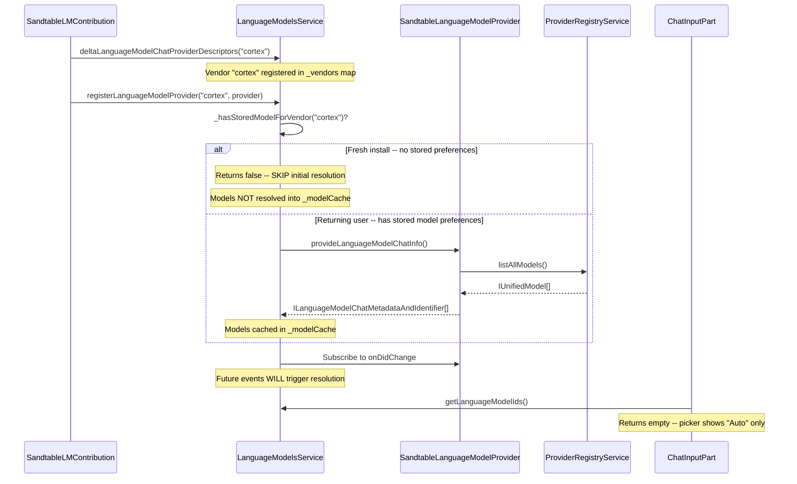
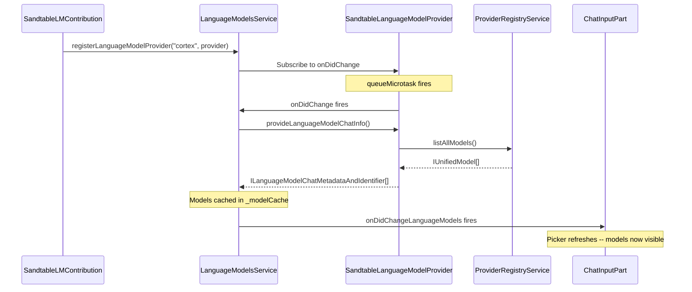
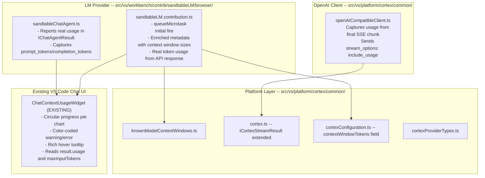
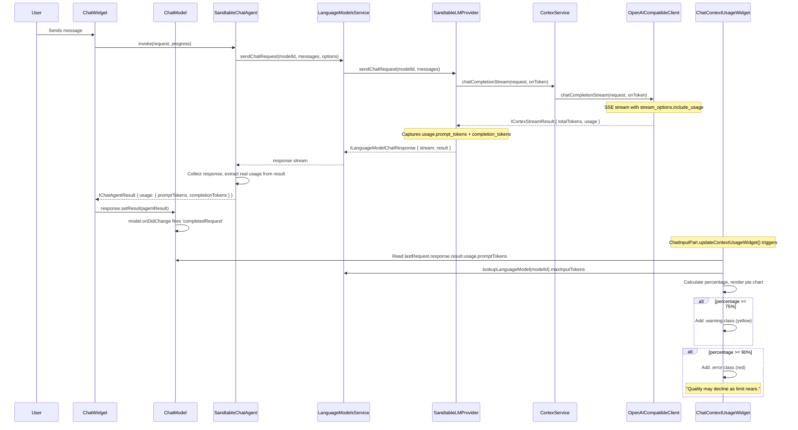

# Chat Model Picker Fix & Token Usage Tracking -- Design

**Status:** Design Complete -- Ready for Implementation
**Date:** 2026-02-08
**Category:** Core Chat UX -- Model Selection & Context Awareness

---

## Table of Contents

1. [Executive Summary](#1-executive-summary)
2. [Problem 1: Model Picker Not Wired to Chat Panel](#2-problem-1-model-picker-not-wired-to-chat-panel)
3. [Problem 2: Token Usage Tracking & Context Window Awareness](#3-problem-2-token-usage-tracking--context-window-awareness)
4. [Architecture Overview](#4-architecture-overview)
5. [Data Models](#5-data-models)
6. [Known Model Context Window Reference Table](#6-known-model-context-window-reference-table)
7. [Token Counting Strategy](#7-token-counting-strategy)
8. [Existing VS Code Context Usage Widget (Discovery)](#8-existing-vs-code-context-usage-widget-discovery)
9. [Implementation Plan](#9-implementation-plan)
10. [Files Index](#10-files-index)
11. [Research Findings & Provider Compatibility](#11-research-findings--provider-compatibility)

---

## 1. Executive Summary

Sandtable's chat panel has two significant gaps in its UX:

1. **Model picker is empty.** The chat panel dropdown shows "Auto" and "Add Language Models" but none of the models Sandtable has registered via `SandtableLanguageModelProvider`. Users cannot see which model they are chatting with, nor switch between models. Root cause: a timing gap in VS Code's `LanguageModelsService` that skips initial model resolution when no stored picker preferences exist.

2. **No context window awareness.** Different models have wildly different context windows (GPT-5: 400K, GPT-4.1: 1M, GPT-4o: 128K, local models: 4K-128K). Users have no way to know how much of the context window they have consumed, when they are approaching the limit, or when they should start a new chat. Consequence: conversations silently degrade or fail when they exceed the model's context limit.

This document specifies fixes for both problems with concrete code changes, data models, and UI wireframes that an implementation agent can follow.

**Key research discovery:** VS Code v1.109 already ships a complete `ChatContextUsageWidget` (circular pie chart with hover details, color-coded warnings, progress bar) wired into the chat input area. It reads from `IChatAgentResult.usage` and `ILanguageModelChatMetadata.maxInputTokens` but is currently hidden because Sandtable does not populate these fields with real data. The implementation is therefore **much simpler than originally anticipated**: feed real data into existing infrastructure rather than building a new UI from scratch.

---

## 2. Problem 1: Model Picker Not Wired to Chat Panel

### 2.1 Root Cause Analysis

The model picker in VS Code's chat panel discovers models via `LanguageModelsService._modelCache`. Models only enter this cache when `_resolveAllLanguageModels()` is called for the vendor. Here is the registration flow and where it breaks:



**The gap:** On a fresh install (or first time using Sandtable models), `_hasStoredModelForVendor('cortex')` returns `false` because the user has never selected a Cortex model before. The service skips initial resolution. The `onDidChange` listener is set up for future events, but if all providers have already connected and stabilized before registration, no change events fire, and the `_modelCache` stays empty.

**Key code references:**

- `_hasStoredModelForVendor()` check: `src/vs/workbench/contrib/chat/common/languageModels.ts` line 594-598
- Registration conditional: `src/vs/workbench/contrib/chat/common/languageModels.ts` line 795
- `onDidChange` subscription: `src/vs/workbench/contrib/chat/common/languageModels.ts` line 799-801
- `getModels()` in chat input: `src/vs/workbench/contrib/chat/browser/widget/input/chatInputPart.ts` line 1024-1035

### 2.2 Fix: Force Initial Model Resolution

The fix is straightforward. In `SandtableLanguageModelProvider`'s constructor, after all event listeners are set up, schedule an immediate `_onDidChange.fire()`. This triggers the `LanguageModelsService` to call `_resolveAllLanguageModels('cortex', true)` and populate the model cache.

```typescript
// In SandtableLanguageModelProvider constructor, after all event listener registrations:

// Force initial model resolution. The LanguageModelsService only auto-resolves
// on registration if stored model picker preferences exist for this vendor.
// On a fresh install, no preferences exist, so models are never resolved.
// This deferred fire guarantees the service queries our models at least once.
queueMicrotask(() => this._onDidChange.fire());
```

`queueMicrotask` is used instead of `setTimeout(0)` because:
- It fires after the current microtask queue (so the `registerLanguageModelProvider()` call completes and the `onDidChange` listener is attached first)
- It fires before any macrotask (so the user sees models immediately, not after a 15-second health poll interval)

After the fix, the flow becomes:



### 2.3 Fix: "Add Language Models" Button

The "Add Language Models" button in the model picker dropdown calls `workbench.action.chat.triggerSetup` -- a Copilot-specific command that does nothing in Sandtable.

**Solution:** Register a command handler for `workbench.action.chat.triggerSetup` in `SandtableLMContribution` that opens Sandtable Settings instead:

```typescript
this._register(CommandsRegistry.registerCommand(
    'workbench.action.chat.triggerSetup',
    (accessor: ServicesAccessor) => {
        const editorService = accessor.get(IEditorService);
        editorService.openEditor({ resource: URI.parse('sandtable://settings') });
    }
));
```

This way, when a user clicks "Add Language Models", they are taken to Sandtable Settings where they can configure providers and curate models.

### 2.4 Fix: Enrich Model Metadata

Currently, `provideLanguageModelChatInfo()` hardcodes `maxInputTokens: 128000` and `maxOutputTokens: 4096` for all models. It also uses the bare `model.modelName` as the display name.

**Improvements:**

1. **Display names from curated config:** If a curated model entry has a `displayName`, use it as the `name` field in `ILanguageModelChatMetadata`. This lets admins control what appears in the picker dropdown (e.g., "GPT-5" instead of "gpt-5-2025-08-06").

2. **Context window sizes:** Look up `maxInputTokens` from:
   - First: curated model's `contextWindowTokens` field (new field, see Section 5.1)
   - Second: known model context window table (new file, see Section 6)
   - Third: hardcoded default of 128000

3. **Max output tokens:** Same layered lookup -- curated config, known table, default 4096.

---

## 3. Problem 2: Token Usage Tracking & Context Window Awareness

### 3.1 Current State of Token Data

Token-related data already exists in several places but is not connected:

| Component | What It Has | What Is Missing |
|-----------|-------------|-----------------|
| `ICortexChatResponse.usage` | `prompt_tokens`, `completion_tokens`, `total_tokens` for non-streaming | Not surfaced to the chat UI |
| `ICortexStreamResult` | `totalTokens` (chunk count, NOT actual tokens) | Real token counts from API |
| `openAICompatibleClient._parseSSEStreamChat()` | Counts SSE chunks as "tokens" | Does not capture `usage` from final streaming chunk |
| `SandtableLMProvider.provideTokenCount()` | `~4 chars/token` heuristic | Only used for pre-send estimation |
| `SandtableLMProvider.sendChatRequest()` | Returns `{ totalTokens: response.usage?.completion_tokens ?? 0 }` for non-streaming | Streaming path returns chunk count |
| `SandtableChatAgentImpl` | `IChatAgentResult.usage` with `completionTokens` and `promptTokens` | Currently set to rough estimates |
| `ICortexModelConstraints` | `context_size`, `max_model_len`, `max_tokens_default` | Only available for Cortex models; not used by LM provider |
| `ILanguageModelChatMetadata` | `maxInputTokens`, `maxOutputTokens` | Hardcoded to 128000/4096 |

### 3.2 What Needs to Happen

```
                         ┌──────────────────────────────────────────────────┐
                         │           TOKEN TRACKING SYSTEM                  │
                         │  Context Window Awareness for Sandtable Chat     │
                         └──────────────────────┬───────────────────────────┘
                                                │
               ┌────────────────────────────────┼────────────────────────────────┐
               │                                │                                │
    ┌──────────▼──────────┐        ┌────────────▼────────────┐       ┌──────────▼──────────┐
    │  CONTEXT WINDOW     │        │   TOKEN COUNTING         │       │   VISUAL DISPLAY    │
    │  SIZE KNOWLEDGE     │        │   (Per-Session Tracking)  │       │   (Chat Panel UI)   │
    │                     │        │                           │       │                     │
    │  Known model table  │        │  API usage field capture  │       │  Progress indicator │
    │  Curated model cfg  │        │  Streaming usage capture  │       │  Color-coded status │
    │  Cortex constraints │        │  Heuristic fallback       │       │  Hover tooltip      │
    │  Per-model lookup   │        │  Session accumulation     │       │  Threshold warnings │
    └─────────────────────┘        └───────────────────────────┘       └─────────────────────┘
```

Three subsystems:

1. **Context window size knowledge** -- How the system knows a model's total context window. Feeds `ILanguageModelChatMetadata.maxInputTokens`.
2. **Token counting** -- How to get real token counts from the API and report them via `IChatAgentResult.usage.promptTokens`.
3. **Visual display** -- **Already built.** VS Code's `ChatContextUsageWidget` renders a circular pie chart that reads both values above. We just need to feed it real data.

---

## 4. Architecture Overview



### 4.1 Data Flow: Token Tracking Per Request



---

## 5. Data Models

### 5.1 Curated Model Configuration Extension

Add a `contextWindowTokens` field to the curated model schema in `cortexConfiguration.ts`:

```typescript
// In sandtable.models.curated items schema, add:
contextWindowTokens: {
    type: 'number',
    description: nls.localize(
        'sandtable.models.curated.contextWindowTokens',
        "Actual context window size in tokens for this model as configured on the serving backend. For local models, this should reflect the server's configured limit (e.g., vLLM --max-model-len, or llama.cpp --ctx-size / --parallel), NOT the model's theoretical maximum. For cloud APIs (OpenAI, Anthropic), leave empty to auto-detect from the known models table. Used for the context usage indicator in the chat panel."
    ),
},
maxOutputTokens: {
    type: 'number',
    description: nls.localize(
        'sandtable.models.curated.maxOutputTokens',
        "Maximum output tokens for this model. Leave empty to use the known models table default."
    ),
},
```

The curated model schema becomes:

```
sandtable.models.curated: Array<{
    qualifiedName: string;         // Required: "providerId::modelName"
    displayName?: string;          // Optional display name override
    enabled: boolean;              // Required: whether model is available
    contextWindowTokens?: number;  // NEW: total context window in tokens
    maxOutputTokens?: number;      // NEW: max output tokens
    overrides?: {                  // Parameter overrides (existing)
        dropParameters?: string[];
        renameParameters?: Record<string, string>;
        forceParameters?: Record<string, string>;
        extraParameters?: Record<string, string>;
    }
}>
```

### 5.2 Extended ICortexStreamResult

Currently `ICortexStreamResult` only has `totalTokens: number` (an inaccurate chunk count). Extend it to carry real usage data:

```typescript
// In src/vs/platform/cortex/common/cortex.ts

export interface ICortexStreamResult {
    totalTokens: number;
    /** Real token usage from the API (if stream_options.include_usage was honored) */
    usage?: ICortexUsage;
}
```

This is a backward-compatible change -- existing consumers that only read `totalTokens` are unaffected.

### 5.3 No Custom Token Tracking Service Needed

The existing `ChatContextUsageWidget` handles all UI rendering and gets its data directly from:
- `IChatAgentResult.usage` (set by `SandtableChatAgentImpl` when it returns)
- `ILanguageModelChatMetadata.maxInputTokens` (set by `SandtableLMProvider`)

No new `ITokenTrackingService` is required. The data flow is:
1. Agent returns `{ usage: { promptTokens, completionTokens } }` in `IChatAgentResult`
2. `ChatResponseModel.setResult()` stores it
3. `ChatInputPart.updateContextUsageWidget()` reads it and feeds the existing widget
4. The widget computes the percentage and renders automatically

### 5.4 Known Model Context Window Entry

```typescript
// In src/vs/platform/cortex/common/knownModelContextWindows.ts

export interface IKnownModelSpec {
    /** Glob pattern to match model names (e.g., "gpt-5*", "deepseek-v3*") */
    pattern: string;
    /** Total context window size in tokens */
    contextWindowTokens: number;
    /** Maximum output tokens */
    maxOutputTokens: number;
    /** Whether this model supports tool calling */
    toolCalling?: boolean;
}
```

---

## 6. Known Model Context Window Reference Table

This static table provides default context window sizes for well-known model families. It is used when the curated model config does not specify `contextWindowTokens` and the model is from an external provider (not Cortex, which has `getModelConstraints()`).

The table is ordered from most-specific pattern to least-specific, so the first match wins.

```typescript
// src/vs/platform/cortex/common/knownModelContextWindows.ts

export const KNOWN_MODEL_CONTEXT_WINDOWS: IKnownModelSpec[] = [
    // ─── OpenAI GPT-5 Family ──────────────────────────────────────────
    { pattern: 'gpt-5*',                contextWindowTokens: 400_000,    maxOutputTokens: 128_000,  toolCalling: true  },
    { pattern: 'gpt-5-mini*',           contextWindowTokens: 400_000,    maxOutputTokens: 128_000,  toolCalling: true  },
    { pattern: 'gpt-5-nano*',           contextWindowTokens: 400_000,    maxOutputTokens: 128_000,  toolCalling: true  },

    // ─── OpenAI GPT-5.1/5.2 ──────────────────────────────────────────
    { pattern: 'gpt-5.1*',              contextWindowTokens: 400_000,    maxOutputTokens: 128_000,  toolCalling: true  },
    { pattern: 'gpt-5.2*',              contextWindowTokens: 400_000,    maxOutputTokens: 128_000,  toolCalling: true  },

    // ─── OpenAI GPT-4.1 Family ────────────────────────────────────────
    { pattern: 'gpt-4.1*',              contextWindowTokens: 1_047_576,  maxOutputTokens: 32_768,   toolCalling: true  },
    { pattern: 'gpt-4.1-mini*',         contextWindowTokens: 1_047_576,  maxOutputTokens: 32_768                      },
    { pattern: 'gpt-4.1-nano*',         contextWindowTokens: 1_047_576,  maxOutputTokens: 32_768                      },

    // ─── OpenAI GPT-4o Family ─────────────────────────────────────────
    { pattern: 'gpt-4o*',               contextWindowTokens: 128_000,    maxOutputTokens: 16_384                      },
    { pattern: 'gpt-4o-mini*',          contextWindowTokens: 128_000,    maxOutputTokens: 16_384                      },
    { pattern: 'chatgpt-4o*',           contextWindowTokens: 128_000,    maxOutputTokens: 16_384                      },

    // ─── OpenAI GPT-4 Turbo ──────────────────────────────────────────
    { pattern: 'gpt-4-turbo*',          contextWindowTokens: 128_000,    maxOutputTokens: 4_096                       },
    { pattern: 'gpt-4-1106*',           contextWindowTokens: 128_000,    maxOutputTokens: 4_096                       },
    { pattern: 'gpt-4-0125*',           contextWindowTokens: 128_000,    maxOutputTokens: 4_096                       },

    // ─── OpenAI GPT-4 Base ───────────────────────────────────────────
    { pattern: 'gpt-4',                 contextWindowTokens: 8_192,      maxOutputTokens: 8_192                       },
    { pattern: 'gpt-4-32k*',            contextWindowTokens: 32_768,     maxOutputTokens: 32_768                      },

    // ─── OpenAI o-Series (Reasoning) ──────────────────────────────────
    { pattern: 'o4-mini*',              contextWindowTokens: 200_000,    maxOutputTokens: 100_000,  toolCalling: true  },
    { pattern: 'o3*',                   contextWindowTokens: 200_000,    maxOutputTokens: 100_000                     },
    { pattern: 'o3-mini*',              contextWindowTokens: 200_000,    maxOutputTokens: 100_000                     },
    { pattern: 'o1*',                   contextWindowTokens: 200_000,    maxOutputTokens: 100_000                     },
    { pattern: 'o1-mini*',              contextWindowTokens: 128_000,    maxOutputTokens: 65_536                      },
    { pattern: 'o1-preview*',           contextWindowTokens: 128_000,    maxOutputTokens: 32_768                      },

    // ─── OpenAI GPT-3.5 ──────────────────────────────────────────────
    { pattern: 'gpt-3.5-turbo*',        contextWindowTokens: 16_385,     maxOutputTokens: 4_096                       },

    // ─── OpenAI GPT-OSS (Open-Weight) ─────────────────────────────────
    { pattern: 'gpt-oss*',              contextWindowTokens: 128_000,    maxOutputTokens: 16_384,   toolCalling: true  },

    // ─── Anthropic Claude ─────────────────────────────────────────────
    { pattern: 'claude-4.5-opus*',      contextWindowTokens: 200_000,    maxOutputTokens: 64_000,   toolCalling: true  },
    { pattern: 'claude-4.5-sonnet*',    contextWindowTokens: 200_000,    maxOutputTokens: 64_000,   toolCalling: true  },
    { pattern: 'claude-4*',             contextWindowTokens: 200_000,    maxOutputTokens: 64_000,   toolCalling: true  },
    { pattern: 'claude-3.7*',           contextWindowTokens: 200_000,    maxOutputTokens: 128_000,  toolCalling: true  },
    { pattern: 'claude-3.5*',           contextWindowTokens: 200_000,    maxOutputTokens: 8_192,    toolCalling: true  },
    { pattern: 'claude-3*',             contextWindowTokens: 200_000,    maxOutputTokens: 4_096,    toolCalling: true  },

    // ─── DeepSeek ─────────────────────────────────────────────────────
    // DeepSeek API (api.deepseek.com) reports 128K context for both chat and reasoner.
    // Self-hosted also supports 128K. Older API docs showed 64K but V3.2 confirmed 128K.
    { pattern: 'deepseek-chat*',        contextWindowTokens: 128_000,    maxOutputTokens: 8_192                       },
    { pattern: 'deepseek-coder*',       contextWindowTokens: 128_000,    maxOutputTokens: 8_192                       },
    { pattern: 'deepseek-reasoner*',    contextWindowTokens: 128_000,    maxOutputTokens: 64_000                      },
    { pattern: 'deepseek-r1*',          contextWindowTokens: 128_000,    maxOutputTokens: 64_000                      },
    { pattern: 'deepseek-v3*',          contextWindowTokens: 128_000,    maxOutputTokens: 8_192                       },
    { pattern: 'deepseek*',             contextWindowTokens: 128_000,    maxOutputTokens: 8_192                       },

    // ─── Qwen ─────────────────────────────────────────────────────────
    { pattern: 'qwen3*',                contextWindowTokens: 131_072,    maxOutputTokens: 8_192,    toolCalling: true  },
    { pattern: 'qwen2.5-coder*',        contextWindowTokens: 131_072,    maxOutputTokens: 8_192                       },
    { pattern: 'qwen2.5*',              contextWindowTokens: 131_072,    maxOutputTokens: 8_192                       },
    { pattern: 'qwq*',                  contextWindowTokens: 32_000,     maxOutputTokens: 8_192                       },
    { pattern: 'qwen*',                 contextWindowTokens: 32_000,     maxOutputTokens: 8_192                       },

    // ─── Meta Llama ───────────────────────────────────────────────────
    { pattern: 'llama-4*',              contextWindowTokens: 131_072,    maxOutputTokens: 8_192,    toolCalling: true  },
    { pattern: 'llama-3.3*',            contextWindowTokens: 131_072,    maxOutputTokens: 2_048                       },
    { pattern: 'llama-3.2*',            contextWindowTokens: 131_072,    maxOutputTokens: 2_048                       },
    { pattern: 'llama-3.1*',            contextWindowTokens: 131_072,    maxOutputTokens: 2_048                       },
    { pattern: 'llama-3*',              contextWindowTokens: 8_192,      maxOutputTokens: 2_048                       },
    { pattern: 'llama*',                contextWindowTokens: 8_192,      maxOutputTokens: 2_048                       },

    // ─── Mistral ──────────────────────────────────────────────────────
    { pattern: 'mistral-nemo*',         contextWindowTokens: 128_000,    maxOutputTokens: 4_096                       },
    { pattern: 'mistral-large*',        contextWindowTokens: 32_000,     maxOutputTokens: 4_096,    toolCalling: true  },
    { pattern: 'mistral-small*',        contextWindowTokens: 32_000,     maxOutputTokens: 4_096                       },
    { pattern: 'mistral-medium*',       contextWindowTokens: 32_000,     maxOutputTokens: 4_096                       },
    { pattern: 'mixtral*',              contextWindowTokens: 32_000,     maxOutputTokens: 4_096                       },
    { pattern: 'mistral*',              contextWindowTokens: 32_000,     maxOutputTokens: 4_096                       },

    // ─── Google Gemini ────────────────────────────────────────────────
    { pattern: 'gemini-2.5*',           contextWindowTokens: 1_048_000,  maxOutputTokens: 64_000,   toolCalling: true  },
    { pattern: 'gemini-2.0*',           contextWindowTokens: 1_048_000,  maxOutputTokens: 8_192                       },
    { pattern: 'gemini-1.5*',           contextWindowTokens: 1_048_000,  maxOutputTokens: 8_192                       },
    { pattern: 'gemma-3*',              contextWindowTokens: 128_000,    maxOutputTokens: 8_192                       },
    { pattern: 'gemma*',                contextWindowTokens: 8_192,      maxOutputTokens: 8_192                       },

    // ─── Microsoft Phi ────────────────────────────────────────────────
    { pattern: 'phi-4*',                contextWindowTokens: 16_000,     maxOutputTokens: 16_000                      },
    { pattern: 'phi-3*',                contextWindowTokens: 4_096,      maxOutputTokens: 4_096                       },
    { pattern: 'phi*',                  contextWindowTokens: 4_096,      maxOutputTokens: 4_096                       },

    // ─── Cohere Command ───────────────────────────────────────────────
    { pattern: 'command-r-plus*',       contextWindowTokens: 128_000,    maxOutputTokens: 4_096,    toolCalling: true  },
    { pattern: 'command-r*',            contextWindowTokens: 128_000,    maxOutputTokens: 4_096                       },
    { pattern: 'command*',              contextWindowTokens: 4_096,      maxOutputTokens: 4_096                       },
];
```

### 6.1 Lookup Function

```typescript
/**
 * Look up context window size for a model name using the known models table.
 * Matches against the bare model name (without provider prefix).
 * Returns undefined if no match is found.
 */
export function lookupKnownModelSpec(modelName: string): IKnownModelSpec | undefined {
    const bare = modelName.includes('::') ? modelName.split('::')[1] : modelName;
    const lower = bare.toLowerCase();
    for (const spec of KNOWN_MODEL_CONTEXT_WINDOWS) {
        if (matchesGlobPattern(spec.pattern, lower)) {
            return spec;
        }
    }
    return undefined;
}

/**
 * Simple glob matching: supports trailing * only (e.g., "gpt-5*" matches "gpt-5-2025-08-06").
 */
function matchesGlobPattern(pattern: string, value: string): boolean {
    const lower = pattern.toLowerCase();
    if (lower.endsWith('*')) {
        return value.startsWith(lower.slice(0, -1));
    }
    return value === lower;
}
```

### 6.2 Resolution Priority

When resolving context window size for a model, the system checks sources in this order:

```
1. Curated model config -- sandtable.models.curated[].contextWindowTokens
   (Highest priority: admin explicitly set this value)

2. Cortex model constraints -- getModelConstraints().max_model_len
   (Cortex backend reports actual serving configuration)

3. Known models table -- KNOWN_MODEL_CONTEXT_WINDOWS[].contextWindowTokens
   (Static fallback for well-known external models)

4. Default -- 128,000 tokens
   (Conservative default for unknown models)
```

### 6.3 Critical: Configured vs Theoretical Context Windows

**The known model table (source 3) reports theoretical maximums -- the model's full native capability as advertised by the provider.** This is accurate for cloud APIs (OpenAI, Anthropic, DeepSeek hosted API, etc.) where every API call always gets the full advertised context.

**For local/self-hosted models, the actual usable context may be much lower.** Inference engines allow (and often require) admins to constrain the context window at serving time:

**vLLM: `--max-model-len`**

vLLM's `--max-model-len` flag caps the context window at server startup. An admin might run Llama 3.1 70B (native 128K) with `--max-model-len 32768` to conserve GPU memory, since KV cache VRAM scales linearly with context length. Every request served by that instance is then capped at 32K. vLLM will reject requests that exceed `max_model_len`.

**llama.cpp: `--ctx-size` divided by `--parallel`**

llama.cpp server divides the total context window across parallel request slots:

```
per_slot_context = ctx_size / parallel
```

Example: `llama-server --ctx-size 32768 --parallel 4` gives each concurrent user only **8K tokens** of context, even if the model natively supports 128K. All slots share a single KV cache. To get 32K per slot with 4 parallel users, set `--ctx-size 131072` (32K x 4).

**Cortex models: Already handled**

For Cortex-managed models, `getModelConstraints()` returns `max_model_len` which reflects the **actual serving configuration**, not the theoretical maximum. This already accounts for any `--max-model-len` or `--ctx-size` overrides.

**External providers: The gap**

For external providers (Ollama direct, standalone vLLM, etc.), Sandtable has no API to query the configured context window. The known-model table reports the theoretical max, which may significantly overestimate the actual available context.

**Resolution: curated model config is the admin's override valve.**

The `contextWindowTokens` field in `sandtable.models.curated` is how an admin communicates "my deployment's actual context limit." This is especially critical for:

- Local vLLM instances with reduced `--max-model-len`
- llama.cpp servers with context divided across slots
- Ollama instances with custom `num_ctx` settings
- Any deployment where VRAM constraints forced a smaller context window

The Sandtable Settings UI should make this field prominent when adding/editing curated models, with helper text explaining that this should reflect the actual serving configuration, not the model's theoretical maximum.

**Potential future enhancement:** For Cortex models, `provideLanguageModelChatInfo()` could asynchronously call `getModelConstraints()` to auto-populate `maxInputTokens` with the real `max_model_len`. This would make the pie chart accurate for Cortex models without any admin configuration. The known-model table would only be used for external providers without constraints APIs.

---

## 7. Token Counting Strategy

### 7.1 Primary: API Usage Data

The most accurate source of token counts is the API's `usage` field in the response.

**Non-streaming path (already works):** `ICortexChatResponse.usage` returns `{ prompt_tokens, completion_tokens, total_tokens }`. The `SandtableLMProvider.sendChatRequest()` non-streaming path already accesses `response.usage`.

**Streaming path (needs fix):** OpenAI and several compatible APIs support returning `usage` in the final SSE chunk when the request includes `stream_options: { include_usage: true }`.

**Provider compatibility (validated by research):**

| Provider | `stream_options.include_usage` | Notes |
|----------|-------------------------------|-------|
| OpenAI API | Supported | Returns usage in extra final chunk with empty choices |
| vLLM | Supported | Implemented since vLLM PR #5319 |
| Ollama `/v1/` | Unknown | OpenAI compatibility mode is experimental; may silently ignore the param |
| DeepSeek API | Likely supported | Uses OpenAI-compatible format; not explicitly documented |
| Cortex (our gateway) | Depends on backend | Cortex proxies to vLLM/llama.cpp, so depends on the engine |

**Important:** `stream_options` must be treated as a best-effort enhancement. When a provider does not support it, the `usage` field will simply be absent from the final chunk, and we fall back to heuristic estimation. The request should NOT fail if the provider ignores the parameter.

The fix:

1. In `openAICompatibleClient.ts`, add `stream_options: { include_usage: true }` to the request body when `stream: true`.
2. In `_parseSSEStreamChat()`, watch for a chunk containing `usage` in the final SSE data block and capture it.
3. Return the captured `ICortexUsage` in `ICortexStreamResult.usage`.

```typescript
// In _parseSSEStreamChat(), capture usage from the final chunk:
let capturedUsage: ICortexUsage | undefined;

// Inside the SSE parse loop, after JSON.parse(data):
if (parsed.usage) {
    capturedUsage = {
        prompt_tokens: parsed.usage.prompt_tokens ?? 0,
        completion_tokens: parsed.usage.completion_tokens ?? 0,
        total_tokens: parsed.usage.total_tokens ?? 0,
    };
}

// Return:
return { totalTokens, usage: capturedUsage };
```

### 7.2 Fallback: Heuristic Estimation

When the API does not return `usage` data (some backends do not support `stream_options`), fall back to heuristic estimation:

**Character-based estimation:** `~4 characters per token` for English text. This is the industry-standard rough estimate used by OpenAI's tokenizer guidelines and already implemented in `SandtableLMProvider.provideTokenCount()`.

```typescript
function estimateTokenCount(text: string): number {
    return Math.ceil(text.length / 4);
}
```

**For prompt tokens:** Estimate from the full message array sent to the API:
- System prompt text length
- All history messages text length
- Current user message text length
- Tool definitions JSON length (if in Agent mode)
- Sum all and divide by 4

**For completion tokens:** Use the received text length divided by 4.

### 7.3 Hybrid Approach in Practice

```
For each request in a session:
  1. Send request with stream_options: { include_usage: true }
  2. After response completes:
     a. If response.usage exists:
        promptTokens = response.usage.prompt_tokens
        completionTokens = response.usage.completion_tokens
     b. Else (API did not return usage):
        promptTokens = estimateTokenCount(all messages sent)
        completionTokens = estimateTokenCount(response text)
  3. Record (promptTokens, completionTokens) in ITokenTrackingService
  4. Service accumulates and recalculates utilization ratio
  5. UI updates
```

### 7.4 Session Token Accumulation

The token tracking service tracks **cumulative** usage per chat session:

```
Session total prompt tokens = last request's prompt_tokens
  (This approximates total context used, since each request includes the full conversation history)

Session total completion tokens = SUM(all response completion_tokens in this session)

Session total tokens ≈ last prompt_tokens + sum of completion_tokens
  (The prompt_tokens from the last request already includes all prior conversation)
```

**Important nuance:** In a multi-turn conversation, `prompt_tokens` from the latest request already includes the full conversation history (system prompt + all prior turns). So the most accurate "context window utilization" is:

```
utilization = last_prompt_tokens / context_window_size
```

Not the cumulative sum of all prompt_tokens across all requests (which would double-count history).

---

## 8. Existing VS Code Context Usage Widget (Discovery)

### 8.1 Key Research Finding: VS Code Already Has a Token Usage Widget

**Critical discovery during deep research:** VS Code v1.109 already includes a complete `ChatContextUsageWidget` with all the UI we need. This eliminates the need for a custom token widget.

**Location:** `src/vs/workbench/contrib/chat/browser/widgetHosts/viewPane/chatContextUsageWidget.ts`

**What it provides:**
- **Circular progress pie chart** (SVG-based) that fills clockwise from the top
- **Color-coded states:** normal (default), warning (>= 75%), error (>= 90%)
- **Rich hover popup** (`ChatContextUsageDetails` in `chatContextUsageDetails.ts`) with:
  - "Context Window" header
  - Token count: "49.3K / 400K tokens"
  - Percentage display
  - Progress bar with color
  - Token category breakdown (if `promptTokenDetails` is provided)
  - Warning message: "Quality may decline as limit nears."
  - Actions section (linked to `MenuId.ChatContextUsageActions`)
- **Already wired into the chat input DOM** at `.chat-context-usage-container` in `chatInputPart.ts`

### 8.2 How the Existing Widget Gets Data

```
ChatInputPart.updateContextUsageWidget()
    │
    └── Subscribes to model.onDidChange('completedRequest')
        │
        └── Calls contextUsageWidget.update(model.lastRequest)
            │
            ├── Reads lastRequest.response.result?.usage.promptTokens
            │   (This is IChatAgentResult.usage.promptTokens)
            │
            └── Reads languageModelsService.lookupLanguageModel(modelId)?.maxInputTokens
                (This is ILanguageModelChatMetadata.maxInputTokens)
```

**The widget is currently HIDDEN because:**
1. `response.result?.usage` is `undefined` or has `promptTokens: 0` (Sandtable's agent reports rough estimates, not real API data)
2. The model may not be in the language model cache (Problem 1), so `lookupLanguageModel(modelId)` returns `undefined`
3. When either `usage` or `maxInputTokens` is missing/zero, the widget calls `this.hide()`

### 8.3 What We Must Do (Instead of Building a New Widget)

**No new widget needed.** We feed real data into the existing widget by:

1. **Fix Problem 1** so models appear in the `_modelCache` (providing `maxInputTokens` via metadata)
2. **Report real `usage.promptTokens`** from `SandtableChatAgentImpl` in `IChatAgentResult.usage`
3. **Set accurate `maxInputTokens`** in model metadata using curated config / known table / Cortex constraints

The existing widget automatically shows when valid data is present and hides when it is not.

### 8.4 ASCII Wireframe -- What the User Sees (Existing Widget)

```
┌─────────────────────────────────────────────────────┐
│  Chat                                          [−]  │
├─────────────────────────────────────────────────────┤
│                                                     │
│  ┌─────────────────────────────────────────────┐    │
│  │ 🧑 What are the key terrain features...     │    │
│  └─────────────────────────────────────────────┘    │
│  ┌─────────────────────────────────────────────┐    │
│  │ 🤖 The Fulda Gap presents several key       │    │
│  │    terrain features that favor defense...    │    │
│  └─────────────────────────────────────────────┘    │
│                                                     │
├─────────────────────────────────────────────────────┤
│ (◔) <-- circular pie chart (existing widget)        │
│ ┌─────────────────────────────────────────────────┐ │
│ │ Ask anything or type / for commands             │ │
│ └─────────────────────────────────────────────────┘ │
│                                                     │
│ [Agent v] [GPT-5 (openai) v]        [Send]         │
│  ▲ mode    ▲ model picker                           │
└─────────────────────────────────────────────────────┘

Clicking/hovering the pie chart shows:
┌─────────────────────────────────────────────┐
│  Context Window                             │
│  49.3K / 400K tokens           • 12%        │
│  ■■■□□□□□□□□□□□□□□□□□                       │
└─────────────────────────────────────────────┘
```

---

## 9. Implementation Plan

### Step 0: Compile Validation

Before any changes, confirm the build passes:
```bash
eval "$(mise activate bash)" && npm run compile
```

### Step 1: Force Initial Model Resolution (Model Picker Fix -- Core)

**File:** `src/vs/workbench/contrib/sandtableLM/browser/sandtableLM.contribution.ts`

**Changes:**

1. In `SandtableLanguageModelProvider` constructor, add after all `this._register(...)` event listener calls (after the curated model config listener at line 151):

```typescript
// Force initial model resolution. The LanguageModelsService only auto-resolves
// on registration when stored model picker preferences exist for this vendor.
// On a fresh install (no stored preferences), models are never resolved into
// the cache and the picker stays empty. This deferred fire guarantees the
// service queries our models at least once after registration completes.
queueMicrotask(() => this._onDidChange.fire());
```

2. In `SandtableLMContribution` constructor, add command handler for "Add Language Models" after the provider registration (after line 387):

```typescript
// Intercept the "Add Language Models" command (Copilot-specific) to open
// Sandtable Settings where users can configure providers and curate models.
this._register(CommandsRegistry.registerCommand(
    'workbench.action.chat.triggerSetup',
    (accessor: ServicesAccessor) => {
        const editorService = accessor.get(IEditorService);
        editorService.openEditor({ resource: URI.parse('sandtable://settings') });
    }
));
```

**New imports needed:**
```typescript
import { CommandsRegistry } from '../../../../platform/commands/common/commands.js';
import { ServicesAccessor } from '../../../../platform/instantiation/common/instantiation.js';
import { IEditorService } from '../../../services/editor/common/editorService.js';
import { URI } from '../../../../base/common/uri.js';
```

**Compile checkpoint:** `npm run compile` must pass with 0 errors.

### Step 2: Known Model Context Window Table

**New file:** `src/vs/platform/cortex/common/knownModelContextWindows.ts`

Create the file with:
- Copyright header
- `IKnownModelSpec` interface
- `KNOWN_MODEL_CONTEXT_WINDOWS` array (from Section 6)
- `lookupKnownModelSpec()` function (from Section 6.1)
- `matchesGlobPattern()` helper function

**Compile checkpoint:** `npm run compile` must pass with 0 errors.

### Step 3: Extend Curated Model Schema

**File:** `src/vs/platform/cortex/common/cortexConfiguration.ts`

In the `sandtable.models.curated` items schema properties (around line 226-267), add after the `enabled` property:

```typescript
contextWindowTokens: {
    type: 'number',
    minimum: 1,
    description: nls.localize(
        'sandtable.models.curated.contextWindowTokens',
        "Actual context window size in tokens as configured on the serving backend. For local models (vLLM, llama.cpp, Ollama), this should reflect the server's configured limit, NOT the model's theoretical maximum. For cloud APIs, leave empty to use the known models table. Powers the context usage indicator in the chat panel."
    ),
},
maxOutputTokens: {
    type: 'number',
    minimum: 1,
    description: nls.localize(
        'sandtable.models.curated.maxOutputTokens',
        "Maximum output tokens for this model. Leave empty to use the known models table default."
    ),
},
```

**Compile checkpoint:** `npm run compile` must pass with 0 errors.

### Step 4: Enrich Model Metadata with Context Window Sizes

**File:** `src/vs/workbench/contrib/sandtableLM/browser/sandtableLM.contribution.ts`

In `provideLanguageModelChatInfo()`, replace the hardcoded `maxInputTokens: 128000` and `maxOutputTokens: 4096` with a lookup:

```typescript
// Resolve context window size for this model
// Priority: curated config > known models table > default
const curatedEntry = curatedList?.find(c => c.qualifiedName === model.qualifiedName);
let maxInput = 128_000;
let maxOutput = 4_096;

if (curatedEntry?.contextWindowTokens) {
    maxInput = curatedEntry.contextWindowTokens;
}
if (curatedEntry?.maxOutputTokens) {
    maxOutput = curatedEntry.maxOutputTokens;
}

if (!curatedEntry?.contextWindowTokens || !curatedEntry?.maxOutputTokens) {
    const knownSpec = lookupKnownModelSpec(model.modelName);
    if (knownSpec) {
        if (!curatedEntry?.contextWindowTokens) { maxInput = knownSpec.contextWindowTokens; }
        if (!curatedEntry?.maxOutputTokens) { maxOutput = knownSpec.maxOutputTokens; }
    }
}
```

Also use the curated `displayName` if available:

```typescript
const displayName = curatedEntry?.displayName || model.modelName;
```

Update the metadata construction:

```typescript
const metadata: ILanguageModelChatMetadata = {
    // ...
    name: displayName,
    maxInputTokens: maxInput,
    maxOutputTokens: maxOutput,
    // ...
};
```

**New import:**
```typescript
import { lookupKnownModelSpec } from '../../../../platform/cortex/common/knownModelContextWindows.js';
```

**Compile checkpoint:** `npm run compile` must pass with 0 errors.

### Step 5: Extend ICortexStreamResult and Capture Streaming Usage

**File:** `src/vs/platform/cortex/common/cortex.ts`

Change `ICortexStreamResult`:

```typescript
export interface ICortexStreamResult {
    totalTokens: number;
    /** Real token usage from the API (when stream_options.include_usage was honored) */
    usage?: ICortexUsage;
}
```

**File:** `src/vs/platform/cortex/common/openAICompatibleClient.ts`

1. In `chatCompletionStream()`, add `stream_options` to the request body when streaming:

```typescript
if (body.stream) {
    body.stream_options = { include_usage: true };
}
```

2. In `_parseSSEStreamChat()`, add usage capture:

```typescript
// Add at the top of the method:
let capturedUsage: ICortexUsage | undefined;

// Inside the parse loop, after JSON.parse(data):
if (parsed.usage) {
    capturedUsage = {
        prompt_tokens: parsed.usage.prompt_tokens ?? 0,
        completion_tokens: parsed.usage.completion_tokens ?? 0,
        total_tokens: parsed.usage.total_tokens ?? 0,
    };
}

// Change the return:
return { totalTokens, usage: capturedUsage };
```

**Compile checkpoint:** `npm run compile` must pass with 0 errors.

### Step 6: Wire Token Usage into Chat Agent

**File:** `src/vs/workbench/contrib/sandtableLM/browser/sandtableChatAgent.ts`

**File:** `src/vs/workbench/contrib/sandtableLM/browser/sandtableLM.contribution.ts`

The key insight is that VS Code's existing `ChatContextUsageWidget` reads `IChatAgentResult.usage.promptTokens`. We need to populate this with real data.

**In `SandtableLMProvider.sendChatRequest()`:**

1. For the non-streaming path (tool calls): capture `response.usage.prompt_tokens` and `response.usage.completion_tokens` from the `ICortexChatResponse`.
2. For the streaming path: capture `result.usage?.prompt_tokens` and `result.usage?.completion_tokens` from the extended `ICortexStreamResult`.
3. Return these in the `result` promise of `ILanguageModelChatResponse`:

```typescript
// Streaming path result:
return {
    totalTokens: result.usage?.completion_tokens ?? result.totalTokens,
    promptTokens: result.usage?.prompt_tokens,
    completionTokens: result.usage?.completion_tokens,
};
```

**In `SandtableChatAgentImpl.runToolLoop()`:**

1. After `await response.result`, capture the returned usage data.
2. In the final `IChatAgentResult`, set real token counts:

```typescript
return {
    metadata: { modelId, iterations: iteration },
    usage: {
        promptTokens: lastPromptTokens,      // From last API response
        completionTokens: totalCompletionTokens, // Sum across all iterations
    },
};
```

3. The `ILanguageModelChatResponse.result` promise needs to resolve with usage data. Check how the `result` value is structured and propagated to the agent.

**Compile checkpoint:** `npm run compile` must pass with 0 errors.

### Step 7: Final Verification

Verify all of these work:

- [ ] Chat panel model picker shows all registered Sandtable models grouped by provider
- [ ] Selecting a model in the picker sends chat requests to that specific model
- [ ] "Auto" mode uses the default model resolution (persona > config > first available)
- [ ] "Add Language Models" button opens Sandtable Settings
- [ ] After a chat request completes, the circular pie chart context usage indicator appears above the input editor
- [ ] The indicator shows correct percentage (prompt_tokens / maxInputTokens) when the API returns usage data
- [ ] When API does not return usage, the indicator uses heuristic estimation (~4 chars/token)
- [ ] Color transitions: normal (< 75%) -> warning (>= 75%, yellow) -> error (>= 90%, red)
- [ ] Clicking/hovering the pie chart shows the detail popup with token count, percentage, and progress bar
- [ ] Warning message "Quality may decline as limit nears." appears when usage >= 75%
- [ ] Starting a new chat resets the context usage (new session, new requests)
- [ ] Switching models updates the maxInputTokens denominator in the pie chart
- [ ] Models with curated `contextWindowTokens` use that value for maxInputTokens
- [ ] Models matching the known table use table values for maxInputTokens
- [ ] Unknown models default to 128K context window
- [ ] `npm run compile` passes with 0 errors

---

## 10. Files Index

### New Files

| File | Layer | Purpose |
|------|-------|---------|
| `src/vs/platform/cortex/common/knownModelContextWindows.ts` | Platform | Static table of known model context window sizes with glob-pattern matching |

### Modified Files

| File | Changes |
|------|---------|
| `src/vs/workbench/contrib/sandtableLM/browser/sandtableLM.contribution.ts` | Force initial `_onDidChange.fire()`, enrich metadata with context window sizes and display names, intercept "Add Language Models" command, propagate real streaming usage data |
| `src/vs/workbench/contrib/sandtableLM/browser/sandtableChatAgent.ts` | Report real token counts in `IChatAgentResult.usage` from API response data |
| `src/vs/platform/cortex/common/cortex.ts` | Extend `ICortexStreamResult` with optional `usage: ICortexUsage` |
| `src/vs/platform/cortex/common/openAICompatibleClient.ts` | Send `stream_options: { include_usage: true }`, capture `usage` from final SSE chunk |
| `src/vs/platform/cortex/common/cortexConfiguration.ts` | Add `contextWindowTokens` and `maxOutputTokens` fields to curated model schema |

### Existing Files Leveraged (No Modifications Needed)

| File | Role |
|------|------|
| `src/vs/workbench/contrib/chat/browser/widgetHosts/viewPane/chatContextUsageWidget.ts` | Already-built circular progress indicator that reads `IChatAgentResult.usage` and `maxInputTokens` |
| `src/vs/workbench/contrib/chat/browser/widgetHosts/viewPane/chatContextUsageDetails.ts` | Already-built hover detail popup with token breakdown, progress bar, and warning message |
| `src/vs/workbench/contrib/chat/browser/widget/input/chatInputPart.ts` | Already wires `ChatContextUsageWidget` into the chat input DOM and updates it on completed requests |

---

## 11. Research Findings & Provider Compatibility

### 11.1 VS Code Language Model API -- Internal vs Extension API

The public VS Code extension API (`vscode.lm.registerLanguageModelChatProvider()`) has a restriction: "Models provided through this API are currently only available to users on individual GitHub Copilot plans." However, **Sandtable uses the internal `ILanguageModelsService` directly** (not the extension API), bypassing this restriction entirely. The internal service at `src/vs/workbench/contrib/chat/common/languageModels.ts` has no Copilot subscription check -- it simply manages vendor/provider/model registrations.

**Validation:** Sandtable's approach of registering via `languageModelsService.deltaLanguageModelChatProviderDescriptors()` + `registerLanguageModelProvider()` is correct and does not require any Copilot subscription.

### 11.2 `stream_options.include_usage` Provider Support Matrix

| Provider | Support Status | Evidence |
|----------|---------------|----------|
| **OpenAI API** | Confirmed | Documented at platform.openai.com/docs/api-reference/chat-streaming. Returns an extra final chunk with `usage` field and empty `choices` |
| **vLLM** | Confirmed | Implemented in vLLM PR #5319 and #5135 (GitHub issue #4967). Users confirm it works with `stream_options={"include_usage": True}` |
| **Ollama `/v1/`** | Uncertain | Ollama's OpenAI compatibility mode is "experimental and subject to breaking changes." Ollama's native API uses `prompt_eval_count`/`eval_count` instead of `prompt_tokens`/`completion_tokens`. The `/v1/` endpoint translates to OpenAI format but `stream_options` support is undocumented |
| **DeepSeek API** | Likely supported | Uses OpenAI-compatible format. API docs confirm streaming support but `stream_options` is not explicitly documented. Should work since DeepSeek V3.2 aims for full OpenAI compatibility |
| **Cortex gateway** | Depends on backend | Cortex proxies to vLLM or llama.cpp. If the backend engine supports `stream_options`, Cortex should pass it through. vLLM backends will work; llama.cpp support varies |

**Design implication:** `stream_options: { include_usage: true }` is sent as a best-effort parameter. If the provider ignores it, no `usage` appears in the final chunk, and we fall back to heuristic estimation. The parameter should never cause a request failure since compliant APIs ignore unknown parameters.

### 11.3 DeepSeek Context Window Correction

The DeepSeek API documentation at `api-docs.deepseek.com` (verified February 2026) confirms:

- **Both `deepseek-chat` and `deepseek-reasoner`** are backed by DeepSeek-V3.2
- **Context length: 128K tokens** (not 64K as some older documentation suggested)
- **Max output:** 8K default / 8K max for chat; 32K default / 64K max for reasoner

The known model context window table has been updated to reflect 128K for all DeepSeek models, with `deepseek-reasoner` and `deepseek-r1` patterns having 64K max output tokens.

### 11.4 Existing ChatContextUsageWidget Discovery

The most impactful research finding was discovering VS Code v1.109's built-in `ChatContextUsageWidget`. This eliminates the need for:
- A custom `ITokenTrackingService` (no new service)
- A custom `tokenUsageWidget.ts` (no new UI component)
- A custom `tokenUsageWidget.css` (no new styles)

The existing widget at `src/vs/workbench/contrib/chat/browser/widgetHosts/viewPane/chatContextUsageWidget.ts`:
- Is already instantiated in `ChatInputPart.render()` (line 1792)
- Is already appended to the `contextUsageWidgetContainer` DOM element (line 1793)
- Already subscribes to model changes via `updateContextUsageWidget()` (line 1684)
- Already reads `response.result?.usage.promptTokens` and `modelMetadata?.maxInputTokens`
- Already has color-coded states (normal, warning at 75%, error at 90%)
- Already has a detailed hover popup with progress bar and warning text

The widget is currently hidden because the data it reads is not populated. Once we:
1. Fix the model picker (so `lookupLanguageModel(modelId)` returns metadata with real `maxInputTokens`)
2. Report real `promptTokens` from the API in `IChatAgentResult.usage`

...the widget will automatically appear and display context window utilization.

### 11.5 `ChatWidget.CONTRIBS` Pattern

`ChatWidget.CONTRIBS` is an array of constructor functions that get instantiated with the chat widget. Each must implement `IChatWidgetContrib` (`id: string`, optional `getInputState`/`setInputState`). Existing contribs:

- `InputEditorDecorations` -- decorates the input editor with agent/slash-command previews
- `InputEditorSlashCommandMode` -- handles slash command input state
- `ChatTokenDeleter` -- handles token deletion in the input editor
- `ChatDynamicVariableModel` -- manages `@`-mention dynamic variables

These contribs focus on **input editor behavior**, not toolbar UI. They don't provide hooks for adding toolbar widgets. The token tracking widget integration does not use this pattern -- the existing `ChatContextUsageWidget` is directly wired in `ChatInputPart.render()`.

### 11.6 Configured vs Theoretical Context Windows in Local Inference Engines

Inference engines allow (and often require) admins to constrain the context window below the model's theoretical maximum:

**vLLM `--max-model-len`:** Caps context at server startup. Llama 3.1 70B natively supports 128K but an admin running `--max-model-len 32768` limits every request to 32K. This conserves GPU VRAM since KV cache scales linearly with context length. vLLM rejects requests exceeding this limit.

**llama.cpp `--ctx-size / --parallel`:** Context is divided across parallel slots. The formula is `per_slot_context = ctx_size / parallel`. Example: `--ctx-size 32768 --parallel 4` gives each concurrent user only 8K tokens. To get 32K per slot with 4 users, set `--ctx-size 131072`.

**Ollama `num_ctx`:** Ollama defaults to 2048 tokens context unless overridden per model. The model may support 128K but Ollama only allocates what's configured.

**Design implication:** The known model table is only accurate for cloud APIs (OpenAI, Anthropic, etc.) where every API call always gets the full advertised context. For local deployments, the curated model config's `contextWindowTokens` field is the admin's override valve to communicate the actual serving limit. For Cortex models, `getModelConstraints().max_model_len` already reflects the serving configuration and should be preferred over the table.

**Future enhancement opportunity:** The Sandtable Settings "Models" section could add a tooltip or help text when editing `contextWindowTokens` that explains: "For local models, set this to your server's configured context limit. Example: if your vLLM instance runs with --max-model-len 32768, enter 32768 here."
