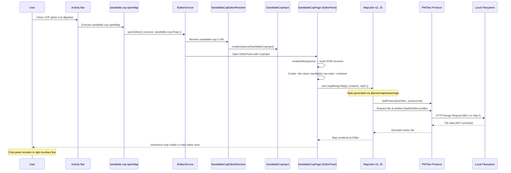
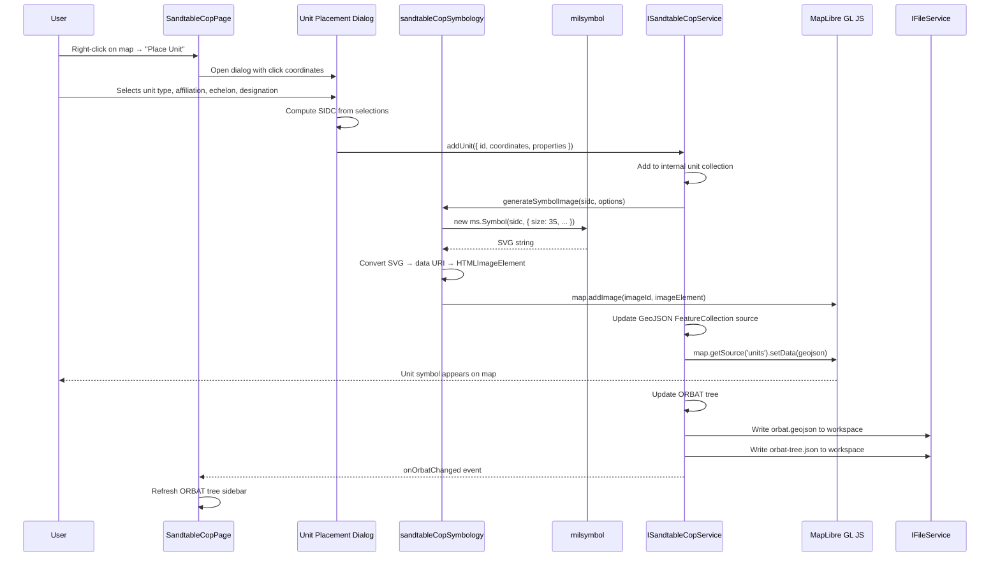
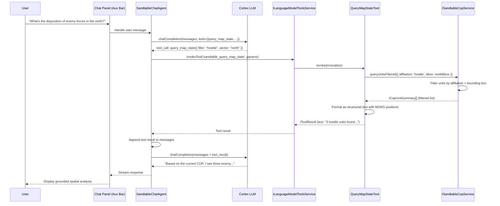
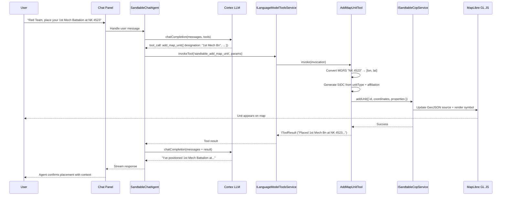
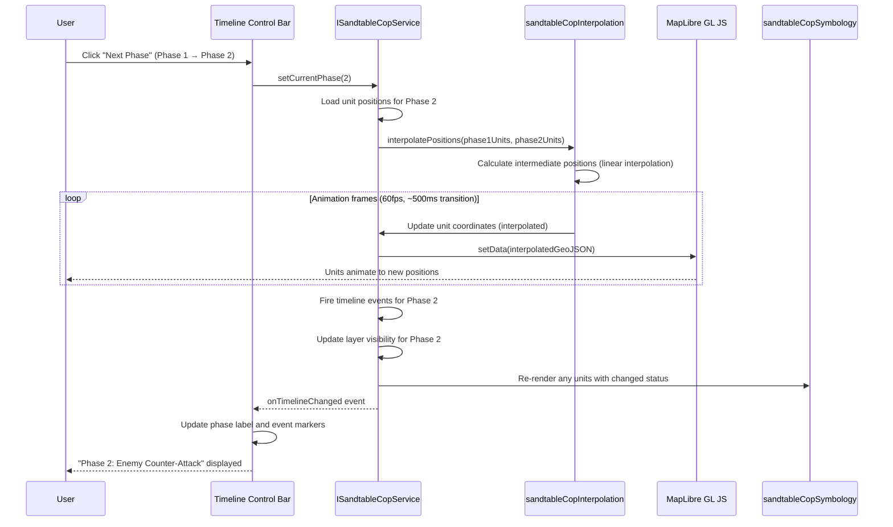

# Integrated Map & Common Operating Picture (COP) -- Technical Architecture

**Status:** Architecture & Implementation Plan
**Date:** 2026-02-08
**Primary Input:** [VISION.md](VISION.md)
**Parent Architecture:** [../../ARCHITECTURE.md](../../ARCHITECTURE.md)

---

## Table of Contents

1. [File Structure Map](#1-file-structure-map)
2. [Interface Definitions](#2-interface-definitions)
3. [Data Flow Diagrams](#3-data-flow-diagrams)
4. [Settings Schema](#4-settings-schema)
5. [New COP Agent Tools](#5-new-cop-agent-tools)
6. [EditorPane Integration Detail](#6-editorpane-integration-detail)
7. [MapLibre Initialization and Offline Asset Loading](#7-maplibre-initialization-and-offline-asset-loading)
8. [ORBAT Data Schema (Full Specification)](#8-orbat-data-schema-full-specification)
9. [Task Breakdown by COP Sub-Phase](#9-task-breakdown-by-cop-sub-phase)
10. [Registration and Wiring](#10-registration-and-wiring)

---

## External Dependencies

All libraries used by the COP feature, with license and loading method:

| npm Package | Version | License | Bundle Method | Purpose |
|-------------|---------|---------|---------------|---------|
| `maplibre-gl` | ^5.x | BSD-3-Clause | npm import, bundled by VS Code's webpack | Map renderer (WebGL vector tiles) |
| `pmtiles` | ^4.x | BSD-3-Clause | npm import, bundled | PMTiles protocol handler for offline tiles |
| `milsymbol` | ^3.x | MIT | npm import, bundled | MIL-STD-2525/APP-6 military symbol rendering |
| `@protomaps/basemaps` | ^4.x | BSD-3-Clause | npm import, bundled | MapLibre style generation (layers, flavors) |
| `maplibre-gl-draw` | ^2.x (birkskyum fork) | ISC | npm import, bundled | Drawing/annotation (points, lines, polygons) |
| `@turf/distance` | ^7.x | MIT | npm import, bundled | Haversine distance calculation |
| `@turf/bearing` | ^7.x | MIT | npm import, bundled | Bearing between coordinates |
| `@turf/area` | ^7.x | MIT | npm import, bundled | Polygon area calculation |
| `@turf/buffer` | ^7.x | MIT | npm import, bundled | Buffer zone generation |
| `@turf/boolean-point-in-polygon` | ^7.x | MIT | npm import, bundled | Point-in-polygon test |
| `@ngageoint/mgrs-js` | ^2.x | MIT | npm import, bundled | MGRS/UTM/lat-lon coordinate conversion |

**Static assets** (not npm -- downloaded and bundled separately):

| Asset | License | Location | Size |
|-------|---------|----------|------|
| Protomaps Noto Sans PBF font glyphs | SIL OFL 1.1 | `resources/cop-assets/fonts/` | ~30 MB |
| Protomaps sprite sheets (v4, light/dark, 1x/2x) | MIT | `resources/cop-assets/sprites/` | ~1 MB |
| Natural Earth low-zoom PMTiles (countries + coastlines) | Public Domain | `resources/cop-assets/natural-earth.pmtiles` | ~5-10 MB |

---

## 1. File Structure Map

Every new file that will be created, organized by COP sub-phase. Follows existing conventions: `sandtableCop*` prefix, `common/` for interfaces/types, `browser/` for UI implementations.

### COP Phase 1: Map Panel and Basic Interaction

```
src/vs/platform/cortex/
  common/
    copTypes.ts                           # ISandtableCopService, ISandtableCopState, ICopLayer, all COP types
    copConfiguration.ts                   # CopConfigKeys enum + settings registration (sandtable.cop.*)

src/vs/workbench/contrib/sandtableCop/
  browser/
    sandtableCop.contribution.ts          # Activity Bar icon, view container, commands, EditorPane + EditorInput + resolver
    sandtableCopInput.ts                  # SandtableCopInput (EditorInput with sandtable-cop:// URI)
    sandtableCopPage.ts                   # SandtableCopPage (EditorPane hosting MapLibre GL JS)
    sandtableCopMapRenderer.ts            # MapLibre initialization, PMTiles protocol, style generation, resize
    sandtableCopCoordinateDisplay.ts      # MGRS/lat-lon/UTM coordinate display widget
    sandtableCopLayerPanel.ts             # Layer management panel (toggle, opacity, ordering)
    sandtableCopDrawTools.ts              # maplibre-gl-draw integration and basic drawing toolbar
    sandtableCopService.ts                # ISandtableCopService browser implementation
    sandtableCop.css                      # COP panel styling (map container, toolbar, coordinate display)

resources/cop-assets/
  fonts/
    Noto Sans Regular/
      0-255.pbf
      256-511.pbf
      ...                                 # PBF glyph ranges (downloaded from protomaps/basemaps-assets)
    Noto Sans Medium/
      ...
    Noto Sans Italic/
      ...
  sprites/
    v4/
      light.png
      light.json
      light@2x.png
      light@2x.json
      dark.png
      dark.json
      dark@2x.png
      dark@2x.json
  natural-earth.pmtiles                   # Bundled low-zoom fallback basemap
```

### COP Phase 2: Military Symbology and ORBAT

```
src/vs/workbench/contrib/sandtableCop/
  browser/
    sandtableCopSymbology.ts              # milsymbol wrapper: SIDC → SVG → MapLibre image, symbol cache
    sandtableCopUnitPlacement.ts          # Unit placement dialog (symbol picker, properties form)
    sandtableCopOrbatTree.ts              # ORBAT tree view (hierarchical unit list in sidebar panel)
    sandtableCopUnitEditor.ts             # Unit properties editor (click unit → edit panel)
    sandtableCopOrbatIO.ts                # ORBAT import/export (JSON file read/write via IFileService)

src/vs/platform/cortex/
  common/
    copUnitTypes.ts                       # ICopUnit, ICopOrbat, ICopUnitProperties, SIDC helpers
```

### COP Phase 3: Agent Map Tools

```
src/vs/workbench/contrib/sandtableCop/
  browser/
    sandtableCopTools.ts                  # 7 COP tools registered with ILanguageModelToolsService
    sandtableCopSnapshot.ts               # Map snapshot capture (canvas → PNG data URI)
    sandtableCopQueryEngine.ts            # Query engine: filters, spatial queries, tiered summaries
```

### COP Phase 4: Scenario Timeline

```
src/vs/workbench/contrib/sandtableCop/
  browser/
    sandtableCopTimeline.ts               # Timeline control bar (phases, play/pause/step)
    sandtableCopTimelineRenderer.ts       # Timeline UI rendering (event markers, phase labels)
    sandtableCopInterpolation.ts          # Unit position interpolation between timeline phases

src/vs/platform/cortex/
  common/
    copScenarioTypes.ts                   # ICopScenario, ICopTimelineEvent, ICopPhase
```

### COP Phase 5: Intelligence Fusion and Advanced Features

```
src/vs/workbench/contrib/sandtableCop/
  browser/
    sandtableCopSpatialTools.ts           # Turf.js wrappers: distance, area, buffer, bearing
    sandtableCopFogOfWar.ts               # Fog of war controls per persona/role
    sandtableCopCoaComparison.ts          # COA overlay comparison view (toggle overlays by name)
    sandtableCopMilitaryDraw.ts           # Custom maplibre-gl-draw modes for tactical graphics
    sandtableCopAarReplay.ts              # After-action review mode (timeline + annotations)
```

---

## 2. Interface Definitions

All TypeScript interfaces defined in documentation form. These will be implemented as actual `.ts` files in `src/vs/platform/cortex/common/`.

### ISandtableCopService

The platform service that manages map state, ORBAT data, scenario layers, and timeline. This is the COP equivalent of `ICortexService`.

```typescript
// src/vs/platform/cortex/common/copTypes.ts

import { createDecorator } from 'vs/platform/instantiation/common/instantiation';
import { Event } from 'vs/base/common/event';
import { URI } from 'vs/base/common/uri';

export const ISandtableCopService = createDecorator<ISandtableCopService>('sandtableCopService');

export interface ISandtableCopService {
    readonly _serviceBrand: undefined;

    // --- State Events ---
    readonly onMapStateChanged: Event<ISandtableCopState>;
    readonly onOrbatChanged: Event<ICopOrbat>;
    readonly onLayersChanged: Event<ICopLayer[]>;
    readonly onTimelineChanged: Event<ICopTimelineEvent[]>;

    // --- Map State ---
    getMapState(): ISandtableCopState;
    setMapState(state: Partial<ISandtableCopState>): void;

    // --- Unit Management ---
    getUnits(filter?: ICopUnitFilter): ICopUnit[];
    getUnit(unitId: string): ICopUnit | undefined;
    addUnit(unit: ICopUnit): void;
    updateUnit(unitId: string, changes: Partial<ICopUnitProperties>): void;
    moveUnit(unitId: string, coordinates: [number, number]): void;
    removeUnit(unitId: string): void;

    // --- ORBAT ---
    getOrbat(): ICopOrbat;
    setOrbat(orbat: ICopOrbat): void;
    getOrbatSubtree(rootUnitId: string): ICopUnit[];

    // --- Layers ---
    getLayers(): ICopLayer[];
    getLayer(layerId: string): ICopLayer | undefined;
    addLayer(layer: ICopLayer): void;
    updateLayer(layerId: string, changes: Partial<ICopLayer>): void;
    removeLayer(layerId: string): void;
    setLayerVisibility(layerId: string, visible: boolean): void;
    setLayerOpacity(layerId: string, opacity: number): void;

    // --- Scenario ---
    getScenario(): ICopScenario | undefined;
    loadScenario(scenarioUri: URI): Promise<void>;
    saveScenario(scenarioUri: URI): Promise<void>;

    // --- Timeline ---
    getTimelineEvents(): ICopTimelineEvent[];
    addTimelineEvent(event: ICopTimelineEvent): void;
    removeTimelineEvent(eventId: string): void;
    getCurrentPhase(): number;
    setCurrentPhase(phase: number): void;
    getPhases(): ICopPhase[];

    // --- Query (for agent tools) ---
    queryMapSummary(): ICopMapSummary;
    queryUnitsFiltered(filter: ICopUnitFilter): ICopUnitSummary[];
    queryUnitDetail(unitId: string): ICopUnitDetail | undefined;
    querySpatial(query: ICopSpatialQuery): ICopSpatialResult;

    // --- Snapshot ---
    captureSnapshot(): Promise<string>;  // Returns PNG data URI

    // --- Persistence ---
    loadFromWorkspace(workspaceUri: URI): Promise<void>;
    saveToWorkspace(workspaceUri: URI): Promise<void>;

    // --- Annotations / Overlays ---
    getAnnotations(layerId?: string): ICopAnnotation[];
    addAnnotation(annotation: ICopAnnotation): void;
    removeAnnotation(annotationId: string): void;
}
```

### ISandtableCopState

Serializable map state (position, zoom, layers, active overlays).

```typescript
// src/vs/platform/cortex/common/copTypes.ts (continued)

export interface ISandtableCopState {
    /** Map center as [longitude, latitude] */
    center: [number, number];
    /** Current zoom level (0-22) */
    zoom: number;
    /** Map bearing/rotation in degrees (0 = north up) */
    bearing: number;
    /** Map pitch in degrees (0 = looking straight down) */
    pitch: number;
    /** Active basemap theme: 'light' | 'dark' | 'grayscale' | 'white' | 'black' */
    basemapTheme: CopBasemapTheme;
    /** Configured tile source (path or URL to .pmtiles file) */
    tileSource: string;
    /** Active layer IDs (visible layers) */
    visibleLayerIds: string[];
    /** Current scenario phase index */
    currentPhase: number;
    /** Whether MGRS grid overlay is shown */
    mgrsGridVisible: boolean;
    /** Coordinate display format preference */
    coordinateFormat: CopCoordinateFormat;
    /** Active drawing mode (null if not drawing) */
    activeDrawMode: string | null;
}

export type CopBasemapTheme = 'light' | 'dark' | 'grayscale' | 'white' | 'black';
export type CopCoordinateFormat = 'mgrs' | 'latlon' | 'utm';
export type CopSymbologyStandard = '2525C' | '2525D' | '2525E' | 'APP6B' | 'APP6D' | 'APP6E';
```

### ICopUnit

A unit on the map. Wraps a GeoJSON Feature with strongly-typed properties.

```typescript
// src/vs/platform/cortex/common/copUnitTypes.ts

export interface ICopUnit {
    /** Unique identifier (e.g., 'unit-001') */
    id: string;
    /** Position as [longitude, latitude] */
    coordinates: [number, number];
    /** Full unit properties */
    properties: ICopUnitProperties;
}

export interface ICopUnitProperties {
    /** Symbol Identification Code (MIL-STD-2525D 20-digit numeric or APP-6 string) */
    sidc: string;
    /** Unit designation (e.g., '2-7 IN') */
    designation: string;
    /** Full name (e.g., '2nd Battalion, 7th Infantry Regiment') */
    name: string;
    /** Affiliation category */
    affiliation: CopAffiliation;
    /** Echelon level */
    echelon: CopEchelon;
    /** Unit type (e.g., 'infantry', 'armor', 'artillery', 'logistics') */
    unitType: string;
    /** Personnel strength */
    strength: number;
    /** Operational status */
    status: CopUnitStatus;
    /** Commander name */
    commander: string;
    /** ID of the parent unit in the ORBAT hierarchy */
    higherFormation: string;
    /** Scenario phase this position applies to (for timeline keyframing) */
    scenarioPhase: number;
    /** Direction of movement in degrees (0-360, 0 = north) */
    directionOfMovement?: number;
    /** Speed in km/h */
    speed?: number;
    /** Free-text notes */
    notes: string;
    /** Layer this unit belongs to (e.g., 'friendly-orbat', 'enemy-orbat') */
    layerId: string;
    /** Additional text modifiers for milsymbol rendering */
    textModifiers?: Record<string, string>;
}

export type CopAffiliation = 'friendly' | 'hostile' | 'neutral' | 'unknown';

export type CopEchelon =
    | 'team' | 'squad' | 'section' | 'platoon'
    | 'company' | 'battalion' | 'regiment' | 'brigade'
    | 'division' | 'corps' | 'army' | 'army_group'
    | 'theater' | 'command';

export type CopUnitStatus =
    | 'operational' | 'degraded' | 'not_operational' | 'destroyed'
    | 'anticipated' | 'planned' | 'present' | 'fully_capable';
```

### ICopOrbat

The ORBAT hierarchy tree structure.

```typescript
// src/vs/platform/cortex/common/copUnitTypes.ts (continued)

export interface ICopOrbat {
    /** Display name for this ORBAT (e.g., 'Blue Force ORBAT') */
    name: string;
    /** Symbology standard used */
    standard: CopSymbologyStandard;
    /** Root unit IDs (top-level commands, e.g., ['unit-100']) */
    roots: string[];
    /** Hierarchy tree: maps unit ID → array of child unit IDs */
    tree: Record<string, string[]>;
}
```

### ICopScenario

A complete scenario (ORBAT + overlays + timeline + metadata).

```typescript
// src/vs/platform/cortex/common/copScenarioTypes.ts

export interface ICopScenario {
    /** Unique scenario identifier */
    id: string;
    /** Scenario name (e.g., 'Battle of 73 Easting') */
    name: string;
    /** Scenario description */
    description: string;
    /** Author or organization */
    author: string;
    /** Creation timestamp (ISO 8601) */
    createdAt: string;
    /** Last modification timestamp (ISO 8601) */
    updatedAt: string;
    /** Symbology standard for this scenario */
    symbologyStandard: CopSymbologyStandard;
    /** Map initial state */
    initialMapState: ISandtableCopState;
    /** All ORBATs (may have multiple sides) */
    orbats: ICopOrbat[];
    /** Layer definitions */
    layers: ICopLayer[];
    /** Timeline phases */
    phases: ICopPhase[];
    /** Timeline events */
    events: ICopTimelineEvent[];
    /** Scenario metadata (arbitrary key-value pairs) */
    metadata: Record<string, string>;
}
```

### ICopLayer

An overlay layer (friendly, enemy, intelligence, custom, etc.).

```typescript
// src/vs/platform/cortex/common/copTypes.ts (continued)

export interface ICopLayer {
    /** Unique layer identifier */
    id: string;
    /** Display name (e.g., 'Friendly ORBAT', 'Enemy ORBAT', 'Intelligence') */
    name: string;
    /** Layer type for categorization */
    type: CopLayerType;
    /** Whether this layer is currently visible */
    visible: boolean;
    /** Layer opacity (0.0 - 1.0) */
    opacity: number;
    /** Rendering order (lower = rendered first / below) */
    zIndex: number;
    /** Color associated with this layer (for UI indicators) */
    color: string;
    /** Whether units/annotations on this layer are editable */
    locked: boolean;
}

export type CopLayerType =
    | 'friendly-orbat'
    | 'enemy-orbat'
    | 'neutral-orbat'
    | 'terrain-analysis'
    | 'intelligence'
    | 'logistics'
    | 'fire-support'
    | 'communications'
    | 'annotation'
    | 'custom';
```

### ICopTimelineEvent

A timeline event (inject, decision, movement, fire).

```typescript
// src/vs/platform/cortex/common/copScenarioTypes.ts (continued)

export interface ICopTimelineEvent {
    /** Unique event identifier */
    id: string;
    /** Event name (e.g., 'Enemy counter-attack begins') */
    name: string;
    /** Detailed description */
    description: string;
    /** Event type */
    type: CopEventType;
    /** Phase index this event belongs to */
    phase: number;
    /** Relative time within the phase (e.g., minutes from phase start) */
    timeOffset: number;
    /** Unit IDs affected by this event */
    affectedUnitIds: string[];
    /** Layer ID this event is associated with */
    layerId?: string;
    /** Coordinates associated with this event (if spatial) */
    coordinates?: [number, number];
    /** Arbitrary event data */
    data: Record<string, unknown>;
}

export type CopEventType =
    | 'inject'        // Facilitator inject (new information)
    | 'decision'      // Decision point
    | 'movement'      // Unit movement
    | 'fire'          // Fire mission / engagement
    | 'intelligence'  // Intelligence report
    | 'logistics'     // Logistics event
    | 'communication' // Communications event
    | 'custom';       // User-defined

export interface ICopPhase {
    /** Phase index (0-based) */
    index: number;
    /** Phase name (e.g., 'Phase 1: Deployment') */
    name: string;
    /** Phase description */
    description: string;
    /** Duration in minutes (for playback) */
    durationMinutes: number;
}
```

### ICopAnnotation

Drawn annotations (tactical graphics, freeform shapes).

```typescript
// src/vs/platform/cortex/common/copTypes.ts (continued)

export interface ICopAnnotation {
    /** Unique annotation ID */
    id: string;
    /** Layer this annotation belongs to */
    layerId: string;
    /** Annotation type */
    type: CopAnnotationType;
    /** GeoJSON geometry (Point, LineString, Polygon) */
    geometry: GeoJSON.Geometry;
    /** Display properties */
    style: ICopAnnotationStyle;
    /** Label text */
    label: string;
    /** Military designation (e.g., 'PL ALPHA', 'OBJ WOLF', 'EA KILL') */
    militaryDesignation?: string;
    /** Phase this annotation belongs to */
    phase?: number;
}

export type CopAnnotationType =
    | 'phase-line'
    | 'axis-of-advance'
    | 'boundary'
    | 'engagement-area'
    | 'objective'
    | 'no-fire-area'
    | 'route'
    | 'freeform-line'
    | 'freeform-polygon'
    | 'freeform-point'
    | 'text-label';

export interface ICopAnnotationStyle {
    strokeColor: string;
    strokeWidth: number;
    strokeDash?: number[];
    fillColor?: string;
    fillOpacity?: number;
    iconSize?: number;
}
```

### Agent Query/Response Types

Types used by the COP service to produce tiered responses for agent tools.

```typescript
// src/vs/platform/cortex/common/copTypes.ts (continued)

export interface ICopUnitFilter {
    /** Filter by affiliation */
    affiliation?: CopAffiliation;
    /** Filter by echelon */
    echelon?: CopEchelon;
    /** Filter by layer ID */
    layerId?: string;
    /** Filter by bounding box [west, south, east, north] */
    bbox?: [number, number, number, number];
    /** Filter by MGRS grid zone (e.g., '38S') */
    mgrsZone?: string;
    /** Filter by unit type */
    unitType?: string;
    /** Filter by status */
    status?: CopUnitStatus;
    /** Filter by scenario phase */
    phase?: number;
}

/** High-level map summary (~200-500 tokens) */
export interface ICopMapSummary {
    center: { mgrs: string; latlon: [number, number] };
    zoom: number;
    basemapTheme: string;
    currentPhase: number;
    totalPhases: number;
    unitCounts: Record<CopAffiliation, number>;
    activeLayers: string[];
    annotationCount: number;
}

/** Filtered unit list entry (~50-100 tokens per unit) */
export interface ICopUnitSummary {
    id: string;
    designation: string;
    sidc: string;
    affiliation: CopAffiliation;
    echelon: CopEchelon;
    position: { mgrs: string; latlon: [number, number] };
    status: CopUnitStatus;
    layerId: string;
}

/** Full unit detail (~100-200 tokens) */
export interface ICopUnitDetail extends ICopUnitSummary {
    name: string;
    unitType: string;
    strength: number;
    commander: string;
    higherFormation: string;
    subordinates: string[];
    notes: string;
    directionOfMovement?: number;
    speed?: number;
    textModifiers: Record<string, string>;
}

export interface ICopSpatialQuery {
    type: 'distance' | 'bearing' | 'area' | 'buffer' | 'point-in-polygon' | 'units-in-radius';
    /** For distance/bearing: origin unit ID or coordinates */
    from?: string | [number, number];
    /** For distance/bearing: target unit ID or coordinates */
    to?: string | [number, number];
    /** For buffer/units-in-radius: center coordinates or unit ID */
    center?: string | [number, number];
    /** For buffer/units-in-radius: radius in kilometers */
    radiusKm?: number;
    /** For area: polygon coordinates */
    polygon?: [number, number][];
    /** For point-in-polygon: point to test */
    point?: [number, number];
}

export interface ICopSpatialResult {
    queryType: string;
    distanceKm?: number;
    bearingDeg?: number;
    areaKm2?: number;
    bufferPolygon?: GeoJSON.Polygon;
    unitsInRadius?: ICopUnitSummary[];
    pointInPolygon?: boolean;
}
```

---

## 3. Data Flow Diagrams

### 3.1 User Opens COP from Activity Bar



### 3.2 User Places a Unit on the Map



### 3.3 Agent Queries Map State via Tool Call



### 3.4 Agent Places a Unit via Tool Call



### 3.5 Scenario Timeline Advance



---

## 4. Settings Schema

All new settings registered under `sandtable.cop.*` in `cortexConfiguration.ts`, following the existing pattern.

```typescript
// Added to src/vs/platform/cortex/common/copConfiguration.ts
// (Separate file to keep cortexConfiguration.ts manageable)

export const enum CopConfigKeys {
    TileSource = 'sandtable.cop.tileSource',
    TileFallback = 'sandtable.cop.tileFallback',
    SymbologyStandard = 'sandtable.cop.symbologyStandard',
    DefaultCoordinateFormat = 'sandtable.cop.defaultCoordinateFormat',
    MgrsGridEnabled = 'sandtable.cop.mgrsGridEnabled',
    BasemapTheme = 'sandtable.cop.basemapTheme',
    DefaultCenter = 'sandtable.cop.defaultCenter',
    DefaultZoom = 'sandtable.cop.defaultZoom',
    UnitSymbolSize = 'sandtable.cop.unitSymbolSize',
    ShowCoordinateDisplay = 'sandtable.cop.showCoordinateDisplay',
    AutoSaveOrbat = 'sandtable.cop.autoSaveOrbat',
    AnimationDurationMs = 'sandtable.cop.animationDurationMs',
}
```

| Setting Key | Type | Default | Description |
|-------------|------|---------|-------------|
| `sandtable.cop.tileSource` | `string` | `''` | Path or URL to `.pmtiles` file. Supports workspace-relative paths (`./maps/region.pmtiles`), absolute paths (`/mnt/shared/maps/germany.pmtiles`), and HTTP URLs (`http://map-server.local:8080/tiles.pmtiles`). Empty uses bundled Natural Earth fallback. |
| `sandtable.cop.tileFallback` | `string` | `'bundled:natural-earth'` | Fallback tile source when primary is unavailable. `'bundled:natural-earth'` uses the bundled low-zoom world map. |
| `sandtable.cop.symbologyStandard` | `string` | `'2525D'` | Military symbology standard. Options: `'2525C'`, `'2525D'`, `'2525E'`, `'APP6B'`, `'APP6D'`, `'APP6E'`. Per-workspace setting. |
| `sandtable.cop.defaultCoordinateFormat` | `string` | `'mgrs'` | Default coordinate display format. Options: `'mgrs'`, `'latlon'`, `'utm'`. |
| `sandtable.cop.mgrsGridEnabled` | `boolean` | `false` | Show MGRS grid overlay on the map. |
| `sandtable.cop.basemapTheme` | `string` | `'light'` | Basemap color theme. Options: `'light'`, `'dark'`, `'grayscale'`, `'white'`, `'black'`. |
| `sandtable.cop.defaultCenter` | `string` | `'0,0'` | Default map center as `'longitude,latitude'` (e.g., `'44.366,33.315'` for Baghdad). |
| `sandtable.cop.defaultZoom` | `number` | `3` | Default map zoom level (0-22). |
| `sandtable.cop.unitSymbolSize` | `number` | `35` | Default milsymbol size in pixels. |
| `sandtable.cop.showCoordinateDisplay` | `boolean` | `true` | Show cursor coordinate display on the map. |
| `sandtable.cop.autoSaveOrbat` | `boolean` | `true` | Auto-save ORBAT changes to workspace files. |
| `sandtable.cop.animationDurationMs` | `number` | `500` | Duration of unit movement animations when advancing timeline phases (ms). |

---

## 5. New COP Agent Tools

Seven map-aware tools registered with `ILanguageModelToolsService`, following the exact pattern used by the existing 6 tools in `sandtableTools.ts`.

### 5.1 query_map_state

```typescript
const queryMapStateToolData: IToolData = {
    id: 'sandtable_query_map_state',
    source: SANDTABLE_TOOL_SOURCE,
    displayName: 'Query Map State',
    modelDescription: 'Query the current state of the Common Operating Picture (COP) map. Without filters, returns a high-level summary (unit counts, active layers, map center, scenario phase). With filters, returns a filtered list of units matching the criteria. Use this to understand the current tactical situation before making decisions.',
    inputSchema: {
        type: 'object',
        properties: {
            filter_affiliation: {
                type: 'string',
                enum: ['friendly', 'hostile', 'neutral', 'unknown'],
                description: 'Filter units by affiliation'
            },
            filter_echelon: {
                type: 'string',
                enum: ['team', 'squad', 'section', 'platoon', 'company', 'battalion', 'regiment', 'brigade', 'division', 'corps', 'army'],
                description: 'Filter units by echelon level'
            },
            filter_unit_type: {
                type: 'string',
                description: 'Filter by unit type (e.g., infantry, armor, artillery)'
            },
            filter_layer: {
                type: 'string',
                description: 'Filter by layer ID'
            },
            bbox_west: { type: 'number', description: 'Bounding box west longitude' },
            bbox_south: { type: 'number', description: 'Bounding box south latitude' },
            bbox_east: { type: 'number', description: 'Bounding box east longitude' },
            bbox_north: { type: 'number', description: 'Bounding box north latitude' },
        },
        required: [],
    },
    canBeReferencedInPrompt: true,
    runsInWorkspace: true,
};
```

**Return format (no filters — summary):**
```
COP Summary:
  Center: 38SMB4488306483 (44.3661°E, 33.3152°N)
  Zoom: 11 | Theme: light | Phase: 2 of 5
  Units: 45 friendly, 23 hostile, 3 neutral, 5 unknown
  Active layers: Friendly ORBAT, Enemy ORBAT, Intelligence
  Annotations: 12
```

**Return format (with filters — unit list):**
```
Hostile units (3 matching):
  1. 3rd Mech Bn | SIDC: 10061000161211000000 | BN | 38SMB4523 | operational
  2. 1st Tank Co  | SIDC: 10061000151211000000 | CO | 38SMB4627 | operational
  3. Recon Plt    | SIDC: 10061000141211000000 | PLT | 38SMB4831 | degraded
```

### 5.2 add_map_unit

```typescript
const addMapUnitToolData: IToolData = {
    id: 'sandtable_add_map_unit',
    source: SANDTABLE_TOOL_SOURCE,
    displayName: 'Add Map Unit',
    modelDescription: 'Place a new military unit on the COP map with MIL-STD-2525 symbology. Specify the unit designation, type, affiliation, echelon, and position (as MGRS grid reference or lat/lon). The unit will be rendered with the appropriate military symbol.',
    inputSchema: {
        type: 'object',
        properties: {
            designation: { type: 'string', description: 'Unit designation (e.g., "2-7 IN", "1st Mech Bn")' },
            name: { type: 'string', description: 'Full unit name (e.g., "2nd Battalion, 7th Infantry Regiment")' },
            unit_type: { type: 'string', description: 'Unit type: infantry, armor, artillery, engineer, logistics, reconnaissance, aviation, signal, medical, headquarters' },
            affiliation: { type: 'string', enum: ['friendly', 'hostile', 'neutral', 'unknown'], description: 'Unit affiliation' },
            echelon: { type: 'string', enum: ['team', 'squad', 'platoon', 'company', 'battalion', 'regiment', 'brigade', 'division', 'corps', 'army'], description: 'Echelon level' },
            position_mgrs: { type: 'string', description: 'Position as MGRS grid reference (e.g., "38SMB4488306483")' },
            position_lat: { type: 'number', description: 'Position latitude (alternative to MGRS)' },
            position_lon: { type: 'number', description: 'Position longitude (alternative to MGRS)' },
            layer: { type: 'string', description: 'Layer to place unit on (default: auto-detect from affiliation)' },
            higher_formation: { type: 'string', description: 'ID or designation of the parent unit' },
            strength: { type: 'integer', description: 'Personnel strength' },
            commander: { type: 'string', description: 'Commander name' },
            status: { type: 'string', enum: ['operational', 'degraded', 'not_operational', 'destroyed'], description: 'Unit status (default: operational)' },
        },
        required: ['designation', 'unit_type', 'affiliation', 'echelon'],
    },
    canBeReferencedInPrompt: true,
    runsInWorkspace: true,
};
```

### 5.3 move_map_unit

```typescript
const moveMapUnitToolData: IToolData = {
    id: 'sandtable_move_map_unit',
    source: SANDTABLE_TOOL_SOURCE,
    displayName: 'Move Map Unit',
    modelDescription: 'Move an existing unit to a new position on the COP map, or update its properties (status, strength, etc.). Identify the unit by its ID or designation.',
    inputSchema: {
        type: 'object',
        properties: {
            unit_id: { type: 'string', description: 'Unit ID (e.g., "unit-001")' },
            unit_designation: { type: 'string', description: 'Unit designation (alternative to ID, e.g., "2-7 IN")' },
            new_position_mgrs: { type: 'string', description: 'New position as MGRS grid reference' },
            new_position_lat: { type: 'number', description: 'New position latitude' },
            new_position_lon: { type: 'number', description: 'New position longitude' },
            new_status: { type: 'string', enum: ['operational', 'degraded', 'not_operational', 'destroyed'], description: 'Updated unit status' },
            new_strength: { type: 'integer', description: 'Updated personnel strength' },
            direction_of_movement: { type: 'number', description: 'Direction of movement in degrees (0-360)' },
            speed_kmh: { type: 'number', description: 'Speed in km/h' },
        },
        required: [],
    },
    canBeReferencedInPrompt: true,
    runsInWorkspace: true,
};
```

### 5.4 add_map_overlay

```typescript
const addMapOverlayToolData: IToolData = {
    id: 'sandtable_add_map_overlay',
    source: SANDTABLE_TOOL_SOURCE,
    displayName: 'Add Map Overlay',
    modelDescription: 'Add a named overlay to the COP map with tactical graphics (phase lines, axes of advance, boundaries, objectives, engagement areas, routes). Each graphic is specified as a type with coordinates. The overlay appears as a toggleable layer.',
    inputSchema: {
        type: 'object',
        properties: {
            name: { type: 'string', description: 'Overlay name (e.g., "Red COA-1: Northern Thrust")' },
            layer_type: { type: 'string', enum: ['annotation', 'custom'], description: 'Layer type (default: annotation)' },
            color: { type: 'string', description: 'Layer color (CSS color, default: auto from type)' },
            graphics: {
                type: 'array',
                description: 'Array of tactical graphics to add',
                items: {
                    type: 'object',
                    properties: {
                        type: { type: 'string', enum: ['phase-line', 'axis-of-advance', 'boundary', 'engagement-area', 'objective', 'no-fire-area', 'route', 'freeform-line', 'freeform-polygon', 'text-label'], description: 'Graphic type' },
                        designation: { type: 'string', description: 'Military designation (e.g., "PL ALPHA", "OBJ WOLF")' },
                        coordinates: { type: 'array', description: 'Array of [longitude, latitude] coordinate pairs', items: { type: 'array', items: { type: 'number' } } },
                    },
                    required: ['type', 'coordinates'],
                },
            },
        },
        required: ['name', 'graphics'],
    },
    canBeReferencedInPrompt: true,
    runsInWorkspace: true,
};
```

### 5.5 add_map_event

```typescript
const addMapEventToolData: IToolData = {
    id: 'sandtable_add_map_event',
    source: SANDTABLE_TOOL_SOURCE,
    displayName: 'Add Map Event',
    modelDescription: 'Add a timeline event to the scenario (inject, decision, movement, fire, intelligence). Events are associated with a phase and optionally with specific units and coordinates.',
    inputSchema: {
        type: 'object',
        properties: {
            name: { type: 'string', description: 'Event name (e.g., "Enemy counter-attack begins")' },
            description: { type: 'string', description: 'Detailed event description' },
            type: { type: 'string', enum: ['inject', 'decision', 'movement', 'fire', 'intelligence', 'logistics', 'communication', 'custom'], description: 'Event type' },
            phase: { type: 'integer', description: 'Phase index (0-based)' },
            time_offset_minutes: { type: 'number', description: 'Minutes from phase start' },
            affected_unit_ids: { type: 'array', items: { type: 'string' }, description: 'Unit IDs affected by this event' },
            coordinates_mgrs: { type: 'string', description: 'MGRS location of the event' },
            coordinates_lat: { type: 'number', description: 'Latitude of the event' },
            coordinates_lon: { type: 'number', description: 'Longitude of the event' },
        },
        required: ['name', 'type', 'phase'],
    },
    canBeReferencedInPrompt: true,
    runsInWorkspace: true,
};
```

### 5.6 capture_map_snapshot

```typescript
const captureMapSnapshotToolData: IToolData = {
    id: 'sandtable_capture_map_snapshot',
    source: SANDTABLE_TOOL_SOURCE,
    displayName: 'Capture Map Snapshot',
    modelDescription: 'Capture a screenshot of the current COP map view and save it as a PNG file in the workspace. Returns the file path. Useful for including map views in reports and after-action reviews.',
    inputSchema: {
        type: 'object',
        properties: {
            filename: { type: 'string', description: 'Output filename (default: map-snapshot-{timestamp}.png)' },
            include_units: { type: 'boolean', description: 'Include unit symbols in snapshot (default: true)' },
            include_annotations: { type: 'boolean', description: 'Include annotations/overlays (default: true)' },
        },
        required: [],
    },
    canBeReferencedInPrompt: true,
    runsInWorkspace: true,
};
```

### 5.7 query_spatial

```typescript
const querySpatialToolData: IToolData = {
    id: 'sandtable_query_spatial',
    source: SANDTABLE_TOOL_SOURCE,
    displayName: 'Query Spatial',
    modelDescription: 'Perform spatial calculations on the COP: measure distance between two points/units, calculate bearing, compute area of a polygon, find units within a radius, or check if a point is inside a polygon. Coordinates can be MGRS grid references or lat/lon.',
    inputSchema: {
        type: 'object',
        properties: {
            query_type: { type: 'string', enum: ['distance', 'bearing', 'area', 'units-in-radius', 'point-in-polygon'], description: 'Type of spatial query' },
            from_unit: { type: 'string', description: 'Origin unit ID or designation (for distance/bearing)' },
            from_mgrs: { type: 'string', description: 'Origin MGRS grid reference (for distance/bearing)' },
            from_lat: { type: 'number', description: 'Origin latitude' },
            from_lon: { type: 'number', description: 'Origin longitude' },
            to_unit: { type: 'string', description: 'Target unit ID or designation (for distance/bearing)' },
            to_mgrs: { type: 'string', description: 'Target MGRS grid reference (for distance/bearing)' },
            to_lat: { type: 'number', description: 'Target latitude' },
            to_lon: { type: 'number', description: 'Target longitude' },
            radius_km: { type: 'number', description: 'Radius in kilometers (for units-in-radius)' },
            center_mgrs: { type: 'string', description: 'Center MGRS (for units-in-radius)' },
            polygon_coords: { type: 'array', description: 'Polygon coordinates as [[lon,lat], ...] (for area/point-in-polygon)', items: { type: 'array', items: { type: 'number' } } },
            point_mgrs: { type: 'string', description: 'Point MGRS to test (for point-in-polygon)' },
        },
        required: ['query_type'],
    },
    canBeReferencedInPrompt: true,
    runsInWorkspace: true,
};
```

**Return format examples:**

```
Distance: 12.4 km (6.7 nautical miles)
Bearing: 047° (NE)
From: 2-7 IN at 38SMB4488306483
To: 1st Tank Co at 38SMB4523307100
```

```
Units within 15 km of 38SMB4488306483:
  1. 2-7 IN (friendly, BN) — 0.0 km
  2. 3-7 IN (friendly, BN) — 4.2 km, bearing 090°
  3. 1st Mech Bn (hostile, BN) — 11.8 km, bearing 315°
```

---

## 6. EditorPane Integration Detail

### 6.1 SandtableCopInput (EditorInput)

Follows the exact pattern of `SandtableSettingsInput`. Uses a virtual URI scheme `sandtable-cop://` with no backing file.

```typescript
// src/vs/workbench/contrib/sandtableCop/browser/sandtableCopInput.ts

export const sandtableCopInputTypeId = 'sandtable.copEditor';

export class SandtableCopInput extends EditorInput {
    static readonly ID = sandtableCopInputTypeId;
    static readonly RESOURCE = URI.from({ scheme: 'sandtable-cop', authority: 'map' });

    override get typeId(): string { return SandtableCopInput.ID; }
    override get editorId(): string | undefined { return this.typeId; }

    toUntyped(): IUntypedEditorInput {
        return {
            resource: SandtableCopInput.RESOURCE,
            options: { override: SandtableCopInput.ID, pinned: true }
        };
    }

    get resource(): URI | undefined { return SandtableCopInput.RESOURCE; }

    override matches(other: EditorInput | IUntypedEditorInput): boolean {
        if (super.matches(other)) return true;
        return other instanceof SandtableCopInput;
    }

    override getName(): string { return 'Common Operating Picture'; }
    override getIcon(): ThemeIcon | undefined { return Codicon.globe; }
}
```

**Key differences from SandtableSettingsInput:**
- URI scheme is `sandtable-cop` (not `sandtable`)
- Tab is pinned by default (`pinned: true`) since the map is a long-lived workspace artifact
- Icon is `$(globe)` (not `$(settings-gear)`)

### 6.2 SandtableCopPage (EditorPane)

The main EditorPane hosting MapLibre GL JS. DOM structure:

```
<div class="sandtable-cop">                        <!-- Root container (fills editor area) -->
  <div class="sandtable-cop-toolbar">              <!-- Top toolbar -->
    <div class="sandtable-cop-toolbar-left">
      <button class="cop-btn" title="Draw">$(edit)</button>
      <button class="cop-btn" title="Layers">$(layers)</button>
      <button class="cop-btn" title="ORBAT">$(list-tree)</button>
    </div>
    <div class="sandtable-cop-toolbar-center">
      <span class="cop-phase-label">Phase 2: Deployment</span>
    </div>
    <div class="sandtable-cop-toolbar-right">
      <select class="cop-basemap-picker">...</select>
      <button class="cop-btn" title="MGRS Grid">$(symbol-ruler)</button>
    </div>
  </div>
  <div class="sandtable-cop-body">                 <!-- Main body (map + optional sidebars) -->
    <div class="sandtable-cop-sidebar-left">       <!-- ORBAT tree sidebar (collapsible) -->
      <!-- Rendered by sandtableCopOrbatTree.ts -->
    </div>
    <div class="sandtable-cop-map-container">      <!-- Map takes remaining space -->
      <div id="cop-map"></div>                     <!-- MapLibre attaches here -->
      <div class="cop-coordinate-display">         <!-- Bottom-left coordinate readout -->
        <span class="cop-coord-mgrs">38SMB4488306483</span>
        <span class="cop-coord-latlon">33.3152°N, 44.3661°E</span>
      </div>
    </div>
    <div class="sandtable-cop-sidebar-right">      <!-- Layer panel sidebar (collapsible) -->
      <!-- Rendered by sandtableCopLayerPanel.ts -->
    </div>
  </div>
  <div class="sandtable-cop-timeline">             <!-- Bottom timeline bar (COP Phase 4) -->
    <!-- Rendered by sandtableCopTimeline.ts -->
  </div>
</div>
```

**Resize handling:**

```typescript
// In SandtableCopPage.layout()
override layout(dimension: Dimension): void {
    super.layout(dimension);
    // MapLibre needs explicit resize notification when container dimensions change
    if (this._map) {
        this._map.resize();
    }
}
```

MapLibre's `map.resize()` must be called whenever the EditorPane is resized (split view changes, sidebar toggle, window resize). The `layout()` method of `EditorPane` is called automatically by VS Code's layout system.

### 6.3 SandtableCopEditorResolver

Maps `sandtable-cop://` URIs to `SandtableCopInput`. Same pattern as `SandtableSettingsEditorResolverContribution`:

```typescript
// In sandtableCop.contribution.ts
this._register(editorResolverService.registerEditor(
    `${SandtableCopInput.RESOURCE.scheme}:/**`,
    {
        id: SandtableCopInput.ID,
        label: 'Common Operating Picture',
        priority: RegisteredEditorPriority.builtin,
    },
    {
        singlePerResource: true,
        canSupportResource: uri => uri.scheme === SandtableCopInput.RESOURCE.scheme,
    },
    {
        createEditorInput: ({ options }) => ({
            editor: this.instantiationService.createInstance(SandtableCopInput),
            options: { ...options, pinned: true }
        })
    }
));
```

### 6.4 Activity Bar Icon and View Container

```typescript
// In sandtableCop.contribution.ts

// View container registration for the COP sidebar (ORBAT tree, layer controls)
const COP_VIEW_CONTAINER_ID = 'workbench.view.sandtableCop';

const viewContainerRegistry = Registry.as<IViewContainersRegistry>(ViewExtensions.ViewContainersRegistry);
const copViewContainer = viewContainerRegistry.registerViewContainer({
    id: COP_VIEW_CONTAINER_ID,
    title: 'Common Operating Picture',
    ctorDescriptor: new SyncDescriptor(ViewPaneContainer),
    icon: Codicon.globe,
    order: 0,  // Position at top of Activity Bar
    hideIfEmpty: false,
}, ViewContainerLocation.Sidebar, { doNotRegisterOpenCommand: true });

// Register ORBAT tree view inside the COP view container
const viewsRegistry = Registry.as<IViewsRegistry>(ViewExtensions.ViewsRegistry);
viewsRegistry.registerViews([{
    id: 'sandtableCop.orbatTree',
    name: 'Order of Battle',
    ctorDescriptor: new SyncDescriptor(SandtableCopOrbatTreeViewPane),
    containerIcon: Codicon.listTree,
    canToggleVisibility: true,
    canMoveView: true,
    order: 1,
}], copViewContainer);
```

**Activity Bar click behavior:**
1. If no COP tab is open → opens a new COP editor tab
2. If a COP tab is already open → switches to it
3. The Activity Bar icon also toggles the COP sidebar (ORBAT tree, layers) in the left panel

### 6.5 ORBAT Tree Sidebar

The ORBAT tree renders as a `ViewPane` inside the COP view container. It uses a tree widget (VS Code's `WorkbenchAsyncDataTree`) to display the unit hierarchy:

```
▼ 🔵 I Corps (unit-100)
  ▼ 🔵 1st Brigade (unit-010)
    ▼ 🔵 2-7 IN (unit-001) — BN, Infantry, Operational
      🔵 A Co, 2-7 IN (unit-001a) — CO
      🔵 B Co, 2-7 IN (unit-001b) — CO
    🔵 3-7 IN (unit-002) — BN, Infantry
    🔵 1-17 AR (unit-003) — BN, Armor
  ▼ 🔵 2nd Brigade (unit-020)
    ...
```

Clicking a unit in the tree:
- Highlights the unit on the map (zoom/pan to it)
- Opens the unit properties editor panel

Clicking a unit on the map:
- Highlights it in the ORBAT tree
- Opens the unit properties editor panel

This bidirectional selection is managed by `ISandtableCopService` events.

---

## 7. MapLibre Initialization and Offline Asset Loading

### 7.1 PMTiles Protocol Registration

The PMTiles protocol is registered once in the Electron renderer process when the COP EditorPane initializes:

```typescript
// src/vs/workbench/contrib/sandtableCop/browser/sandtableCopMapRenderer.ts

import { Protocol } from 'pmtiles';
import maplibregl from 'maplibre-gl';

// Register PMTiles protocol handler (once globally)
let pmtilesProtocolRegistered = false;

function ensurePmtilesProtocol(): void {
    if (pmtilesProtocolRegistered) return;
    const protocol = new Protocol();
    maplibregl.addProtocol('pmtiles', protocol.tile);
    pmtilesProtocolRegistered = true;
}
```

**Tile source resolution:**

The `sandtable.cop.tileSource` setting value is resolved into a `pmtiles://` URL:

| Setting Value | Resolution | pmtiles:// URL |
|---------------|------------|----------------|
| `./maps/exercise.pmtiles` | Workspace-relative | `pmtiles://file:///workspace/path/maps/exercise.pmtiles` |
| `/mnt/shared/maps/germany.pmtiles` | Absolute path | `pmtiles://file:///mnt/shared/maps/germany.pmtiles` |
| `http://map-server:8080/tiles.pmtiles` | HTTP URL | `pmtiles://http://map-server:8080/tiles.pmtiles` |
| `` (empty) | Bundled fallback | `pmtiles://file:///app/resources/cop-assets/natural-earth.pmtiles` |

In Electron, `file://` URIs work directly for local filesystem access. PMTiles uses HTTP Range Requests internally, which Chromium's `file://` protocol handler supports for local files.

### 7.2 Local Font and Sprite Path Resolution

Fonts and sprites are bundled in the Electron app's `resources/cop-assets/` directory. The path is resolved at runtime:

```typescript
// In sandtableCopMapRenderer.ts

function getCopAssetsPath(): string {
    // In Electron, app resources are at:
    //   development: {workspaceRoot}/resources/cop-assets
    //   packaged:    {app.getPath('exe')}/../resources/cop-assets
    // The INativeEnvironmentService provides the app root path
    const appRoot = this.environmentService.appRoot;
    return join(appRoot, 'resources', 'cop-assets');
}

function buildGlyphsUrl(): string {
    const assetsPath = getCopAssetsPath();
    // MapLibre glyphs URL template: {fontstack} and {range} are replaced by MapLibre
    return `file://${assetsPath}/fonts/{fontstack}/{range}.pbf`;
}

function buildSpriteUrl(theme: CopBasemapTheme): string {
    const assetsPath = getCopAssetsPath();
    // MapLibre sprite URL: MapLibre appends .json and .png automatically
    return `file://${assetsPath}/sprites/v4/${theme}`;
}
```

**Font stack:** Noto Sans Regular, Noto Sans Medium, Noto Sans Italic. MapLibre's `{fontstack}` template is resolved to the directory name (e.g., `Noto Sans Regular`). Each directory contains PBF files named by Unicode range (e.g., `0-255.pbf`, `256-511.pbf`).

### 7.3 MapLibre Style Construction

The full MapLibre style JSON is constructed programmatically using `@protomaps/basemaps`:

```typescript
// src/vs/workbench/contrib/sandtableCop/browser/sandtableCopMapRenderer.ts

import { layers, namedFlavor } from '@protomaps/basemaps';

function buildMapStyle(
    tileSourceUrl: string,
    theme: CopBasemapTheme,
    glyphsUrl: string,
    spriteUrl: string,
): maplibregl.StyleSpecification {
    return {
        version: 8,
        glyphs: glyphsUrl,
        sprite: spriteUrl,
        sources: {
            basemap: {
                type: 'vector',
                url: tileSourceUrl,   // e.g., 'pmtiles://file:///path/to/tiles.pmtiles'
                attribution: '© <a href="https://openstreetmap.org/copyright">OpenStreetMap</a>',
            },
        },
        layers: layers('basemap', namedFlavor(theme), { lang: 'en' }),
    };
}
```

**Additional sources added after map initialization:**

```typescript
// Unit positions GeoJSON source (added in map 'load' event)
map.addSource('cop-units', {
    type: 'geojson',
    data: { type: 'FeatureCollection', features: [] },
});

// Unit symbol layer
map.addLayer({
    id: 'cop-units-layer',
    type: 'symbol',
    source: 'cop-units',
    layout: {
        'icon-image': ['get', 'iconImageId'],   // Each feature references its pre-loaded icon
        'icon-size': 1.0,
        'icon-allow-overlap': true,
        'icon-ignore-placement': true,
        'text-field': ['get', 'designation'],
        'text-font': ['Noto Sans Regular'],
        'text-size': 10,
        'text-offset': [0, 1.5],
        'text-anchor': 'top',
    },
    paint: {
        'text-color': '#333333',
        'text-halo-color': '#ffffff',
        'text-halo-width': 1,
    },
});

// Annotations GeoJSON source
map.addSource('cop-annotations', {
    type: 'geojson',
    data: { type: 'FeatureCollection', features: [] },
});
```

### 7.4 milsymbol SVG → MapLibre Image Pipeline

milsymbol generates SVG strings that must be converted to images MapLibre can render in its WebGL symbol layer.

```typescript
// src/vs/workbench/contrib/sandtableCop/browser/sandtableCopSymbology.ts

import ms from 'milsymbol';

/** Cache of generated symbol images to avoid re-rendering */
const symbolImageCache = new Map<string, HTMLImageElement>();

/**
 * Generate a MapLibre-compatible image from a SIDC code.
 * Returns the image ID used in the symbol layer's icon-image property.
 */
async function generateSymbolImage(
    map: maplibregl.Map,
    sidc: string,
    options: {
        size?: number;
        uniqueDesignation?: string;
        higherFormation?: string;
    } = {},
): Promise<string> {
    const cacheKey = `${sidc}-${options.size ?? 35}-${options.uniqueDesignation ?? ''}`;

    if (symbolImageCache.has(cacheKey) && map.hasImage(cacheKey)) {
        return cacheKey;
    }

    const symbol = new ms.Symbol(sidc, {
        size: options.size ?? 35,
        uniqueDesignation: options.uniqueDesignation,
        higherFormation: options.higherFormation,
    });

    const svgString = symbol.asSVG();
    const svgDataUri = 'data:image/svg+xml;charset=utf-8,' + encodeURIComponent(svgString);

    // Convert SVG data URI to HTMLImageElement
    const img = new Image();
    await new Promise<void>((resolve, reject) => {
        img.onload = () => resolve();
        img.onerror = (e) => reject(e);
        img.src = svgDataUri;
    });

    // Add to MapLibre's image registry
    if (!map.hasImage(cacheKey)) {
        map.addImage(cacheKey, img);
    }

    symbolImageCache.set(cacheKey, img);
    return cacheKey;
}
```

**Symbol size and anchor:** milsymbol's `asSVG()` output includes an anchor point (the symbol's center). The `symbol.getAnchor()` method returns `{ x, y }` coordinates for the anchor within the SVG. When adding to MapLibre, the symbol layer's `icon-anchor` property should be set to `'center'`, and the SVG viewBox is already centered by milsymbol.

### 7.5 CSP Modifications

MapLibre GL JS requires WebGL shader compilation. In VS Code's Electron renderer, the Content Security Policy may need modification.

**Specific directives needed:**

```
script-src: 'unsafe-eval'     -- Only if MapLibre uses eval() for expression parsing (unlikely in v5+)
worker-src: blob:              -- MapLibre uses Web Workers for tile parsing
child-src: blob:               -- Alternative worker directive
img-src: data: blob: file:     -- For milsymbol SVG data URIs and local tile images
connect-src: file: http:       -- For PMTiles file:// and http:// tile fetches
```

**Implementation approach:**

1. **Test first.** Initialize MapLibre in the EditorPane DOM and verify if WebGL works without CSP changes. Electron's Chromium renderer may already have relaxed CSP compared to a web browser context.

2. **If CSP blocks WebGL:** Modify the workbench's CSP meta tag in `src/vs/code/browser/workbench/workbench.html` (or the Electron equivalent) to add the necessary directives. Since Sandtable is a controlled fork running in an air-gapped environment, the security tradeoff is minimal.

3. **Fallback:** If direct DOM rendering is problematic, embed MapLibre in a sandboxed `<iframe>` within the EditorPane with its own relaxed CSP. Communication uses `postMessage`. This adds complexity but fully isolates the map's security context.

**Files to modify for CSP:**
- `src/vs/code/electron-sandbox/workbench/workbench.html` — Electron renderer CSP meta tag
- `src/vs/workbench/workbench.web.main.ts` — If web target is ever needed

### 7.6 MGRS Grid Overlay

```typescript
// src/vs/workbench/contrib/sandtableCop/browser/sandtableCopCoordinateDisplay.ts

import { MGRS } from '@ngageoint/mgrs-js';

/**
 * Convert lat/lon to MGRS string at specified precision
 * Precision: 0=GZD (e.g., 38S), 1=100km, 2=10km, 3=1km, 4=100m, 5=10m, 6=1m
 */
function toMGRS(lat: number, lon: number, precision: number = 5): string {
    const mgrsPoint = MGRS.from(MGRS.toPoint(lon, lat));
    return mgrsPoint.coordinate(precision);
}

/**
 * Convert MGRS string to [longitude, latitude]
 */
function fromMGRS(mgrs: string): [number, number] {
    const point = MGRS.parse(mgrs).toPoint();
    return [point.getLongitude(), point.getLatitude()];
}
```

The MGRS grid overlay is rendered as a MapLibre source/layer that computes grid lines based on the current zoom level and viewport bounds. At low zoom, only Grid Zone Designators (100km squares) are shown. At high zoom, the grid subdivides to 1km or 100m squares.

---

## 8. ORBAT Data Schema (Full Specification)

### 8.1 orbat.geojson (Unit Positions)

A GeoJSON `FeatureCollection` containing all unit positions. This file is directly renderable by MapLibre as a GeoJSON source.

```json
{
  "$schema": "http://json-schema.org/draft-07/schema#",
  "title": "COP ORBAT GeoJSON",
  "description": "Unit positions as GeoJSON FeatureCollection for the Sandtable Common Operating Picture",
  "type": "object",
  "required": ["type", "features"],
  "properties": {
    "type": { "const": "FeatureCollection" },
    "features": {
      "type": "array",
      "items": {
        "type": "object",
        "required": ["type", "id", "geometry", "properties"],
        "properties": {
          "type": { "const": "Feature" },
          "id": {
            "type": "string",
            "pattern": "^unit-[a-zA-Z0-9-]+$",
            "description": "Unique unit identifier (e.g., 'unit-001')"
          },
          "geometry": {
            "type": "object",
            "required": ["type", "coordinates"],
            "properties": {
              "type": { "const": "Point" },
              "coordinates": {
                "type": "array",
                "items": { "type": "number" },
                "minItems": 2,
                "maxItems": 2,
                "description": "[longitude, latitude] in WGS84"
              }
            }
          },
          "properties": {
            "type": "object",
            "required": ["sidc", "designation", "name", "affiliation", "echelon", "unitType", "status", "layerId"],
            "properties": {
              "sidc": {
                "type": "string",
                "description": "Symbol Identification Code (MIL-STD-2525D 20-char numeric or APP-6 alphanumeric)"
              },
              "designation": { "type": "string", "description": "Short unit designation (e.g., '2-7 IN')" },
              "name": { "type": "string", "description": "Full unit name" },
              "affiliation": { "type": "string", "enum": ["friendly", "hostile", "neutral", "unknown"] },
              "echelon": {
                "type": "string",
                "enum": ["team", "squad", "section", "platoon", "company", "battalion", "regiment", "brigade", "division", "corps", "army", "army_group", "theater", "command"]
              },
              "unitType": { "type": "string", "description": "e.g., infantry, armor, artillery, engineer" },
              "strength": { "type": "integer", "minimum": 0 },
              "status": { "type": "string", "enum": ["operational", "degraded", "not_operational", "destroyed", "anticipated", "planned", "present", "fully_capable"] },
              "commander": { "type": "string" },
              "higherFormation": { "type": "string", "description": "ID of parent unit" },
              "scenarioPhase": { "type": "integer", "minimum": 0 },
              "directionOfMovement": { "type": "number", "minimum": 0, "maximum": 360 },
              "speed": { "type": "number", "minimum": 0, "description": "km/h" },
              "notes": { "type": "string" },
              "layerId": { "type": "string" },
              "textModifiers": { "type": "object", "additionalProperties": { "type": "string" } },
              "iconImageId": { "type": "string", "description": "MapLibre image ID (computed at render time, not stored)" }
            }
          }
        }
      }
    }
  }
}
```

**Example file:**

```json
{
  "type": "FeatureCollection",
  "features": [
    {
      "type": "Feature",
      "id": "unit-001",
      "geometry": { "type": "Point", "coordinates": [44.3661, 33.3152] },
      "properties": {
        "sidc": "10031000161211000000",
        "designation": "2-7 IN",
        "name": "2nd Battalion, 7th Infantry Regiment",
        "affiliation": "friendly",
        "echelon": "battalion",
        "unitType": "infantry",
        "strength": 800,
        "status": "operational",
        "commander": "LTC Smith",
        "higherFormation": "unit-010",
        "scenarioPhase": 1,
        "notes": "",
        "layerId": "friendly-orbat"
      }
    }
  ]
}
```

### 8.2 orbat-tree.json (Hierarchy Structure)

```json
{
  "$schema": "http://json-schema.org/draft-07/schema#",
  "title": "COP ORBAT Hierarchy Tree",
  "description": "Hierarchical structure of unit subordination relationships",
  "type": "object",
  "required": ["name", "standard", "roots", "tree"],
  "properties": {
    "name": { "type": "string", "description": "ORBAT name (e.g., 'Blue Force ORBAT')" },
    "standard": { "type": "string", "enum": ["2525C", "2525D", "2525E", "APP6B", "APP6D", "APP6E"] },
    "roots": {
      "type": "array",
      "items": { "type": "string" },
      "description": "Root unit IDs (top-level commands)"
    },
    "tree": {
      "type": "object",
      "additionalProperties": {
        "type": "array",
        "items": { "type": "string" },
        "description": "Array of child unit IDs"
      },
      "description": "Maps each unit ID to its direct children"
    }
  }
}
```

### 8.3 scenario.json (Scenario Definition)

```json
{
  "$schema": "http://json-schema.org/draft-07/schema#",
  "title": "COP Scenario Definition",
  "description": "Complete scenario with metadata, phases, events, layers, and ORBAT references",
  "type": "object",
  "required": ["id", "name", "symbologyStandard", "initialMapState", "layers", "phases"],
  "properties": {
    "id": { "type": "string" },
    "name": { "type": "string" },
    "description": { "type": "string" },
    "author": { "type": "string" },
    "createdAt": { "type": "string", "format": "date-time" },
    "updatedAt": { "type": "string", "format": "date-time" },
    "symbologyStandard": { "type": "string", "enum": ["2525C", "2525D", "2525E", "APP6B", "APP6D", "APP6E"] },
    "initialMapState": {
      "type": "object",
      "properties": {
        "center": { "type": "array", "items": { "type": "number" }, "minItems": 2, "maxItems": 2 },
        "zoom": { "type": "number" },
        "bearing": { "type": "number" },
        "pitch": { "type": "number" },
        "basemapTheme": { "type": "string" }
      }
    },
    "orbatFiles": {
      "type": "array",
      "items": { "type": "string" },
      "description": "Relative paths to orbat.geojson and orbat-tree.json files"
    },
    "layers": {
      "type": "array",
      "items": {
        "type": "object",
        "required": ["id", "name", "type"],
        "properties": {
          "id": { "type": "string" },
          "name": { "type": "string" },
          "type": { "type": "string", "enum": ["friendly-orbat", "enemy-orbat", "neutral-orbat", "terrain-analysis", "intelligence", "logistics", "fire-support", "communications", "annotation", "custom"] },
          "visible": { "type": "boolean", "default": true },
          "opacity": { "type": "number", "default": 1.0 },
          "zIndex": { "type": "integer" },
          "color": { "type": "string" },
          "locked": { "type": "boolean", "default": false }
        }
      }
    },
    "phases": {
      "type": "array",
      "items": {
        "type": "object",
        "required": ["index", "name"],
        "properties": {
          "index": { "type": "integer" },
          "name": { "type": "string" },
          "description": { "type": "string" },
          "durationMinutes": { "type": "number" }
        }
      }
    },
    "events": {
      "type": "array",
      "items": {
        "type": "object",
        "required": ["id", "name", "type", "phase"],
        "properties": {
          "id": { "type": "string" },
          "name": { "type": "string" },
          "description": { "type": "string" },
          "type": { "type": "string", "enum": ["inject", "decision", "movement", "fire", "intelligence", "logistics", "communication", "custom"] },
          "phase": { "type": "integer" },
          "timeOffset": { "type": "number" },
          "affectedUnitIds": { "type": "array", "items": { "type": "string" } },
          "coordinates": { "type": "array", "items": { "type": "number" } },
          "data": { "type": "object" }
        }
      }
    },
    "metadata": { "type": "object", "additionalProperties": { "type": "string" } }
  }
}
```

**Workspace file layout for a scenario:**

```
my-workspace/
  .sandtable/
    cop/
      scenario.json           # Scenario definition
      orbat.geojson           # Unit positions (GeoJSON)
      orbat-tree.json         # ORBAT hierarchy
      annotations.geojson     # Drawn annotations (GeoJSON)
      snapshots/              # Captured map screenshots
        map-snapshot-001.png
  maps/
    exercise-area.pmtiles     # Regional tile data (user-provided)
  documents/
    scenario-brief.md
    intelligence-reports/
```

---

## 9. Task Breakdown by COP Sub-Phase

### COP Phase 1: Map Panel and Basic Interaction

#### 1.1 Platform Types and Service Interface

- [ ] Create `src/vs/platform/cortex/common/copTypes.ts`
  - Define `ISandtableCopService` interface with `createDecorator`
  - Define `ISandtableCopState`, `ICopLayer`, `ICopAnnotation` types
  - Define `ICopUnitFilter`, `ICopMapSummary`, `ICopSpatialQuery`, `ICopSpatialResult`
  - Define all enums: `CopBasemapTheme`, `CopCoordinateFormat`, `CopLayerType`, etc.
- [ ] Create `src/vs/platform/cortex/common/copConfiguration.ts`
  - Define `CopConfigKeys` enum
  - Register all `sandtable.cop.*` settings with `configurationRegistry`
  - Import and re-export from `cortexConfiguration.ts` (or register in its own configuration block)
- [ ] `npm run compile` passes with 0 errors

#### 1.2 npm Dependencies

- [ ] `npm install maplibre-gl` (BSD-3-Clause)
- [ ] `npm install pmtiles` (BSD-3-Clause)
- [ ] `npm install @protomaps/basemaps` (BSD-3-Clause)
- [ ] `npm install @ngageoint/mgrs-js` (MIT)
- [ ] Verify all packages appear in `package.json` with correct versions
- [ ] `npm run compile` passes with 0 errors

#### 1.3 Static Asset Bundling

- [ ] Download Protomaps basemaps-assets fonts (Noto Sans Regular/Medium/Italic PBF files)
- [ ] Download Protomaps basemaps-assets sprites (v4, light/dark, 1x/2x)
- [ ] Generate Natural Earth low-zoom PMTiles fallback (via Tilemaker or download pre-built)
- [ ] Place all assets in `resources/cop-assets/` with correct directory structure
- [ ] Verify font PBF files load from `file://` path in a test HTML page

#### 1.4 EditorPane Registration

- [ ] Create `src/vs/workbench/contrib/sandtableCop/browser/sandtableCopInput.ts`
  - `SandtableCopInput` class extending `EditorInput`
  - URI scheme: `sandtable-cop://map`
  - Icon: `Codicon.globe`
  - Singleton behavior via `matches()`
- [ ] Create `src/vs/workbench/contrib/sandtableCop/browser/sandtableCopPage.ts`
  - `SandtableCopPage` class extending `EditorPane`
  - `createEditor()`: build DOM structure (toolbar, map container, coordinate display)
  - `layout()`: call `map.resize()` on dimension change
  - `setInput()`: initialize or update map when input is set
  - `dispose()`: clean up MapLibre instance and event listeners
- [ ] Create `src/vs/workbench/contrib/sandtableCop/browser/sandtableCop.contribution.ts`
  - Register `EditorPane` with `EditorPaneDescriptor.create()`
  - Register `EditorSerializer` for tab persistence
  - Register `EditorResolver` for `sandtable-cop://` URI scheme
  - Register `sandtable.cop.openMap` command
  - Register Activity Bar view container with globe icon
  - Register menu entry in Command Palette
- [ ] Create `src/vs/workbench/contrib/sandtableCop/browser/sandtableCop.css`
  - Map container fills available space (`flex: 1; position: relative;`)
  - Toolbar styling
  - Coordinate display overlay positioning
- [ ] `npm run compile` passes with 0 errors

#### 1.5 MapLibre Initialization

- [ ] Create `src/vs/workbench/contrib/sandtableCop/browser/sandtableCopMapRenderer.ts`
  - `ensurePmtilesProtocol()`: register PMTiles protocol handler (once)
  - `buildMapStyle()`: construct MapLibre style using `@protomaps/basemaps`
  - `initializeMap()`: create `maplibregl.Map` instance in the DOM container
  - `resolveTileSource()`: convert setting value to `pmtiles://` URL
  - `getCopAssetsPath()`: resolve bundled assets directory path
  - Theme switching: `map.setStyle()` with new flavor
  - Cleanup: `map.remove()` on dispose
- [ ] Test: MapLibre renders with bundled Natural Earth fallback tiles
- [ ] Test: MapLibre renders with a custom PMTiles file
- [ ] Test: Pan/zoom at 60fps
- [ ] Test: CSP does not block WebGL (fix if needed)
- [ ] `npm run compile` passes with 0 errors

#### 1.6 Coordinate Display

- [ ] Create `src/vs/workbench/contrib/sandtableCop/browser/sandtableCopCoordinateDisplay.ts`
  - Listen to `map.on('mousemove')` events
  - Convert cursor position to MGRS via `@ngageoint/mgrs-js`
  - Display MGRS + lat/lon + UTM in coordinate widget
  - Click-to-cycle between coordinate formats
  - Click-to-copy coordinates to clipboard
- [ ] `npm run compile` passes with 0 errors

#### 1.7 Layer Management Panel

- [ ] Create `src/vs/workbench/contrib/sandtableCop/browser/sandtableCopLayerPanel.ts`
  - Layer list with visibility toggle (eye icon)
  - Opacity slider per layer
  - Drag-to-reorder (z-index)
  - "Add Layer" button
  - Layer color indicator
- [ ] `npm run compile` passes with 0 errors

#### 1.8 Basic Drawing Tools

- [ ] `npm install maplibre-gl-draw` (ISC, birkskyum fork)
- [ ] Create `src/vs/workbench/contrib/sandtableCop/browser/sandtableCopDrawTools.ts`
  - Initialize `MapboxDraw` with basic modes (point, line, polygon)
  - Add draw toolbar buttons to COP toolbar
  - Listen for `draw.create`, `draw.update`, `draw.delete` events
  - Store drawn features in `cop-annotations` GeoJSON source
- [ ] `npm run compile` passes with 0 errors

#### 1.9 COP Service Implementation

- [ ] Create `src/vs/workbench/contrib/sandtableCop/browser/sandtableCopService.ts`
  - Implement `ISandtableCopService` interface
  - In-memory state management for units, layers, annotations
  - Event emitters for state changes
  - `registerSingleton(ISandtableCopService, SandtableCopService, InstantiationType.Delayed)`
- [ ] `npm run compile` passes with 0 errors

#### 1.10 Registration and Wiring

- [ ] Add imports to `src/vs/workbench/workbench.common.main.ts`:
  - `import './contrib/sandtableCop/browser/sandtableCop.contribution.js';`
  - `import './contrib/sandtableCop/browser/sandtableCopService.js';`  (if separate from contribution)
- [ ] Add COP section to Sandtable Settings page
- [ ] `npm run compile` passes with 0 errors

#### 1.11 Verification Checkpoint

- [ ] COP globe icon appears in Activity Bar
- [ ] Clicking globe icon opens COP EditorPane with rendered map
- [ ] Map shows bundled Natural Earth basemap when no tile source configured
- [ ] Pan/zoom works smoothly
- [ ] Coordinate display shows MGRS/lat-lon as cursor moves
- [ ] Basic drawing (point, line, polygon) works
- [ ] Layer panel toggles visibility and opacity
- [ ] Map persists position/zoom across tab switches
- [ ] `npm run compile` passes with 0 errors

---

### COP Phase 2: Military Symbology and ORBAT

#### 2.1 Symbology Engine

- [ ] Create `src/vs/platform/cortex/common/copUnitTypes.ts`
  - `ICopUnit`, `ICopUnitProperties`, `ICopOrbat` interfaces
  - Affiliation, echelon, status enums
  - SIDC helper functions (build SIDC from unit type + affiliation + echelon)
- [ ] `npm install milsymbol` (MIT)
- [ ] Create `src/vs/workbench/contrib/sandtableCop/browser/sandtableCopSymbology.ts`
  - `generateSymbolImage()`: SIDC → milsymbol SVG → data URI → MapLibre image
  - Symbol image cache (Map<string, HTMLImageElement>)
  - `clearSymbolCache()`: for theme/standard changes
  - `buildSidc()`: construct SIDC from high-level properties
- [ ] Test: render 500 symbols on map, verify frame rate
- [ ] `npm run compile` passes with 0 errors

#### 2.2 Unit Placement Dialog

- [ ] Create `src/vs/workbench/contrib/sandtableCop/browser/sandtableCopUnitPlacement.ts`
  - Right-click context menu on map → "Place Unit"
  - Dialog with: affiliation selector (blue/red/green/yellow), echelon selector, unit type selector
  - Designation text input, commander input, strength input
  - SIDC preview using milsymbol
  - Submit → `copService.addUnit()`
- [ ] `npm run compile` passes with 0 errors

#### 2.3 ORBAT Tree View

- [ ] Create `src/vs/workbench/contrib/sandtableCop/browser/sandtableCopOrbatTree.ts`
  - `SandtableCopOrbatTreeViewPane` extending `ViewPane`
  - `WorkbenchAsyncDataTree` with `ICopUnit` nodes
  - Tree data source reads from `ISandtableCopService.getOrbat()`
  - Expand/collapse, icon per affiliation, designation + echelon labels
  - Click → select unit on map (pan/zoom to position, highlight)
  - Drag-and-drop for reparenting units in hierarchy
- [ ] `npm run compile` passes with 0 errors

#### 2.4 Unit Properties Editor

- [ ] Create `src/vs/workbench/contrib/sandtableCop/browser/sandtableCopUnitEditor.ts`
  - Inline editor panel (appears when a unit is selected on map or tree)
  - Editable fields: designation, name, commander, strength, status, notes
  - SIDC display with symbol preview
  - "Delete Unit" button with confirmation
  - "Move Unit" mode (click new position on map)
- [ ] `npm run compile` passes with 0 errors

#### 2.5 ORBAT Import/Export

- [ ] Create `src/vs/workbench/contrib/sandtableCop/browser/sandtableCopOrbatIO.ts`
  - Export ORBAT to `orbat.geojson` + `orbat-tree.json` in workspace
  - Import ORBAT from JSON files via `IFileDialogService`
  - Auto-save when `sandtable.cop.autoSaveOrbat` is enabled
- [ ] `npm run compile` passes with 0 errors

#### 2.6 Verification Checkpoint

- [ ] Place a friendly infantry battalion on the map with correct MIL-STD-2525D symbol
- [ ] Place a hostile armor company with correct red diamond symbol
- [ ] ORBAT tree shows hierarchical unit structure
- [ ] Clicking unit in tree highlights it on map
- [ ] Clicking unit on map highlights it in tree
- [ ] Edit unit properties (change status → symbol updates)
- [ ] Export ORBAT → valid GeoJSON + tree JSON files
- [ ] Import ORBAT from JSON
- [ ] 200 units render without frame drops
- [ ] `npm run compile` passes with 0 errors

---

### COP Phase 3: Agent Map Tools

#### 3.1 Query Engine

- [ ] Create `src/vs/workbench/contrib/sandtableCop/browser/sandtableCopQueryEngine.ts`
  - `queryMapSummary()`: returns `ICopMapSummary` (unit counts, layers, center)
  - `queryUnitsFiltered()`: filter by affiliation, echelon, bbox, type, status
  - `queryUnitDetail()`: full detail for a single unit including subordinates
  - `querySpatial()`: Turf.js wrappers for distance, bearing, area, buffer, point-in-polygon
  - MGRS coordinate conversion in all query responses
- [ ] `npm install @turf/distance @turf/bearing @turf/area @turf/buffer @turf/boolean-point-in-polygon` (all MIT)
- [ ] `npm run compile` passes with 0 errors

#### 3.2 Tool Registration

- [ ] Create `src/vs/workbench/contrib/sandtableCop/browser/sandtableCopTools.ts`
  - Register 7 tools with `ILanguageModelToolsService` (same pattern as `sandtableTools.ts`)
  - `QueryMapStateTool`: reads from `ISandtableCopService.queryMapSummary()` or `.queryUnitsFiltered()`
  - `AddMapUnitTool`: parses parameters, converts MGRS, calls `.addUnit()`
  - `MoveMapUnitTool`: finds unit by ID or designation, calls `.moveUnit()` / `.updateUnit()`
  - `AddMapOverlayTool`: creates layer + annotations from graphics array
  - `AddMapEventTool`: adds timeline event via `.addTimelineEvent()`
  - `CaptureMapSnapshotTool`: calls `.captureSnapshot()`, saves to workspace
  - `QuerySpatialTool`: delegates to `querySpatial()`, formats result
- [ ] `npm run compile` passes with 0 errors

#### 3.3 Map Snapshot

- [ ] Create `src/vs/workbench/contrib/sandtableCop/browser/sandtableCopSnapshot.ts`
  - `captureSnapshot()`: uses `map.getCanvas().toDataURL('image/png')`
  - Save PNG to workspace directory via `IFileService`
  - Return file path as tool result
- [ ] `npm run compile` passes with 0 errors

#### 3.4 Verification Checkpoint

- [ ] Agent calls `query_map_state()` → receives summary text
- [ ] Agent calls `query_map_state()` with filters → receives filtered unit list
- [ ] Agent calls `add_map_unit()` → unit appears on map
- [ ] Agent calls `move_map_unit()` → unit moves to new position
- [ ] Agent calls `add_map_overlay()` → overlay graphics appear on map
- [ ] Agent calls `capture_map_snapshot()` → PNG file saved to workspace
- [ ] Agent calls `query_spatial()` → distance/bearing result
- [ ] `npm run compile` passes with 0 errors

---

### COP Phase 4: Scenario Timeline

#### 4.1 Scenario Types

- [ ] Create `src/vs/platform/cortex/common/copScenarioTypes.ts`
  - `ICopScenario`, `ICopTimelineEvent`, `ICopPhase` interfaces
  - `CopEventType` enum
- [ ] `npm run compile` passes with 0 errors

#### 4.2 Timeline Control Bar

- [ ] Create `src/vs/workbench/contrib/sandtableCop/browser/sandtableCopTimeline.ts`
  - Timeline bar at bottom of COP EditorPane
  - Phase labels and clickable phase markers
  - Play/pause/step-forward/step-back controls
  - Event markers on the timeline (color-coded by type)
  - Current phase indicator
- [ ] Create `src/vs/workbench/contrib/sandtableCop/browser/sandtableCopTimelineRenderer.ts`
  - Canvas-based timeline rendering (or DOM-based with styled divs)
  - Zoom into timeline (expand phase duration)
  - Tooltip on hover showing event details
- [ ] `npm run compile` passes with 0 errors

#### 4.3 Position Interpolation

- [ ] Create `src/vs/workbench/contrib/sandtableCop/browser/sandtableCopInterpolation.ts`
  - Linear interpolation between unit positions at different phases
  - `requestAnimationFrame` loop for smooth 60fps animation
  - Configurable animation duration (`sandtable.cop.animationDurationMs`)
  - Update GeoJSON source data during animation
- [ ] `npm run compile` passes with 0 errors

#### 4.4 Scenario Load/Save

- [ ] Extend `ISandtableCopService` with `loadScenario()` / `saveScenario()`
  - Read `scenario.json`, `orbat.geojson`, `orbat-tree.json` from workspace
  - Populate all service state (units, layers, phases, events)
  - Write back to workspace files on save
- [ ] `npm run compile` passes with 0 errors

#### 4.5 Verification Checkpoint

- [ ] Load a scenario from workspace files
- [ ] Timeline shows phases and events
- [ ] Advance phase → units animate to new positions
- [ ] Step back → units return to previous positions
- [ ] Events display on timeline with correct markers
- [ ] Save scenario → valid JSON files written to workspace
- [ ] `npm run compile` passes with 0 errors

---

### COP Phase 5: Intelligence Fusion and Advanced Features

#### 5.1 Spatial Analysis Tools

- [ ] Create `src/vs/workbench/contrib/sandtableCop/browser/sandtableCopSpatialTools.ts`
  - Distance measurement tool (click two points)
  - Area calculation tool (draw polygon)
  - Buffer zone visualization (select unit → draw radius circle)
  - Bearing line tool (click two points → show bearing)
- [ ] `npm run compile` passes with 0 errors

#### 5.2 Custom Military Drawing Modes

- [ ] Create `src/vs/workbench/contrib/sandtableCop/browser/sandtableCopMilitaryDraw.ts`
  - Phase Line mode (polyline with label)
  - Axis of Advance mode (arrow polyline)
  - Boundary mode (line with tick marks)
  - Engagement Area mode (polygon with crosshatch)
  - Objective mode (polygon/point with marker)
  - No-Fire Area mode (polygon with NFA label)
  - Route mode (polyline with direction arrows)
  - All modes extend `maplibre-gl-draw` mode API
- [ ] `npm run compile` passes with 0 errors

#### 5.3 Fog of War

- [ ] Create `src/vs/workbench/contrib/sandtableCop/browser/sandtableCopFogOfWar.ts`
  - Per-persona visibility controls
  - Layer filtering based on active persona
  - Red Team Commander cannot see Blue Force positions (and vice versa)
  - Facilitator sees all layers
- [ ] `npm run compile` passes with 0 errors

#### 5.4 COA Comparison

- [ ] Create `src/vs/workbench/contrib/sandtableCop/browser/sandtableCopCoaComparison.ts`
  - Toggle multiple named overlays (COA-1, COA-2, COA-3)
  - Side-by-side comparison (split map view)
  - Overlay transparency for stacking
- [ ] `npm run compile` passes with 0 errors

#### 5.5 After-Action Review

- [ ] Create `src/vs/workbench/contrib/sandtableCop/browser/sandtableCopAarReplay.ts`
  - Full timeline replay with spatial animation
  - Bookmark decision points
  - Annotation overlay for AAR notes
  - Export AAR data for report generation
- [ ] `npm run compile` passes with 0 errors

#### 5.6 Verification Checkpoint

- [ ] Measure distance between two points on map
- [ ] Draw Phase Line with military designation
- [ ] Fog of War hides units based on persona
- [ ] Compare two COA overlays side by side
- [ ] Replay exercise timeline from start to finish
- [ ] `npm run compile` passes with 0 errors

---

## 10. Registration and Wiring

### 10.1 Imports in workbench.common.main.ts

Add the following imports at the end of the Sandtable imports block:

```typescript
// In src/vs/workbench/workbench.common.main.ts
// After existing Sandtable imports:

// COP -- Common Operating Picture (Map Panel)
import './contrib/sandtableCop/browser/sandtableCop.contribution.js';       // EditorPane, Activity Bar, commands
import './contrib/sandtableCop/browser/sandtableCopService.js';             // ISandtableCopService singleton
import './contrib/sandtableCop/browser/sandtableCopTools.js';               // 7 COP agent tools (Phase 3)
```

### 10.2 Service Registration with DI System

```typescript
// In src/vs/workbench/contrib/sandtableCop/browser/sandtableCopService.ts

import { registerSingleton, InstantiationType } from 'vs/platform/instantiation/common/extensions';
import { ISandtableCopService } from 'vs/platform/cortex/common/copTypes';
import { SandtableCopService } from './sandtableCopServiceImpl';

registerSingleton(ISandtableCopService, SandtableCopService, InstantiationType.Delayed);
```

**Injection pattern** (any contribution can inject `ISandtableCopService`):

```typescript
class SomeCopConsumer {
    constructor(
        @ISandtableCopService private readonly copService: ISandtableCopService,
    ) {
        // Access COP state, units, layers, etc.
    }
}
```

### 10.3 Tool Registration with ILanguageModelToolsService

```typescript
// In src/vs/workbench/contrib/sandtableCop/browser/sandtableCopTools.ts

class SandtableCopToolsContribution extends Disposable implements IWorkbenchContribution {
    static readonly ID = 'workbench.contrib.sandtableCopTools';

    constructor(
        @ILanguageModelToolsService private readonly toolsService: ILanguageModelToolsService,
        @ISandtableCopService private readonly copService: ISandtableCopService,
        @IFileService private readonly fileService: IFileService,
        @IWorkspaceContextService private readonly workspaceService: IWorkspaceContextService,
        @ILogService private readonly logService: ILogService,
    ) {
        super();
        this.logService.info('[Sandtable COP Tools] Registering map tools');

        this._register(this.toolsService.registerTool(queryMapStateToolData, new QueryMapStateTool(this.copService, this.logService)));
        this._register(this.toolsService.registerTool(addMapUnitToolData, new AddMapUnitTool(this.copService, this.logService)));
        this._register(this.toolsService.registerTool(moveMapUnitToolData, new MoveMapUnitTool(this.copService, this.logService)));
        this._register(this.toolsService.registerTool(addMapOverlayToolData, new AddMapOverlayTool(this.copService, this.logService)));
        this._register(this.toolsService.registerTool(addMapEventToolData, new AddMapEventTool(this.copService, this.logService)));
        this._register(this.toolsService.registerTool(captureMapSnapshotToolData, new CaptureMapSnapshotTool(this.copService, this.fileService, this.workspaceService, this.logService)));
        this._register(this.toolsService.registerTool(querySpatialToolData, new QuerySpatialTool(this.copService, this.logService)));

        this.logService.info('[Sandtable COP Tools] 7 COP tools registered');
    }
}

registerWorkbenchContribution2(
    SandtableCopToolsContribution.ID,
    SandtableCopToolsContribution,
    WorkbenchPhase.AfterRestored
);
```

### 10.4 Settings Registration in cortexConfiguration.ts

The COP settings are registered in a separate file (`copConfiguration.ts`) to keep the main `cortexConfiguration.ts` manageable, but they follow the exact same pattern:

```typescript
// src/vs/platform/cortex/common/copConfiguration.ts

import { IConfigurationRegistry, Extensions as ConfigurationExtensions } from '../../configuration/common/configurationRegistry.js';
import { Registry } from '../../registry/common/platform.js';
import * as nls from '../../../nls.js';

const configurationRegistry = Registry.as<IConfigurationRegistry>(ConfigurationExtensions.Configuration);

configurationRegistry.registerConfiguration({
    id: 'sandtable.cop',
    order: 115,
    title: nls.localize('sandtableCopConfigurationTitle', "Sandtable COP"),
    type: 'object',
    properties: {
        [CopConfigKeys.TileSource]: {
            type: 'string',
            default: '',
            description: nls.localize('sandtable.cop.tileSource', "Path or URL to .pmtiles tile archive..."),
        },
        // ... (all settings from Section 4)
    }
});
```

This file is imported by the COP contribution:

```typescript
// In sandtableCop.contribution.ts
import '../../../../platform/cortex/common/copConfiguration.js';
```

### 10.5 Activity Bar Icon and View Container Registration

```typescript
// In sandtableCop.contribution.ts

import { ViewContainerLocation, IViewContainersRegistry, IViewsRegistry, ViewExtensions } from 'vs/workbench/common/views';
import { SyncDescriptor } from 'vs/platform/instantiation/common/descriptors';
import { ViewPaneContainer } from 'vs/workbench/browser/parts/views/viewPaneContainer';

// Register COP view container in Activity Bar
const COP_VIEW_CONTAINER_ID = 'workbench.view.sandtableCop';

const viewContainerRegistry = Registry.as<IViewContainersRegistry>(ViewExtensions.ViewContainersRegistry);
viewContainerRegistry.registerViewContainer({
    id: COP_VIEW_CONTAINER_ID,
    title: { value: 'Common Operating Picture', original: 'Common Operating Picture' },
    ctorDescriptor: new SyncDescriptor(ViewPaneContainer),
    icon: Codicon.globe,
    order: 0,       // Top of Activity Bar
    hideIfEmpty: false,
}, ViewContainerLocation.Sidebar, { doNotRegisterOpenCommand: true });

// Register ORBAT tree view within the COP container
const viewsRegistry = Registry.as<IViewsRegistry>(ViewExtensions.ViewsRegistry);
viewsRegistry.registerViews([{
    id: 'sandtableCop.orbatTree',
    name: { value: 'Order of Battle', original: 'Order of Battle' },
    ctorDescriptor: new SyncDescriptor(SandtableCopOrbatTreeViewPane),
    containerIcon: Codicon.listTree,
    canToggleVisibility: true,
    canMoveView: true,
    order: 1,
}], copViewContainer);

viewsRegistry.registerViews([{
    id: 'sandtableCop.layers',
    name: { value: 'Map Layers', original: 'Map Layers' },
    ctorDescriptor: new SyncDescriptor(SandtableCopLayerViewPane),
    containerIcon: Codicon.layers,
    canToggleVisibility: true,
    canMoveView: true,
    order: 2,
}], copViewContainer);
```

### 10.6 Full Dependency Graph

```mermaid
flowchart TD
    subgraph Phase1 [COP Phase 1: Map Panel]
        P1_Types[copTypes.ts + copConfiguration.ts]
        P1_Input[SandtableCopInput]
        P1_Page[SandtableCopPage EditorPane]
        P1_Renderer[sandtableCopMapRenderer]
        P1_Coords[sandtableCopCoordinateDisplay]
        P1_Layers[sandtableCopLayerPanel]
        P1_Draw[sandtableCopDrawTools]
        P1_Service[SandtableCopService]
        P1_Contrib[sandtableCop.contribution]
        P1_CSS[sandtableCop.css]

        P1_Types --> P1_Service
        P1_Types --> P1_Input
        P1_Input --> P1_Contrib
        P1_Page --> P1_Contrib
        P1_Renderer --> P1_Page
        P1_Coords --> P1_Page
        P1_Layers --> P1_Page
        P1_Draw --> P1_Page
        P1_Service --> P1_Page
        P1_CSS --> P1_Page
    end

    subgraph Phase2 [COP Phase 2: Symbology + ORBAT]
        P2_UnitTypes[copUnitTypes.ts]
        P2_Symbology[sandtableCopSymbology]
        P2_Placement[sandtableCopUnitPlacement]
        P2_OrbatTree[sandtableCopOrbatTree]
        P2_UnitEditor[sandtableCopUnitEditor]
        P2_OrbatIO[sandtableCopOrbatIO]

        P2_UnitTypes --> P2_Symbology
        P2_Symbology --> P2_Placement
        P2_Symbology --> P1_Page
        P2_UnitTypes --> P2_OrbatTree
        P2_UnitTypes --> P2_UnitEditor
        P2_UnitTypes --> P2_OrbatIO
    end

    subgraph Phase3 [COP Phase 3: Agent Tools]
        P3_QueryEngine[sandtableCopQueryEngine]
        P3_Tools[sandtableCopTools - 7 tools]
        P3_Snapshot[sandtableCopSnapshot]

        P1_Service --> P3_QueryEngine
        P3_QueryEngine --> P3_Tools
        P3_Snapshot --> P3_Tools
    end

    subgraph Phase4 [COP Phase 4: Timeline]
        P4_ScenarioTypes[copScenarioTypes.ts]
        P4_Timeline[sandtableCopTimeline]
        P4_Renderer[sandtableCopTimelineRenderer]
        P4_Interpolation[sandtableCopInterpolation]

        P4_ScenarioTypes --> P4_Timeline
        P4_Timeline --> P4_Renderer
        P4_Interpolation --> P4_Timeline
    end

    subgraph Phase5 [COP Phase 5: Advanced]
        P5_Spatial[sandtableCopSpatialTools]
        P5_FOW[sandtableCopFogOfWar]
        P5_COA[sandtableCopCoaComparison]
        P5_MilDraw[sandtableCopMilitaryDraw]
        P5_AAR[sandtableCopAarReplay]
    end

    Phase1 --> Phase2
    Phase2 --> Phase3
    Phase1 --> Phase4
    Phase3 --> Phase5
    Phase4 --> Phase5

    subgraph ExternalDeps [External Dependencies]
        MapLibre[maplibre-gl BSD-3]
        PMTiles[pmtiles BSD-3]
        Protomaps[@protomaps/basemaps BSD-3]
        Milsymbol[milsymbol MIT]
        Draw[maplibre-gl-draw ISC]
        Turf[Turf.js modules MIT]
        MGRS[@ngageoint/mgrs-js MIT]
    end

    MapLibre --> P1_Renderer
    PMTiles --> P1_Renderer
    Protomaps --> P1_Renderer
    Milsymbol --> P2_Symbology
    Draw --> P1_Draw
    Draw --> P5_MilDraw
    Turf --> P3_QueryEngine
    Turf --> P5_Spatial
    MGRS --> P1_Coords
    MGRS --> P3_QueryEngine
```

---

*This architecture document provides the complete implementation blueprint for the Sandtable COP feature. Every file path, interface, data schema, tool definition, and task has been specified to the level of detail needed for an implementation agent to proceed without ambiguity. All decisions are grounded in the 13 resolved architectural decisions from VISION.md and cross-referenced against the hard requirements (air-gapped deployment, open-source licensing, EditorPane integration).*
