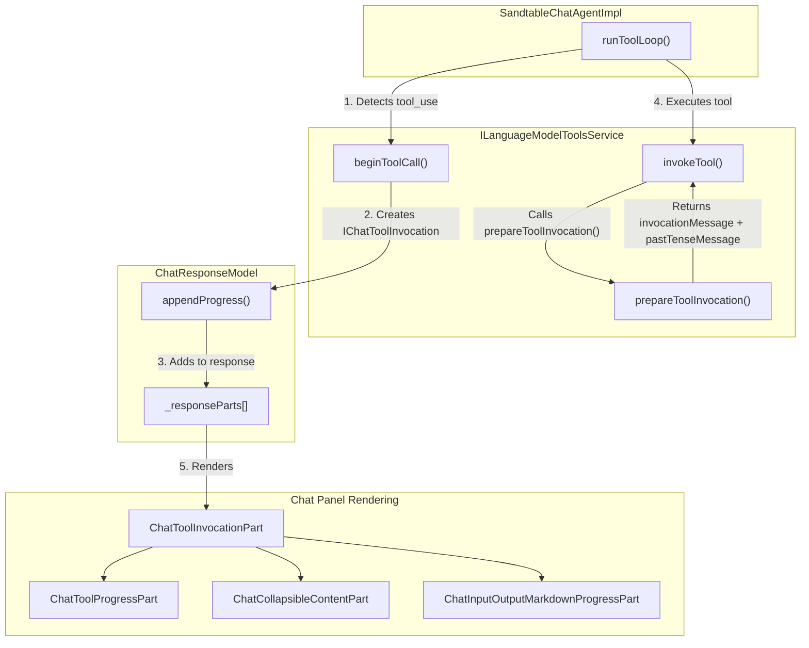

# Tool Call Display Overhaul -- Design

**Status:** Implementation In Progress
**Date:** 2026-02-08
**Category:** Funspace -- Chat UX Transparency & Tool Call Rendering

---

## Table of Contents

1. [Executive Summary](#1-executive-summary)
2. [Problem Statement](#2-problem-statement)
3. [Current State Analysis](#3-current-state-analysis)
4. [Research Findings](#4-research-findings)
5. [Architecture Overview](#5-architecture-overview)
6. [Implementation Plan](#6-implementation-plan)
7. [Tool Alias Reference Table](#7-tool-alias-reference-table)
8. [Files Index](#8-files-index)
9. [Acceptance Criteria](#9-acceptance-criteria)

---

## 1. Executive Summary

Sandtable's chat agent handles tool calls internally and reports them as transient `IChatProgressMessage` that say "Running tool: **toolName**..." These messages disappear after the tool completes, leaving zero trace in the conversation. Users have no visibility into what the LLM read, executed, or found.

VS Code v1.109 ships a complete tool invocation rendering system with persistent, collapsible, state-tracked tool call displays -- including `ChatToolInvocationPart`, `ChatCollapsibleContentPart`, and specialized renderers per tool type. Sandtable bypasses this entire system.

**Solution:** Wire the Sandtable tools into VS Code's native tool invocation pipeline by implementing `prepareToolInvocation()` on each tool class and refactoring the agent's tool loop to use `beginToolCall()` / `invokeTool()`. This gives us persistence, collapsible results, state icons, and serialization for free -- no custom UI work needed.

---

## 2. Problem Statement

Three specific UX gaps:

1. **Tool names are raw IDs.** The chat shows "Running tool: **sandtable_read_file**..." instead of a human-friendly alias like "Reading `src/utils.ts`".

2. **Tool calls vanish after completion.** The transient `progressMessage` kind disappears when the tool finishes. Users cannot review what the LLM read, edited, or executed during a multi-step agent session.

3. **No transparency into tool results.** Even during execution, users see nothing about what the tool returned -- no file contents, no command output, no search results.

---

## 3. Current State Analysis

### What Sandtable Does Now

The `SandtableChatAgentImpl` in `src/vs/workbench/contrib/sandtableLM/browser/sandtableChatAgent.ts` handles tools in its `runToolLoop()`:

1. Collects `tool_use` parts from the LM response stream
2. For each tool call, emits a **transient** progress message:
   ```typescript
   progress([{
       kind: 'progressMessage',
       content: new MarkdownString(`Running tool: **${toolName}**...`),
   }]);
   ```
3. Invokes tools directly via `toolsService.invokeTool()`
4. Feeds results back into the message history and loops

### What VS Code Provides Natively (Unused)

- **`IChatToolInvocation`** -- Persistent, stateful tool call representation with `invocationMessage` (shown during execution) and `pastTenseMessage` (shown after completion)
- **`ChatToolInvocationPart`** -- Main renderer with state machine icons (spinner -> checkmark)
- **`ChatCollapsibleContentPart`** -- Base class for collapsible tool results
- **`ChatInputOutputMarkdownProgressPart`** -- Collapsible input/output display with scrollable containers
- **`beginToolCall()` / `invokeTool()`** pipeline on `ILanguageModelToolsService`
- **`prepareToolInvocation()`** method on `IToolImpl` for custom display messages
- **Persistence** in `ChatResponseModel._responseParts` with serialization support
- **State machine:** Streaming -> WaitingForConfirmation -> Executing -> Completed with visual transitions

### Tool Metadata Already Available

Each Sandtable tool already has `id`, `displayName`, and `modelDescription` but is missing:
- `userDescription` (concise user-facing description)
- `prepareToolInvocation()` (custom invocation/past-tense messages)
- `alwaysDisplayInputOutput` (flag to render collapsible I/O)

---

## 4. Research Findings

### Competitor Analysis

| Product | Pattern | Details |
|---------|---------|---------|
| **Cursor** | Compact chat mode + persistent tool cards | Tools show as collapsible cards. "Compact mode" (v1.4) hides tool icons, collapses diffs by default, auto-hides input when idle. Designed for long agent sessions. |
| **Cline** | Full transparency, step-by-step display | Shows every file read, edit, and command as discrete visible steps. Token usage and API cost tracked per tool call. Terminal output shown inline. |
| **Continue.dev** | Tool call responses as context items | Tool results automatically included as context items. Agent sees previous action results to decide next steps. |
| **ChatGPT/Claude** | Collapsible tool result sections | Function calls shown as expandable cards with the function name as header, parameters shown on expand, results in scrollable container. |
| **VS Code native** | Full rendering pipeline | Collapsible, persistent, state-tracked tool invocations with specialized renderers per tool type. |

### UX Design Patterns

**Progressive Disclosure** (from agentic-design.ai) is the recommended pattern:

- Layer 1 (collapsed): Tool alias + one-line summary ("Read `src/utils.ts`")
- Layer 2 (expanded): Parameters + truncated result
- Layer 3 (full): Complete result in scrollable container
- Max nesting: 3-4 levels
- Remember user disclosure preferences via `WeakMap`
- Smooth animations for transitions
- Consistent expand/collapse icons

### Key VS Code Implementation Details

- **State machine:** `IChatToolInvocation.StateKind` has `Streaming`, `WaitingForConfirmation`, `Executing`, `WaitingForPostApproval`, `Completed`, `Cancelled`
- **Icons:** `Codicon.loading` (spinning) during execution, `Codicon.check` on completion, `Codicon.error` on failure
- **Collapsible state persistence:** Uses `WeakMap<IChatToolInvocation, boolean>` pattern to remember expanded/collapsed per tool call
- **Auto-expand on errors:** Configurable via `chat.autoExpandToolFailures` setting
- **Output truncation:** `ChatInputOutputMarkdownProgressPart` applies `max-height` + `overflow-y: auto` for scrollable containers
- **Serialization:** `IChatToolInvocationSerialized` stores `invocationMessage`, `pastTenseMessage`, `toolSpecificData`, and `resultDetails` for persistence across reloads

---

## 5. Architecture Overview



**Data Flow:**

1. Agent detects `tool_use` in LLM response stream
2. Agent calls `toolsService.beginToolCall()` with session resource and request ID
3. The tools service creates a `ChatToolInvocation` in Streaming state and appends it to the chat response model via `chatService.appendProgress()`
4. Agent calls `toolsService.invokeTool()` which internally calls `prepareToolInvocation()` on the tool implementation to get `invocationMessage` and `pastTenseMessage`
5. Tool invocation transitions through Executing -> Completed states
6. `ChatToolInvocationPart` renders the appropriate sub-part based on state and tool-specific data
7. After completion, the tool invocation persists in chat as a collapsible card showing the `pastTenseMessage`

---

## 6. Implementation Plan

### Step 1: Add `prepareToolInvocation()` to All Sandtable Tools

**File:** `src/vs/workbench/contrib/sandtableLM/browser/sandtableTools.ts`

Each tool class gets a `prepareToolInvocation()` method that reads the `parameters` from the preparation context and returns context-specific `invocationMessage` and `pastTenseMessage`.

Additionally, set `toolSpecificData` with `kind: 'input'` and `rawInput: context.parameters` to populate the native collapsible input/output display.

### Step 2: Add `userDescription` and `alwaysDisplayInputOutput` to Tool Metadata

**File:** `src/vs/workbench/contrib/sandtableLM/browser/sandtableTools.ts`

Add `userDescription` to each `IToolData` definition for user-facing descriptions. Set `alwaysDisplayInputOutput: true` on workspace tools (read_file, edit_file, create_file, run_command, search_files, list_directory) to ensure their input/output is always rendered in the collapsible display.

### Step 3: Refactor Agent Tool Loop to Use Native Pipeline

**File:** `src/vs/workbench/contrib/sandtableLM/browser/sandtableChatAgent.ts`

Refactor `runToolLoop()` to call `toolsService.beginToolCall()` before execution and pass the `chatRequestId` and `sessionResource`. The `beginToolCall()` method creates a `ChatToolInvocation`, appends it to the chat response model, and returns the invocation object. The subsequent `toolsService.invokeTool()` call then transitions the invocation through its state machine. Remove the manual `progress([{ kind: 'progressMessage' }])` calls for tool execution.

---

## 7. Tool Alias Reference Table

### Workspace Tools

| Tool ID | displayName | invocationMessage | pastTenseMessage | userDescription |
|---------|-------------|-------------------|------------------|-----------------|
| `sandtable_read_file` | Read File | "Reading `{path}`" | "Read `{path}`" | Reads a file from the workspace |
| `sandtable_edit_file` | Edit File | "Editing `{path}`" | "Edited `{path}`" | Edits text in a file |
| `sandtable_create_file` | Create File | "Creating `{path}`" | "Created `{path}`" | Creates a new file |
| `sandtable_run_command` | Run Command | "Running `{command}`" | "Ran `{command}`" | Runs a shell command |
| `sandtable_search_files` | Search Files | "Searching for `{pattern}`" | "Searched for `{pattern}`" | Searches across workspace files |
| `sandtable_list_directory` | List Directory | "Listing `{path}`" | "Listed `{path}`" | Lists directory contents |

### Persona Management Tools

| Tool ID | displayName | invocationMessage | pastTenseMessage | userDescription |
|---------|-------------|-------------------|------------------|-----------------|
| `sandtable_create_persona` | Create Agent Persona | "Creating persona **{name}**" | "Created persona **{name}**" | Creates an agent persona |
| `sandtable_list_personas` | List Agent Personas | "Listing personas" | "Listed personas" | Lists all available personas |
| `sandtable_get_persona` | Get Persona Details | "Getting persona details" | "Got persona details" | Gets full details of a persona |
| `sandtable_edit_persona` | Edit Agent Persona | "Editing persona" | "Edited persona" | Updates a persona's fields |
| `sandtable_delete_persona` | Delete Agent Persona | "Deleting persona" | "Deleted persona" | Deletes a custom persona |
| `sandtable_activate_persona` | Activate Agent Persona | "Activating persona" | "Activated persona" | Activates or deactivates a persona |
| `sandtable_duplicate_persona` | Duplicate Agent Persona | "Duplicating persona" | "Duplicated persona" | Clones a persona with modifications |
| `sandtable_export_persona` | Export Agent Persona | "Exporting persona(s)" | "Exported persona(s)" | Exports personas as JSON |
| `sandtable_import_persona` | Import Agent Persona | "Importing persona(s)" | "Imported persona(s)" | Imports personas from JSON |

---

## 8. Files Index

### Modified Files

| File | Changes |
|------|---------|
| `src/vs/workbench/contrib/sandtableLM/browser/sandtableTools.ts` | Add `prepareToolInvocation()` to all 15 tool classes, add `userDescription` to all tool metadata, set `alwaysDisplayInputOutput: true` where appropriate |
| `src/vs/workbench/contrib/sandtableLM/browser/sandtableChatAgent.ts` | Refactor `runToolLoop()` to use `beginToolCall()`/`invokeTool()` native pipeline instead of transient progress messages |
| `docs/project/funspace/README.md` | Add tool call display feature to feature index |
| `docs/project/PROGRESS.md` | Add funspace entry for tool call display overhaul |

### Files Leveraged (No Modifications Expected)

| File | Role |
|------|------|
| `src/vs/workbench/contrib/chat/browser/widget/chatContentParts/toolInvocationParts/chatToolInvocationPart.ts` | Native tool invocation renderer |
| `src/vs/workbench/contrib/chat/browser/widget/chatContentParts/chatCollapsibleContentPart.ts` | Collapsible content base class |
| `src/vs/workbench/contrib/chat/browser/widget/chatContentParts/toolInvocationParts/chatInputOutputMarkdownProgressPart.ts` | Input/output collapsible markdown renderer |
| `src/vs/workbench/contrib/chat/browser/tools/languageModelToolsService.ts` | Tool invocation lifecycle management |

---

## 9. Acceptance Criteria

### Tool Alias Display
- Each Sandtable tool shows a human-friendly alias during execution (e.g., "Reading `src/utils.ts`" not "Running tool: **sandtable_read_file**...")
- After completion, each tool shows a past-tense summary (e.g., "Read `src/utils.ts`")
- Tool icon changes from spinner to checkmark on completion
- Failed tools show error icon with error context

### Transparency / Result Visibility
- `read_file` shows the file path as input and file content (with line numbers) as output
- `edit_file` shows the file path and old/new text as input, and success/failure message as output
- `create_file` shows path and content preview as input, success message as output
- `run_command` shows the command as input and stdout/stderr as output
- `search_files` shows the search pattern as input and matching files/lines as output
- `list_directory` shows the path as input and directory listing as output
- `create_persona` shows persona name/role as input and creation summary as output

### Persistence
- Tool calls persist in chat conversation after completion (do NOT disappear)
- Tool calls survive chat panel hide/show cycles
- Tool calls appear in chat history on reload (serialization works)

### Collapsible / Space Management
- Completed tool calls collapse to a single line by default
- Clicking a collapsed tool call expands to show input/output details
- Expanded tool results use a scrollable container with max-height constraint
- Expand/collapse state persists across re-renders (WeakMap pattern)

### Vertical Space
- A sequence of 5+ tool calls does not dominate the chat pane when collapsed
- User can scan tool call summaries without scrolling through large output blocks
- Expanded tool results do not push subsequent chat content out of view

### Build
- `npm run compile` passes with 0 errors at every step
