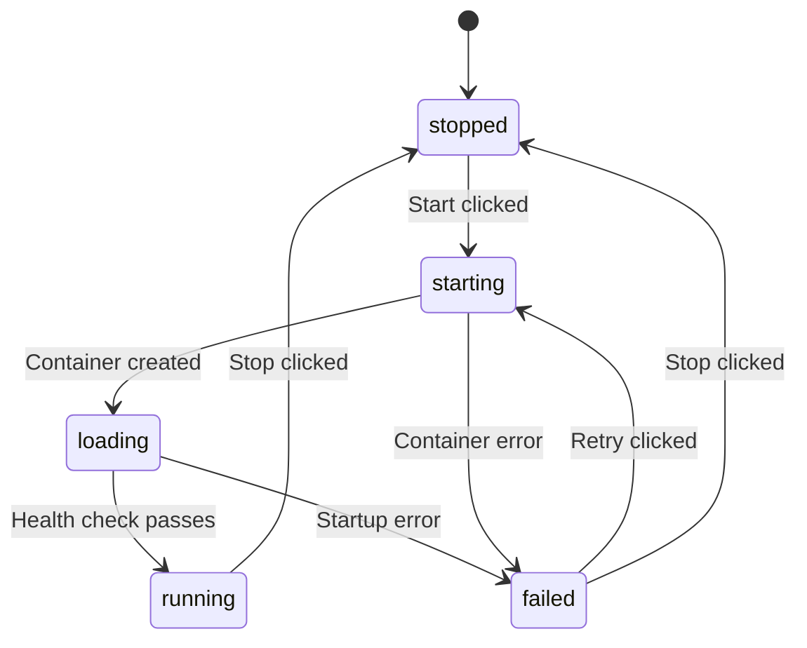

# Phase 3: Model Manager Panel

**Duration:** 10-14 days
**Dependencies:** Phase 1 complete (needs `ICortexService`)
**Cortex changes required:** `GET /v1/ide/status` combined endpoint (see [CORTEX-ENHANCEMENTS.md](../CORTEX-ENHANCEMENTS.md))

## Objective

Build a native workbench panel that gives developers visibility into the Cortex infrastructure directly from the IDE -- running models, GPU utilization, system health, and the ability to start/stop models and view logs without leaving the editor.

## Panel Layout

```
+------------------------------------------------------------------+
| MODEL MANAGER                                          [Refresh]  |
+------------------------------------------------------------------+
| SYSTEM OVERVIEW                                                   |
| CPU: [========--] 78%  RAM: [======----] 62%  Disk: [===-------] 35% |
+------------------------------------------------------------------+
| GPU DASHBOARD                                                     |
| +---------------------------+ +---------------------------+       |
| | GPU 0: RTX 4090           | | GPU 1: RTX 4090           |       |
| | VRAM: [=========-] 89%    | | VRAM: [======----] 62%    |       |
| | 22.1 / 24.0 GB            | | 15.2 / 24.0 GB            |       |
| | Util: 95%  Temp: 72C      | | Util: 45%  Temp: 58C      |       |
| +---------------------------+ +---------------------------+       |
+------------------------------------------------------------------+
| MODELS                                                            |
| +------+-------------------------+--------+--------+-----------+  |
| | State| Name                    | Engine | Served | Actions   |  |
| +------+-------------------------+--------+--------+-----------+  |
| | [*]  | GPT-OSS 120B            | llcpp  | gpt-120| [Stop][L] |  |
| | [*]  | Codestral 22B           | vLLM   | codest | [Stop][L] |  |
| | [ ]  | DeepSeek Coder V2       | vLLM   | dscv2  | [Start]   |  |
| | [!]  | Qwen 72B                | vLLM   | qwen72 | [Retry]   |  |
| +------+-------------------------+--------+--------+-----------+  |
+------------------------------------------------------------------+
| LOG VIEWER (GPT-OSS 120B)                          [Clear][Copy] |
| > [2026-02-07 10:23:45] Model loaded successfully                |
| > [2026-02-07 10:23:46] Server listening on 0.0.0.0:8000        |
| > [2026-02-07 10:24:01] POST /v1/chat/completions 200 1.2s      |
+------------------------------------------------------------------+
```

## Task Breakdown

### Task 3.1: Cortex IDE Status Endpoint (Cortex Side)

See [CORTEX-ENHANCEMENTS.md](../CORTEX-ENHANCEMENTS.md) for the full specification of `GET /v1/ide/status`. This combines multiple admin API calls into one lightweight response.

### Task 3.2: Model Manager Contribution

File: `src/vs/workbench/contrib/sandtableModels/browser/sandtableModels.contribution.ts`

Registers:
- A view container in the Activity Bar (with a server/database icon)
- The Model Manager view within that container
- Commands: `sandtable.models.refresh`, `sandtable.models.startModel`, `sandtable.models.stopModel`

```typescript
const MAGE_MODELS_VIEW_CONTAINER = Registry.as<IViewContainersRegistry>(
    ViewExtensions.ViewContainersRegistry
).registerViewContainer({
    id: 'mage-models',
    title: 'MAGE Models',
    icon: Codicon.server,
    order: 101,
}, ViewContainerLocation.Sidebar);
```

### Task 3.3: Models List

File: `src/vs/workbench/contrib/sandtableModels/browser/sandtableModelsList.ts`

Displays all models from Cortex with:

| Column | Source | Description |
|--------|--------|-------------|
| State indicator | `model.state` | Green dot (running), gray dot (stopped), yellow dot (starting/loading), red dot (failed) |
| Name | `model.name` | Human-readable model name |
| Engine | `model.engine_type` | "vLLM" or "llama.cpp" |
| Served Name | `model.served_model_name` | Name used in API calls |
| Actions | - | Start/Stop/Restart buttons, Logs button |

**State machine for model states:**



**Data source:** `GET /admin/models` (returns all models) polled every 10 seconds, or refreshed on demand after start/stop actions.

**Actions:**
- **Start:** `POST /admin/models/{id}/start` -- show confirmation if dry-run reports VRAM warnings
- **Stop:** `POST /admin/models/{id}/stop` -- immediate, no confirmation needed
- **Logs:** Opens the log viewer section focused on this model

### Task 3.4: GPU Dashboard

File: `src/vs/workbench/contrib/sandtableModels/browser/sandtableGpuDashboard.ts`

Displays a card per GPU with:

| Metric | Source | Display |
|--------|--------|---------|
| GPU Name | `gpu.name` | "NVIDIA GeForce RTX 4090" |
| VRAM Usage | `gpu.mem_used_mb / gpu.mem_total_mb` | Progress bar with percentage |
| VRAM Numbers | Same | "22.1 / 24.0 GB" |
| Utilization | `gpu.utilization_pct` | Percentage text |
| Temperature | `gpu.temperature_c` | Degrees with color coding (green < 70, yellow < 85, red >= 85) |
| Flash Attention | `gpu.flash_attention_supported` | Badge (supported / not supported) |

**Polling strategy:**
- Uses `GET /v1/ide/status` (combined endpoint) every 5 seconds (configurable via `sandtable.models.gpuPollIntervalMs`)
- Falls back to `GET /admin/system/gpus` if the IDE status endpoint is not available
- Pauses polling when the Model Manager panel is not visible (performance optimization)

**Rendering:** Uses DOM elements with CSS progress bars (not canvas/WebGL). Keeps it simple and consistent with VS Code's UI patterns.

### Task 3.5: System Summary

File: `src/vs/workbench/contrib/sandtableModels/browser/sandtableSystemSummary.ts`

Compact bar showing:
- CPU utilization percentage with progress bar
- RAM usage percentage with progress bar
- Disk usage percentage with progress bar

Data from `GET /v1/ide/status` (system field) or `GET /admin/system/summary`.

### Task 3.6: Model Log Viewer

File: `src/vs/workbench/contrib/sandtableModels/browser/sandtableModelLogs.ts`

When a model is selected in the model list, shows its container logs:

- **Data source:** `GET /admin/models/{id}/logs?diagnose=true`
- **Display:** Monospace text in a scrollable container
- **Auto-scroll:** Scrolls to bottom as new log lines appear
- **Polling:** Refreshes every 3 seconds while visible
- **Actions:** Clear (clears the display, not the actual logs), Copy (copies to clipboard)
- **Diagnostics:** When `diagnose=true` is set, Cortex returns startup diagnostics with actionable error fixes. Display these prominently with colored severity indicators (info/warning/error).

### Task 3.7: Dry-Run Before Start

When the user clicks "Start" on a stopped model:

1. Call `POST /admin/models/{id}/dry-run`
2. Check response for warnings (VRAM, quantization compatibility, etc.)
3. If warnings exist, show a confirmation dialog:
   ```
   Starting GPT-OSS 120B

   Warnings:
   - VRAM Warning: Estimated 35.2 GB per GPU, available 46.0 GB (76% utilization)

   Estimated VRAM: 35.2 GB per GPU

   [Cancel] [Start Anyway]
   ```
4. If no warnings, start immediately

### Task 3.8: Admin Authentication

The Model Manager uses admin endpoints that require session cookie authentication. The `CortexService` handles this by:

1. On first admin request, perform login: `POST /admin/login` with username/password from settings
2. Store the `cortex_session` cookie in memory
3. Include cookie in subsequent admin requests
4. If a 401 response is received, re-authenticate and retry

Settings used:
- `sandtable.cortex.username` (default: "admin")
- `sandtable.cortex.password` (stored securely -- see note below)

**Security note:** The password setting should ideally use VS Code's `ISecretStorageService` rather than plain settings. For the initial implementation (internal team use), storing in settings is acceptable. A follow-up task should migrate to secret storage.

## Cortex Admin API Endpoints Used

| Endpoint | Method | Purpose |
|----------|--------|---------|
| `/v1/ide/status` | GET | Combined status (models, system, GPUs) -- NEW |
| `/admin/models` | GET | List all models with full details |
| `/admin/models/{id}/start` | POST | Start a model container |
| `/admin/models/{id}/stop` | POST | Stop a model container |
| `/admin/models/{id}/dry-run` | POST | Validate config + VRAM estimation |
| `/admin/models/{id}/logs` | GET | Container logs (with `?diagnose=true`) |
| `/admin/system/summary` | GET | CPU/mem/disk summary (fallback) |
| `/admin/system/gpus` | GET | Per-GPU metrics (fallback) |
| `/admin/system/throughput` | GET | Tokens/sec, RPS, latency |
| `/admin/models/metrics` | GET | Per-model inference metrics |

## Testing Plan

| Test | Steps | Expected Result |
|------|-------|-----------------|
| Panel opens | Click Model Manager icon in Activity Bar | Panel displays with all sections |
| Models listed | Cortex has models configured | All models shown with correct state |
| GPU dashboard | Cortex on machine with GPUs | GPU cards show VRAM, util, temp |
| Start model | Click Start on stopped model | Dry-run check, then model starts, state transitions visible |
| Stop model | Click Stop on running model | Model stops, state changes to stopped |
| View logs | Select a running model, click Logs | Container logs displayed and auto-updating |
| Diagnostics | Start a model with config issues | Diagnostic warnings shown with suggested fixes |
| No Cortex | Start IDE without Cortex running | Panel shows "Cortex Disconnected" message |
| GPU polling paused | Switch to a different panel | GPU polling stops (verify via network tab) |

## Definition of Done

Phase 3 is complete when:

1. Cortex IDE status endpoint is deployed and returning combined data
2. Model Manager panel opens from Activity Bar
3. Models list shows all models with correct state indicators
4. Start/Stop buttons work with dry-run VRAM validation
5. GPU dashboard shows per-GPU metrics with auto-refresh
6. System summary shows CPU/RAM/disk
7. Log viewer displays container logs for selected model
8. Admin authentication handles session cookies automatically
9. Polling pauses when panel is not visible
