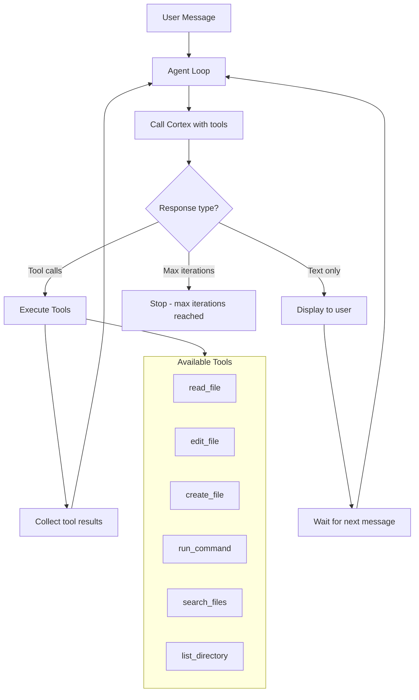

# Phase 4: Agent Mode

**Duration:** 14-21 days
**Dependencies:** Phase 1 complete (needs `ICortexService`)
**Cortex changes required:** `supports_tool_calling` field on model constraints (see [CORTEX-ENHANCEMENTS.md](../CORTEX-ENHANCEMENTS.md))

## Objective

Build an autonomous coding agent within MAGE IDE that can read files, write code, run terminal commands, and perform multi-step coding tasks based on natural language instructions -- all powered by models running on Cortex.

## Agent Architecture



## Tool Definitions

The agent has access to these tools, sent as the `tools` parameter in chat completion requests:

### read_file

```json
{
    "type": "function",
    "function": {
        "name": "read_file",
        "description": "Read the contents of a file in the workspace. Returns the file text with line numbers.",
        "parameters": {
            "type": "object",
            "properties": {
                "path": {
                    "type": "string",
                    "description": "Relative path to the file from workspace root (e.g., 'src/utils/auth.ts')"
                },
                "start_line": {
                    "type": "integer",
                    "description": "Optional starting line number (1-indexed). If omitted, reads from beginning."
                },
                "end_line": {
                    "type": "integer",
                    "description": "Optional ending line number (inclusive). If omitted, reads to end."
                }
            },
            "required": ["path"]
        }
    }
}
```

### edit_file

```json
{
    "type": "function",
    "function": {
        "name": "edit_file",
        "description": "Replace a specific text string in a file. The old_text must match exactly (including whitespace and indentation). Use read_file first to see the current content.",
        "parameters": {
            "type": "object",
            "properties": {
                "path": {
                    "type": "string",
                    "description": "Relative path to the file from workspace root"
                },
                "old_text": {
                    "type": "string",
                    "description": "The exact text to find and replace. Must be unique within the file."
                },
                "new_text": {
                    "type": "string",
                    "description": "The replacement text"
                }
            },
            "required": ["path", "old_text", "new_text"]
        }
    }
}
```

### create_file

```json
{
    "type": "function",
    "function": {
        "name": "create_file",
        "description": "Create a new file with the given contents. Will fail if the file already exists.",
        "parameters": {
            "type": "object",
            "properties": {
                "path": {
                    "type": "string",
                    "description": "Relative path for the new file from workspace root"
                },
                "contents": {
                    "type": "string",
                    "description": "The full contents of the new file"
                }
            },
            "required": ["path", "contents"]
        }
    }
}
```

### run_command

```json
{
    "type": "function",
    "function": {
        "name": "run_command",
        "description": "Run a shell command in the workspace terminal. Returns stdout and stderr. Use for running tests, installing packages, checking git status, etc.",
        "parameters": {
            "type": "object",
            "properties": {
                "command": {
                    "type": "string",
                    "description": "The shell command to execute"
                },
                "working_directory": {
                    "type": "string",
                    "description": "Optional working directory relative to workspace root. Defaults to workspace root."
                }
            },
            "required": ["command"]
        }
    }
}
```

### search_files

```json
{
    "type": "function",
    "function": {
        "name": "search_files",
        "description": "Search for text across files in the workspace using regex. Returns matching file paths and line numbers.",
        "parameters": {
            "type": "object",
            "properties": {
                "pattern": {
                    "type": "string",
                    "description": "Regex pattern to search for"
                },
                "file_glob": {
                    "type": "string",
                    "description": "Optional glob pattern to filter files (e.g., '**/*.ts', 'src/**/*.py'). Defaults to all files."
                },
                "max_results": {
                    "type": "integer",
                    "description": "Maximum number of results to return. Default: 20."
                }
            },
            "required": ["pattern"]
        }
    }
}
```

### list_directory

```json
{
    "type": "function",
    "function": {
        "name": "list_directory",
        "description": "List files and directories at a given path. Returns names with file/directory indicators.",
        "parameters": {
            "type": "object",
            "properties": {
                "path": {
                    "type": "string",
                    "description": "Relative path to list. Use '.' or '' for workspace root."
                }
            },
            "required": ["path"]
        }
    }
}
```

## Agent Loop Algorithm

File: `src/vs/workbench/contrib/mageAgent/common/mageAgentLoop.ts`

```
FUNCTION runAgent(userMessage, tools, maxIterations = 25):
    messages = [
        { role: "system", content: AGENT_SYSTEM_PROMPT },
        { role: "user", content: userMessage }
    ]
    iteration = 0

    WHILE iteration < maxIterations:
        iteration++

        response = cortexService.chatCompletion({
            model: agentModel,
            messages: messages,
            tools: tools,
            temperature: 0.3,
            max_tokens: 4096,
        })

        IF response has tool_calls:
            // Add assistant message with tool calls to history
            messages.append({ role: "assistant", tool_calls: response.tool_calls })

            FOR EACH toolCall IN response.tool_calls:
                // Check if tool needs confirmation
                IF toolCall.function.name IN ["edit_file", "create_file", "run_command"]:
                    approved = AWAIT requestUserConfirmation(toolCall)
                    IF NOT approved:
                        messages.append({
                            role: "tool",
                            tool_call_id: toolCall.id,
                            content: "User declined this action."
                        })
                        CONTINUE

                // Execute the tool
                result = AWAIT executeTool(toolCall)

                // Show what happened in the UI
                emitAgentEvent({ type: "tool_executed", tool: toolCall, result: result })

                // Add tool result to messages
                messages.append({
                    role: "tool",
                    tool_call_id: toolCall.id,
                    content: result
                })

        ELSE (text response, no tool calls):
            // Final response from the agent
            emitAgentEvent({ type: "message", content: response.content })
            RETURN { success: true, iterations: iteration }

    // Max iterations reached
    emitAgentEvent({ type: "max_iterations", message: "Agent stopped after {maxIterations} iterations" })
    RETURN { success: false, reason: "max_iterations" }
```

### Agent System Prompt

```
You are MAGE, an AI coding agent integrated into the MAGE IDE. You help developers by reading, writing, and modifying code in their workspace.

Rules:
1. Always read a file before editing it to understand the current state.
2. Make minimal, targeted changes. Do not rewrite entire files unless asked.
3. When editing, use exact text matching -- include enough context to be unique.
4. Explain what you are doing and why before making changes.
5. If you are unsure about something, ask the user rather than guessing.
6. After making changes, verify them by reading the file again if needed.
7. When running commands, prefer non-destructive operations. Never run rm -rf or similar without explicit user request.
```

## Safety Confirmation System

File: `src/vs/workbench/contrib/mageAgent/common/mageAgentSafety.ts`

### Confirmation Rules

| Tool | Confirmation Required | Display |
|------|----------------------|---------|
| `read_file` | No | Show "Reading {path}..." in agent panel |
| `list_directory` | No | Show "Listing {path}..." in agent panel |
| `search_files` | No | Show "Searching for {pattern}..." in agent panel |
| `edit_file` | Yes (if `mage.agent.confirmDestructive` is true) | Show diff of old_text vs new_text |
| `create_file` | Yes (if `mage.agent.confirmDestructive` is true) | Show file contents preview |
| `run_command` | Yes (always for terminal commands) | Show command to be executed |

### Confirmation Dialog

When a destructive tool needs approval, the agent panel shows:

```
+------------------------------------------------------------------+
| AGENT wants to edit src/utils/auth.ts                             |
|                                                                    |
| - function validateToken(token) {            (red - removed)       |
| -   return token.length > 0;                 (red - removed)       |
| + function validateToken(token: string) {    (green - added)       |
| +   if (!token || token.length === 0) {      (green - added)       |
| +     throw new AuthError('Invalid token');  (green - added)       |
| +   }                                        (green - added)       |
| +   return jwt.verify(token, SECRET_KEY);    (green - added)       |
|                                                                    |
|                               [Reject]  [Accept]                   |
+------------------------------------------------------------------+
```

For terminal commands:
```
+------------------------------------------------------------------+
| AGENT wants to run a command                                       |
|                                                                    |
|   $ npm install jsonwebtoken @types/jsonwebtoken                   |
|   Working directory: /home/mage/repos/myproject                    |
|                                                                    |
|                               [Reject]  [Accept]                   |
+------------------------------------------------------------------+
```

### Diff View Integration

File: `src/vs/workbench/contrib/mageAgent/browser/mageAgentDiffView.ts`

For `edit_file` confirmations, use VS Code's built-in diff editor:

```typescript
// Show diff in VS Code's native diff view
const originalUri = URI.parse(`mage-agent-original:${path}`);
const modifiedUri = URI.parse(`mage-agent-modified:${path}`);

// Register content providers for the diff URIs
// originalUri shows file with old_text
// modifiedUri shows file with new_text applied

await this.editorService.openEditor({
    original: { resource: originalUri },
    modified: { resource: modifiedUri },
    label: `Agent Edit: ${path}`,
});
```

## Agent Panel UI

File: `src/vs/workbench/contrib/mageAgent/browser/mageAgentPanel.ts`

The agent panel reuses much of the chat panel's rendering (markdown, code blocks) but adds:

1. **Tool execution indicators** -- Shows what tools the agent is using with progress
2. **Confirmation dialogs** -- Inline approve/reject for destructive operations
3. **Iteration counter** -- "Step 3/25" to show progress and remaining budget
4. **Stop button** -- Aborts the agent loop at any point
5. **Diff previews** -- Inline diffs for file edits

Layout:
```
+------------------------------------------------------------------+
| AGENT                                                   [Stop]    |
+------------------------------------------------------------------+
| User: Add error handling to the auth module                       |
|                                                                    |
| Agent: I'll start by reading the auth module to understand the    |
| current implementation.                                            |
|                                                                    |
| [Tool] Reading src/utils/auth.ts... done                          |
|                                                                    |
| Agent: I can see the validateToken function lacks error handling.  |
| I'll add proper validation and JWT verification.                   |
|                                                                    |
| [Tool] Editing src/utils/auth.ts                                  |
| +----------------------------------------------------------+      |
| | - function validateToken(token) {                         |      |
| | + function validateToken(token: string): boolean {        |      |
| |   ...                                                     |      |
| |                              [Reject] [Accept]            |      |
| +----------------------------------------------------------+      |
|                                                                    |
| Step 3/25                                                          |
+------------------------------------------------------------------+
| Type a message...                                       [Send]    |
+------------------------------------------------------------------+
```

## Model Requirements for Tool Calling

Not all models support function/tool calling. The agent must check model capabilities.

### Models Known to Support Tool Calling

| Model | Tool Calling | Notes |
|-------|-------------|-------|
| DeepSeek V3 / V3.2 | Yes | Excellent tool calling support |
| Qwen3-Coder | Yes | Good tool calling support |
| Llama 3.1 / 3.3 70B+ | Yes | Reliable with larger sizes |
| Codestral 22B | Partial | Better for completion than tools |
| GPT-OSS 20B/120B | Unknown | Needs testing -- Harmony architecture may not have tool training |

### Fallback for Non-Tool Models

If a model doesn't support tool calling (or `supports_tool_calling` is false on constraints):

1. **Prompt-based approach:** Instead of OpenAI-style tool calling, embed tool descriptions in the system prompt and parse structured output (JSON blocks) from the model's response.

2. **Model switching:** If the user's preferred chat model doesn't support tools, automatically switch to a designated "agent model" that does. This is configured via `mage.agent.model`.

3. **Degraded mode:** If no tool-capable model is available, disable agent mode and show a message explaining which models are needed.

## Context Management

File: `src/vs/workbench/contrib/mageAgent/common/mageAgentContext.ts`

The agent loop accumulates messages (user messages, assistant responses, tool calls, tool results). This can grow large quickly.

### Token Budget Strategy

```
Total context budget: model's max_model_len (from constraints)
Reserved for response: mage.agent.maxTokens (default 4096)
Available for context: max_model_len - maxTokens

Example with GPT-OSS 120B (8K context):
  Available: 8192 - 4096 = 4096 tokens for context
  This is tight -- may only fit 3-4 tool call rounds

Example with DeepSeek V3 (128K context):
  Available: 131072 - 4096 = 126976 tokens for context
  Can fit many rounds of tool calls
```

### Context Pruning

When the message history exceeds the token budget:

1. Always keep the system prompt (first message)
2. Always keep the last user message
3. Summarize earlier tool call results (replace full file contents with "Read 150 lines from auth.ts")
4. Remove intermediate assistant reasoning if needed
5. Never remove tool call / tool result pairs (they must stay paired)

## Settings

```
mage.agent.enabled                (boolean, default: true)
mage.agent.model                  (string, default: '')       -- Empty = use chat model
mage.agent.confirmDestructive     (boolean, default: true)    -- Require approval for edits/commands
mage.agent.maxIterations          (number, default: 25)       -- Max tool call rounds
mage.agent.maxTokens              (number, default: 4096)     -- Max tokens per agent response
```

## Testing Plan

### Functional Tests

| Test | Steps | Expected Result |
|------|-------|-----------------|
| Read file | "What does auth.ts contain?" | Agent reads and summarizes the file |
| Edit file | "Add a docstring to the main function" | Agent reads file, proposes edit, shows diff |
| Create file | "Create a test file for auth.ts" | Agent creates new file with test code |
| Run command | "What is the git status?" | Agent runs `git status` and reports results |
| Search files | "Where is the database connection configured?" | Agent searches and reports locations |
| Multi-step | "Refactor the logger to use structured logging" | Agent reads, plans, makes multiple edits |
| Confirmation reject | "Delete all files" -> Reject | Agent respects rejection, reports back |
| Max iterations | Complex task that exceeds 25 steps | Agent stops with "max iterations" message |
| Stop button | Start complex task, click Stop | Agent loop terminates cleanly |

### Model-Specific Tests

| Model | Test | Expected |
|-------|------|----------|
| GPT-OSS 120B | Simple read + edit task | Verify tool calling works with Harmony arch |
| DeepSeek V3 (if available) | Complex multi-step refactor | Full agent capabilities |
| Codestral 22B | Simple edit task | May need prompt-based fallback |

## Definition of Done

Phase 4 is complete when:

1. All six tools are implemented and working (read, edit, create, run, search, list)
2. Agent loop correctly handles the message -> tool_call -> execute -> repeat cycle
3. Safety confirmations appear for all destructive operations
4. Diff view shows proposed changes before applying
5. Stop button aborts the agent at any point
6. Max iteration guard prevents runaway loops
7. Agent tested successfully with at least one model on Cortex
8. Context pruning handles long conversations gracefully
9. Fallback behavior works when model doesn't support tool calling
