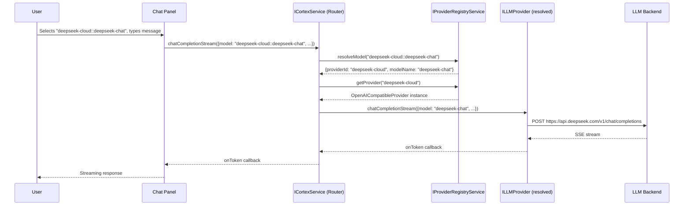
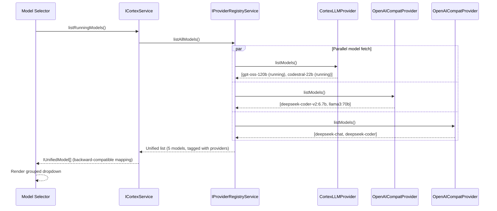
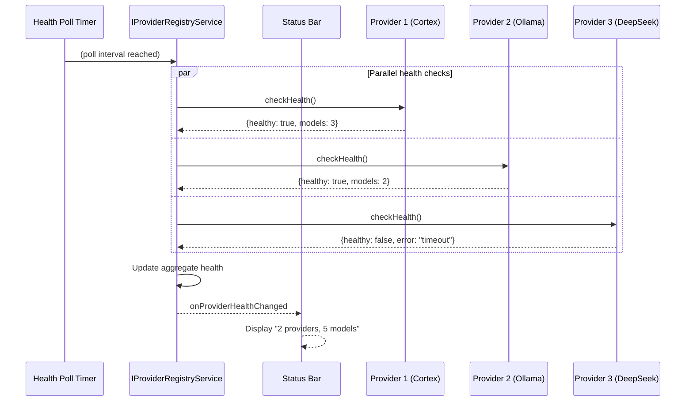

# Phase 4.5: Multi-Provider LLM Connection System

**Duration:** 14-21 days
**Dependencies:** Phase 1 complete (needs `ICortexService`, `CortexClient`, settings infrastructure)
**Cortex changes required:** None (Cortex already exposes OpenAI-compatible API)

## Objective

Expand Sandtable from a single-backend system (Cortex only) to a multi-provider system where administrators can configure connections to multiple LLM providers simultaneously. Models from all enabled providers appear in a unified interface throughout the application. Cortex remains the primary and recommended provider, retaining all its special capabilities (model lifecycle management, GPU monitoring, admin APIs), while external providers offer inference-only access.

## Motivation

The original project charter specified "Cortex is the only LLM backend" as a constraint for the initial build. With Phases 0-4 complete (IDE-side), the core integration is proven and stable. Relaxing this constraint delivers significant value:

1. **Flexibility:** Users with existing Ollama, vLLM, or LM Studio setups can connect them alongside Cortex without migration.
2. **Cloud fallback:** Teams can configure DeepSeek API, Together AI, or Groq as backup providers for when local GPU capacity is saturated.
3. **Model diversity:** Different tasks benefit from different models on different backends -- FIM completion from a local Codestral on Cortex, chat from DeepSeek V3 via cloud API, agent from Qwen3-Coder on Ollama.
4. **Air-gap compatibility preserved:** The multi-provider system is purely additive. Cortex-only deployments continue to work unchanged.

## Provider Types

### Cortex (Primary Provider)

Our self-hosted gateway with full admin capabilities. This is the only provider type that supports:

- Model lifecycle management (start, stop, dry-run)
- GPU monitoring and VRAM metrics
- System resource monitoring (CPU, RAM, disk)
- Container log viewing
- FIM completion via the dedicated `/v1/fim/completions` endpoint
- Chat session persistence via the Cortex session API
- Admin authentication (session cookie)

### OpenAI-Compatible (External Providers)

Any server that exposes the OpenAI chat completions API. These are inference-only -- no admin, no monitoring, no model lifecycle control. Covers:

| Server | Endpoint Pattern | Notes |
|--------|-----------------|-------|
| Ollama | `http://localhost:11434` | Also exposes `/v1/models` |
| llama.cpp server | `http://localhost:8080` | Single model per instance |
| vLLM (direct) | `http://localhost:8000` | Full OpenAI-compatible API |
| text-generation-inference | `http://localhost:8080` | HuggingFace TGI |
| LocalAI | `http://localhost:8080` | Drop-in OpenAI replacement |
| LM Studio | `http://localhost:1234` | Exposes `/v1/models` and `/v1/chat/completions` |
| OpenAI API | `https://api.openai.com` | Requires API key |
| DeepSeek API | `https://api.deepseek.com` | OpenAI-compatible |
| Together AI | `https://api.together.xyz` | OpenAI-compatible |
| Groq | `https://api.groq.com/openai` | OpenAI-compatible |
| Fireworks AI | `https://api.fireworks.ai/inference` | OpenAI-compatible |
| Mistral API | `https://api.mistral.ai` | OpenAI-compatible |

The `openai-compatible` type supports these endpoints:

| Method | Endpoint | Purpose | Required |
|--------|----------|---------|----------|
| GET | `/v1/models` | List available models | Yes |
| POST | `/v1/chat/completions` | Chat inference (streaming + non-streaming) | Yes |
| POST | `/v1/completions` | Text completion | Optional |
| POST | `/v1/fim/completions` | FIM completion | Optional (Cortex only) |

## Architecture

### Current Architecture (Single Provider)

```
┌─────────────────────────────────────────────────────┐
│ Consumers (Chat, Completion, Agent, Status, Models)  │
│                                                      │
│       All inject ICortexService directly             │
└──────────────────────┬──────────────────────────────┘
                       │
                       ▼
┌──────────────────────────────────────────────────────┐
│ CortexService (browser/cortexService.ts)             │
│   - Single CortexClient instance                     │
│   - Single endpoint + API key from settings          │
│   - Health polling on one endpoint                   │
│   - Monolithic: inference + admin + monitoring        │
└──────────────────────┬──────────────────────────────┘
                       │
                       ▼
┌──────────────────────────────────────────────────────┐
│ CortexClient (common/cortexClient.ts)                │
│   - HTTP fetch + SSE streaming                       │
│   - Single endpoint, single API key                  │
│   - Session cookie for admin                         │
└──────────────────────┬──────────────────────────────┘
                       │
                       ▼
                 Cortex Gateway
```

### Target Architecture (Multi-Provider)

```
┌─────────────────────────────────────────────────────────────┐
│ Consumers (Chat, Completion, Agent, Status, Models)          │
│                                                              │
│   Still inject ICortexService (backward compatible)          │
│   Model refs use compound ID: "providerId::modelName"        │
│   Bare names resolve against default provider                │
└────────────────────────┬────────────────────────────────────┘
                         │
                         ▼
┌──────────────────────────────────────────────────────────────┐
│ CortexService (evolved into routing layer)                    │
│   - Injects IProviderRegistryService                         │
│   - Inference methods: parse model ID → find provider → call │
│   - listRunningModels(): aggregate from all providers        │
│   - Admin methods: delegate to Cortex provider specifically  │
│   - Health: aggregate from provider registry                 │
│   - Backward compat: bare model names → default provider     │
└────────────────────────┬────────────────────────────────────┘
                         │
                         ▼
┌──────────────────────────────────────────────────────────────┐
│ IProviderRegistryService (NEW)                                │
│   - Manages array of ILLMProvider instances                  │
│   - Reads provider configs from sandtable.providers setting  │
│   - Per-provider health checking                             │
│   - Unified model listing with provider tagging              │
│   - Provider lifecycle (add/remove/enable/disable)           │
│   - Emits events: onProvidersChanged, onProviderHealth       │
└──────┬─────────────────┬─────────────────┬──────────────────┘
       │                 │                 │
       ▼                 ▼                 ▼
┌──────────────┐  ┌──────────────┐  ┌──────────────┐
│ CortexLLM    │  │ OpenAICompat │  │ OpenAICompat │
│ Provider     │  │ Provider     │  │ Provider     │
│              │  │ (Ollama)     │  │ (DeepSeek)   │
│ - CortexCli  │  │              │  │              │
│ - Admin APIs │  │ - /v1/models │  │ - /v1/models │
│ - GPU/System │  │ - /v1/chat/* │  │ - /v1/chat/* │
│ - FIM        │  │              │  │              │
│ - Sessions   │  │              │  │              │
└──────┬───────┘  └──────┬───────┘  └──────┬───────┘
       │                 │                 │
       ▼                 ▼                 ▼
   Cortex GW         Ollama           DeepSeek API
```

### Key Design Decisions

#### Decision 1: Facade Pattern for Backward Compatibility

`ICortexService` remains the primary injection point for all consumers. It evolves from a direct Cortex client wrapper into a routing facade that delegates to the correct provider. This means:

- **Zero consumer changes for basic functionality.** Chat, completion, agent, status bar all continue to inject `ICortexService` and call the same methods.
- **Gradual enhancement.** Consumers that want provider-aware features (grouped model lists, provider badges) can access the new `IProviderRegistryService` directly.
- **No big-bang refactor.** The migration is incremental and backward-compatible at every step.

Rejected alternatives:
- *Replace ICortexService with IInferenceService:* Would require updating every consumer's constructor injection and all DI registrations. High risk, no benefit.
- *Multiple separate service interfaces (IChatService, ICompletionService):* Over-engineering for the current scope. Can be revisited if the interface grows unwieldy.

#### Decision 2: Compound Model Identity

Models are identified by `"providerId::modelName"` throughout the system. The `::` separator is chosen because:
- `/` appears in model names (e.g., `meta-llama/Llama-3.1-70B`)
- `:` appears in model tags (e.g., `llama3:70b`)
- `::` is unambiguous and never appears in model names

Examples:
- `"cortex-local::gpt-oss-120b-abliterated"` -- explicit provider
- `"ollama::deepseek-coder-v2:6.7b"` -- Ollama model with tag
- `"gpt-oss-120b"` -- bare name, resolved against default provider (backward compatible)

Resolution rules:
1. If the model string contains `::`, split into `providerId` and `modelName`
2. If no `::`, check all enabled providers for a model with that name
3. If found on multiple providers, use the one with highest priority
4. If not found, return an error

#### Decision 3: Provider Configuration as Settings Array

Provider configurations are stored in `sandtable.providers`, a JSON array in VS Code settings. This leverages the existing `IConfigurationService` infrastructure.

```jsonc
// settings.json
{
    "sandtable.providers": [
        {
            "id": "cortex-local",
            "displayName": "Cortex (Local)",
            "type": "cortex",
            "endpoint": "http://localhost:8084",
            "apiKey": "your-cortex-api-key",
            "username": "admin",
            "password": "admin-password",
            "enabled": true,
            "priority": 1
        },
        {
            "id": "ollama-local",
            "displayName": "Ollama",
            "type": "openai-compatible",
            "endpoint": "http://localhost:11434",
            "apiKey": "",
            "enabled": true,
            "priority": 2
        },
        {
            "id": "deepseek-cloud",
            "displayName": "DeepSeek API",
            "type": "openai-compatible",
            "endpoint": "https://api.deepseek.com",
            "apiKey": "sk-...",
            "enabled": false,
            "priority": 3
        }
    ]
}
```

**Migration from legacy settings:** If `sandtable.providers` is empty/undefined but `sandtable.cortex.endpoint` has a value, the system auto-creates a Cortex provider from the legacy settings. The legacy `sandtable.cortex.*` settings continue to work and are synced with the first Cortex provider in the array. This ensures zero-friction upgrade.

#### Decision 4: Cortex Is Special (Asymmetric Provider Model)

Cortex is not just another OpenAI-compatible endpoint. It has admin capabilities that no other provider has. The architecture handles this asymmetry cleanly:

- `ILLMProvider` -- base interface for all providers (inference + model listing)
- `ICortexLLMProvider extends ILLMProvider` -- adds admin, monitoring, sessions, FIM
- `IProviderRegistryService.getCortexProvider()` -- returns the Cortex provider specifically (or undefined if no Cortex is configured)
- The Model Manager panel continues to use Cortex-specific APIs directly
- External provider models appear as read-only entries in model lists (no start/stop/logs)

#### Decision 5: Capability Detection

Not all providers/models support all features. The system tracks capabilities per-provider and per-model:

```typescript
export interface IModelCapabilities {
    chat: boolean;              // /v1/chat/completions
    completion: boolean;        // /v1/completions
    fim: boolean;               // /v1/fim/completions (Cortex only)
    toolCalling: boolean;       // Supports tools parameter
    streaming: boolean;         // Supports stream: true
    systemPrompt: boolean;      // Supports system role messages
}
```

Provider-level capabilities are detected during the initial connection test. Model-level capabilities are refined from the `/v1/models` response and (for Cortex) from the `/v1/models/{name}/constraints` endpoint.

The consumers use this information:
- **Completion provider:** Only routes to providers/models with `fim: true` or `completion: true`
- **Agent loop:** Only routes to models with `toolCalling: true`
- **Chat panel:** All providers with `chat: true`

## New Types and Interfaces

### Provider Configuration Types

```typescript
// src/vs/platform/cortex/common/cortexProviderTypes.ts

/**
 * LLM provider types supported by Sandtable.
 */
export type LLMProviderType = 'cortex' | 'openai-compatible';

/**
 * Serializable provider configuration stored in settings.
 */
export interface IProviderConfig {
    /** Unique identifier for this provider (user-assigned or auto-generated UUID) */
    id: string;
    /** Human-readable display name */
    displayName: string;
    /** Provider type determines API behavior and capabilities */
    type: LLMProviderType;
    /** Base URL of the provider's API */
    endpoint: string;
    /** API key for authentication (empty string if none required) */
    apiKey: string;
    /** Whether this provider is active */
    enabled: boolean;
    /** Priority for model resolution when the same model exists on multiple providers (lower = higher priority) */
    priority: number;
    /** Cortex-specific: admin username */
    username?: string;
    /** Cortex-specific: admin password */
    password?: string;
}

/**
 * Compound model identifier: providerId + modelName.
 */
export interface IModelIdentifier {
    providerId: string;
    modelName: string;
}

/**
 * Model capabilities detected from the provider.
 */
export interface IModelCapabilities {
    chat: boolean;
    completion: boolean;
    fim: boolean;
    toolCalling: boolean;
    streaming: boolean;
    systemPrompt: boolean;
}

/**
 * Unified model representation that includes provider context.
 * Extends ICortexModel with multi-provider awareness.
 */
export interface IUnifiedModel {
    /** The model name as known to its provider */
    modelName: string;
    /** Compound ID: "providerId::modelName" */
    qualifiedName: string;
    /** Provider this model belongs to */
    providerId: string;
    providerName: string;
    providerType: LLMProviderType;
    /** Model state (running models from Cortex have state; external models are always 'available') */
    state: 'running' | 'available' | 'stopped' | 'starting' | 'loading' | 'failed';
    /** Detected capabilities */
    capabilities: IModelCapabilities;
    /** Engine type (Cortex models have vllm/llamacpp; external models have 'external') */
    engineType: string;
    /** Task type if known */
    task?: string;
}

/**
 * Health check result for a single provider.
 */
export interface IProviderHealthResult {
    providerId: string;
    providerName: string;
    healthy: boolean;
    modelCount: number;
    latencyMs: number;
    error?: string;
}

/**
 * Aggregate health status across all providers.
 */
export interface IAggregateHealthResult {
    totalProviders: number;
    healthyProviders: number;
    totalModels: number;
    providers: IProviderHealthResult[];
}
```

### ILLMProvider Interface

```typescript
// src/vs/platform/cortex/common/llmProvider.ts

import { Event } from 'vs/base/common/event';
import { CancellationToken } from 'vs/base/common/cancellation';
import { IProviderConfig, IUnifiedModel, IProviderHealthResult, IModelCapabilities } from './cortexProviderTypes.js';
import {
    ICortexChatRequest, ICortexChatResponse,
    ICortexCompletionRequest, ICortexCompletionResponse,
    ICortexFimRequest,
    ICortexStreamChunk, ICortexStreamResult,
    ICortexModelConstraints,
} from './cortex.js';

/**
 * Base interface for all LLM providers.
 * Covers inference and model discovery -- the minimum any provider must support.
 */
export interface ILLMProvider {
    /** Provider's unique identifier */
    readonly id: string;
    /** Human-readable display name */
    readonly displayName: string;
    /** Provider type */
    readonly type: LLMProviderType;
    /** Current connection state */
    readonly isConnected: boolean;
    /** Fires when connection health changes */
    readonly onConnectionChanged: Event<boolean>;
    /** The provider's configuration */
    readonly config: IProviderConfig;

    // --- Health ---
    checkHealth(): Promise<IProviderHealthResult>;

    // --- Model Discovery ---
    listModels(): Promise<IUnifiedModel[]>;
    getModelCapabilities(modelName: string): Promise<IModelCapabilities>;

    // --- Chat Inference (required) ---
    chatCompletion(request: ICortexChatRequest): Promise<ICortexChatResponse>;
    chatCompletionStream(
        request: ICortexChatRequest,
        onToken: (chunk: ICortexStreamChunk) => void,
        cancellation?: CancellationToken
    ): Promise<ICortexStreamResult>;

    // --- Text Completion (optional -- not all providers expose /v1/completions) ---
    supportsTextCompletion: boolean;
    textCompletion?(request: ICortexCompletionRequest): Promise<ICortexCompletionResponse>;
    textCompletionStream?(
        request: ICortexCompletionRequest,
        onToken: (text: string) => void,
        cancellation?: CancellationToken
    ): Promise<ICortexStreamResult>;

    // --- FIM Completion (optional -- typically Cortex only) ---
    supportsFimCompletion: boolean;
    fimCompletion?(request: ICortexFimRequest): Promise<ICortexCompletionResponse>;
    fimCompletionStream?(
        request: ICortexFimRequest,
        onToken: (text: string) => void,
        cancellation?: CancellationToken
    ): Promise<ICortexStreamResult>;

    // --- Model Constraints (optional) ---
    getModelConstraints?(modelName: string): Promise<ICortexModelConstraints>;

    // --- Lifecycle ---
    dispose(): void;
}
```

### ICortexLLMProvider Interface (Cortex-Specific Extension)

```typescript
// src/vs/platform/cortex/common/cortexLLMProvider.ts

import { ILLMProvider } from './llmProvider.js';
import {
    ICortexModelDetail, ICortexDryRunResult,
    ICortexGPUMetric, ICortexSystemSummary, ICortexThroughput,
    ICortexIDEStatus,
    ICortexChatSession, ICortexChatSessionDetail,
    ICortexCreateSessionRequest, ICortexSessionMessage,
} from './cortex.js';

/**
 * Extended provider interface for Cortex-specific capabilities.
 * Only the Cortex provider implements this -- other providers are inference-only.
 */
export interface ICortexLLMProvider extends ILLMProvider {
    /** Identifies this as a Cortex provider */
    readonly isCortex: true;

    // --- Admin: Model Management ---
    listAllModels(): Promise<ICortexModelDetail[]>;
    startModel(modelId: number): Promise<void>;
    stopModel(modelId: number): Promise<void>;
    getModelLogs(modelId: number, diagnose?: boolean): Promise<string>;
    dryRunModel(modelId: number): Promise<ICortexDryRunResult>;

    // --- System Monitoring ---
    getSystemSummary(): Promise<ICortexSystemSummary>;
    getGPUMetrics(): Promise<ICortexGPUMetric[]>;
    getThroughputMetrics(): Promise<ICortexThroughput>;
    getIDEStatus(): Promise<ICortexIDEStatus>;

    // --- Chat Sessions ---
    listChatSessions(): Promise<ICortexChatSession[]>;
    getChatSession(sessionId: string): Promise<ICortexChatSessionDetail>;
    createChatSession(request: ICortexCreateSessionRequest): Promise<ICortexChatSession>;
    addMessageToSession(sessionId: string, message: ICortexSessionMessage): Promise<void>;
    deleteChatSession(sessionId: string): Promise<void>;
}
```

### IProviderRegistryService Interface

```typescript
// src/vs/platform/cortex/common/providerRegistry.ts

import { createDecorator } from 'vs/platform/instantiation/common/instantiation';
import { Event } from 'vs/base/common/event';
import { ILLMProvider } from './llmProvider.js';
import { ICortexLLMProvider } from './cortexLLMProvider.js';
import {
    IProviderConfig, IUnifiedModel, IProviderHealthResult,
    IAggregateHealthResult, IModelIdentifier,
} from './cortexProviderTypes.js';

export const IProviderRegistryService = createDecorator<IProviderRegistryService>('providerRegistryService');

export interface IProviderRegistryService {
    readonly _serviceBrand: undefined;

    // --- Events ---
    /** Fires when the provider list changes (add/remove/enable/disable) */
    readonly onProvidersChanged: Event<void>;
    /** Fires when any provider's health status changes */
    readonly onProviderHealthChanged: Event<IProviderHealthResult>;
    /** Fires when the unified model list changes */
    readonly onModelsChanged: Event<void>;

    // --- Provider Management ---
    /** Get all configured providers (enabled and disabled) */
    getProviders(): ILLMProvider[];
    /** Get only enabled and healthy providers */
    getActiveProviders(): ILLMProvider[];
    /** Get a specific provider by ID */
    getProvider(providerId: string): ILLMProvider | undefined;
    /** Get the first Cortex provider (or undefined if none configured) */
    getCortexProvider(): ICortexLLMProvider | undefined;

    /** Add a new provider from configuration */
    addProvider(config: IProviderConfig): Promise<ILLMProvider>;
    /** Remove a provider by ID */
    removeProvider(providerId: string): void;
    /** Update a provider's configuration */
    updateProvider(providerId: string, updates: Partial<IProviderConfig>): void;
    /** Test connectivity to a provider without adding it */
    testConnection(config: IProviderConfig): Promise<IProviderHealthResult>;

    // --- Model Resolution ---
    /** Get unified model list from all active providers */
    listAllModels(): Promise<IUnifiedModel[]>;
    /** Resolve a model string to a provider + model name */
    resolveModel(modelRef: string): IModelIdentifier | undefined;
    /** Get the provider for a specific model */
    getProviderForModel(modelRef: string): ILLMProvider | undefined;

    // --- Health ---
    /** Get aggregate health across all providers */
    getAggregateHealth(): IAggregateHealthResult;
    /** Get health for a specific provider */
    getProviderHealth(providerId: string): IProviderHealthResult | undefined;
}
```

## Settings Schema

### New Settings

```typescript
// Added to cortexConfiguration.ts

export const enum ProviderConfigKeys {
    Providers = 'sandtable.providers',
    DefaultProvider = 'sandtable.defaultProvider',
}

// Registration:
'sandtable.providers': {
    type: 'array',
    default: [],
    description: 'LLM provider connections. Each entry configures a connection to an LLM inference endpoint.',
    items: {
        type: 'object',
        required: ['id', 'displayName', 'type', 'endpoint'],
        properties: {
            id: {
                type: 'string',
                description: 'Unique identifier for this provider.',
            },
            displayName: {
                type: 'string',
                description: 'Human-readable name shown in the UI.',
            },
            type: {
                type: 'string',
                enum: ['cortex', 'openai-compatible'],
                description: 'Provider type. Use "cortex" for Cortex gateways, "openai-compatible" for any OpenAI-compatible endpoint.',
            },
            endpoint: {
                type: 'string',
                description: 'Base URL of the provider API (e.g., http://localhost:8084).',
            },
            apiKey: {
                type: 'string',
                default: '',
                description: 'API key for authentication. Leave empty if not required.',
            },
            enabled: {
                type: 'boolean',
                default: true,
                description: 'Whether this provider is active.',
            },
            priority: {
                type: 'number',
                default: 10,
                description: 'Priority for model resolution (lower = higher priority).',
            },
            username: {
                type: 'string',
                description: 'Admin username (Cortex providers only).',
            },
            password: {
                type: 'string',
                description: 'Admin password (Cortex providers only).',
            },
        },
    },
},

'sandtable.defaultProvider': {
    type: 'string',
    default: '',
    description: 'ID of the default provider for model resolution when no provider prefix is specified. Empty = first enabled provider.',
},
```

### Legacy Settings Migration

The existing `sandtable.cortex.*` settings continue to work. The migration logic:

```
IF sandtable.providers is empty/undefined:
    IF sandtable.cortex.endpoint has a non-default value OR sandtable.cortex.apiKey is set:
        Auto-create a Cortex provider entry from legacy settings:
        {
            id: "cortex-default",
            displayName: "Cortex",
            type: "cortex",
            endpoint: sandtable.cortex.endpoint,
            apiKey: sandtable.cortex.apiKey,
            username: sandtable.cortex.username,
            password: sandtable.cortex.password,
            enabled: true,
            priority: 1,
        }
    ELSE:
        Use default Cortex provider (http://localhost:8084) as before

IF sandtable.providers is populated:
    Use the providers array as the source of truth
    Legacy sandtable.cortex.* settings are ignored (but not deleted)
```

### Model Reference Updates

Model settings that currently store bare model names now support compound IDs:

```jsonc
// Before (still works -- resolves against default provider):
"sandtable.chat.defaultModel": "gpt-oss-120b"

// After (explicit provider):
"sandtable.chat.defaultModel": "cortex-local::gpt-oss-120b"

// Another example:
"sandtable.completion.model": "ollama::deepseek-coder-v2:6.7b"
"sandtable.agent.model": "deepseek-cloud::deepseek-chat"
```

## Data Flow Diagrams

### Multi-Provider Chat Flow



### Unified Model Discovery Flow



### Provider Health Monitoring Flow



## UI Wireframes

### Model Selector Dropdown (Grouped by Provider)

```
┌─────────────────────────────────────────────┐
│ Model: ▼                                     │
├─────────────────────────────────────────────┤
│                                              │
│  ── Cortex (Local) ──────────────────────── │
│    ● gpt-oss-120b-abliterated  (llamacpp)   │
│    ● codestral-22b             (vllm)       │
│    ○ deepseek-v3               (stopped)    │
│                                              │
│  ── Ollama ──────────────────────────────── │
│    ● deepseek-coder-v2:6.7b                 │
│    ● llama3:70b                              │
│                                              │
│  ── DeepSeek API ─── ⚠ disconnected ─────  │
│    (unavailable)                             │
│                                              │
└─────────────────────────────────────────────┘

Legend:
  ● = available/running    ○ = stopped    ⚠ = provider error
  Group headers show provider name and status
```

### Status Bar (Aggregate View)

```
Connected state:
  ┌───────────────────────────────────────┐
  │ $(check) 2 providers, 5 models        │
  └───────────────────────────────────────┘
  Click → Quick pick showing all providers and their models

Partial failure:
  ┌───────────────────────────────────────┐
  │ $(warning) 2/3 providers, 5 models    │
  └───────────────────────────────────────┘
  Click → Quick pick highlighting the failed provider

All disconnected:
  ┌───────────────────────────────────────┐
  │ $(error) No providers connected        │
  └───────────────────────────────────────┘
  Click → Opens Sandtable Settings > Providers
```

### Settings Page: Providers Section

```
┌─────────────────────────────────────────────────────────────────┐
│ Sandtable Settings                                               │
├────────────────┬────────────────────────────────────────────────┤
│                │                                                 │
│  General       │  Providers                                      │
│  Code Mode     │                                                 │
│  ▶ Providers   │  Configure connections to LLM inference         │
│  Connection    │  endpoints. Cortex is the recommended primary   │
│  Chat          │  provider with full admin capabilities.         │
│  Completion    │                                                 │
│  Models        │  ┌───────────────────────────────────────────┐ │
│  Agent         │  │ Cortex (Local)                     ● On   │ │
│  Appearance    │  │ http://localhost:8084                      │ │
│                │  │ cortex · 3 models · 12ms          [Edit]  │ │
│                │  └───────────────────────────────────────────┘ │
│                │                                                 │
│                │  ┌───────────────────────────────────────────┐ │
│                │  │ Ollama                              ● On   │ │
│                │  │ http://localhost:11434                     │ │
│                │  │ openai-compatible · 2 models       [Edit]  │ │
│                │  └───────────────────────────────────────────┘ │
│                │                                                 │
│                │  ┌───────────────────────────────────────────┐ │
│                │  │ DeepSeek API                        ○ Off  │ │
│                │  │ https://api.deepseek.com                  │ │
│                │  │ openai-compatible · disabled       [Edit]  │ │
│                │  └───────────────────────────────────────────┘ │
│                │                                                 │
│                │  [+ Add Provider]                                │
│                │                                                 │
└────────────────┴────────────────────────────────────────────────┘
```

### Add/Edit Provider Dialog

```
┌─────────────────────────────────────────────────────┐
│ Add Provider                                         │
│                                                      │
│ Display Name:  [                              ]      │
│                                                      │
│ Provider Type: [ Cortex          ▼ ]                 │
│                [ OpenAI-Compatible ▼ ]               │
│                                                      │
│ Endpoint URL:  [ http://                      ]      │
│                                                      │
│ API Key:       [ ••••••••••••                 ]      │
│                                                      │
│ ┌──── Cortex Only ─────────────────────────────┐    │
│ │ Admin Username: [ admin                    ] │    │
│ │ Admin Password: [ ••••••                   ] │    │
│ └──────────────────────────────────────────────┘    │
│                                                      │
│ Priority:      [ 1  ]  (lower = higher priority)     │
│                                                      │
│ [Test Connection]                                     │
│                                                      │
│ ┌──────────────────────────────────────────────┐    │
│ │ ✓ Connected! Found 3 models:                 │    │
│ │   • gpt-oss-120b (running)                   │    │
│ │   • codestral-22b (running)                  │    │
│ │   • deepseek-v3 (stopped)                    │    │
│ │ Latency: 12ms                                │    │
│ └──────────────────────────────────────────────┘    │
│                                                      │
│                        [Cancel]  [Save Provider]     │
└─────────────────────────────────────────────────────┘
```

### Model Manager Panel (Multi-Provider)

```
┌─────────────────────────────────────────────────────┐
│ Model Manager                                        │
├─────────────────────────────────────────────────────┤
│                                                      │
│ ── System Summary ─────────────────────────────────  │
│ CPU: ████████░░ 78%   RAM: ██████░░░░ 62%           │
│ Disk: ████░░░░░░ 35%                                 │
│                                                      │
│ ── GPU Dashboard ──────────────────────────────────  │
│ [GPU 0: NVIDIA L40S]  VRAM: █████████░ 83% (38/46G) │
│                                                      │
│ ── Cortex Models ──────────────────────────────────  │
│ ● gpt-oss-120b         llamacpp  running   [Stop]   │
│ ● codestral-22b        vllm      running   [Stop]   │
│ ○ deepseek-v3          vllm      stopped   [Start]  │
│ ✕ experimental-7b      vllm      failed    [Logs]   │
│                                                      │
│ ── External Models (Read-Only) ────────────────────  │
│ │ Ollama                                             │
│ │  ● deepseek-coder-v2:6.7b                         │
│ │  ● llama3:70b                                      │
│ │                                                    │
│ │ DeepSeek API (disabled)                            │
│ │  — (provider disabled)                             │
│                                                      │
│ ── Selected Model Logs ────────────────────────────  │
│ (select a Cortex model above to view logs)           │
└─────────────────────────────────────────────────────┘
```

## New File Structure

```
src/vs/platform/cortex/
  common/
    cortex.ts                          # (EXISTING) ICortexService + types -- MODIFIED
    cortexClient.ts                    # (EXISTING) HTTP client -- UNCHANGED
    cortexConfiguration.ts             # (EXISTING) Settings -- MODIFIED (new provider settings)
    cortexProviderTypes.ts             # (NEW) Provider config types, IUnifiedModel, etc.
    llmProvider.ts                     # (NEW) ILLMProvider base interface
    cortexLLMProvider.ts               # (NEW) ICortexLLMProvider extended interface
    providerRegistry.ts                # (NEW) IProviderRegistryService interface
    openAICompatibleClient.ts          # (NEW) HTTP client for OpenAI-compatible endpoints
    modelResolver.ts                   # (NEW) Compound model ID parsing and resolution

  browser/
    cortexService.ts                   # (EXISTING) CortexService -- MODIFIED (routing logic)
    providerRegistryService.ts         # (NEW) ProviderRegistryService implementation
    cortexLLMProviderImpl.ts           # (NEW) CortexLLMProvider implementation
    openAICompatibleProviderImpl.ts    # (NEW) OpenAICompatibleProvider implementation

src/vs/workbench/contrib/sandtableSettings/
  browser/
    sandtableSettingsPage.ts           # (EXISTING) -- MODIFIED (add Providers section)
    sandtableProviderEditor.ts         # (NEW) Add/edit provider dialog
```

## Implementation Plan

### Sub-Phase 4.5.1: Provider Abstraction Layer (3-4 days)

**Goal:** Define all new types and interfaces. Implement concrete provider classes.

| Task | File | Description |
|------|------|-------------|
| 4.5.1.1 | `cortexProviderTypes.ts` | Define `IProviderConfig`, `IUnifiedModel`, `IModelCapabilities`, `IModelIdentifier`, health types |
| 4.5.1.2 | `llmProvider.ts` | Define `ILLMProvider` interface |
| 4.5.1.3 | `cortexLLMProvider.ts` | Define `ICortexLLMProvider` interface |
| 4.5.1.4 | `openAICompatibleClient.ts` | HTTP client for OpenAI-compatible endpoints (reuses SSE parsing pattern from CortexClient) |
| 4.5.1.5 | `cortexLLMProviderImpl.ts` | `CortexLLMProvider` class -- wraps existing `CortexClient`, implements both `ILLMProvider` and `ICortexLLMProvider` |
| 4.5.1.6 | `openAICompatibleProviderImpl.ts` | `OpenAICompatibleProvider` class -- uses `openAICompatibleClient`, implements `ILLMProvider` |
| 4.5.1.7 | `modelResolver.ts` | `parseModelReference()` and `resolveModel()` utilities |
| 4.5.1.8 | Compile and test | `npm run compile` passes with 0 errors |

**Key implementation detail for `OpenAICompatibleProvider`:**

```typescript
class OpenAICompatibleProvider implements ILLMProvider {
    private readonly _client: OpenAICompatibleClient;
    private _isConnected = false;
    private _cachedModels: IUnifiedModel[] = [];
    private _healthTimer: ReturnType<typeof setInterval> | undefined;

    constructor(config: IProviderConfig, logService: ILogService) {
        this._client = new OpenAICompatibleClient(config.endpoint, config.apiKey);
    }

    async listModels(): Promise<IUnifiedModel[]> {
        // GET /v1/models
        const response = await this._client.request<{ data: Array<{ id: string }> }>('/v1/models');
        return response.data.map(m => ({
            modelName: m.id,
            qualifiedName: `${this.id}::${m.id}`,
            providerId: this.id,
            providerName: this.displayName,
            providerType: this.type,
            state: 'available' as const,
            capabilities: { chat: true, completion: false, fim: false, toolCalling: false, streaming: true, systemPrompt: true },
            engineType: 'external',
        }));
    }

    async chatCompletionStream(request, onToken, cancellation?) {
        // POST /v1/chat/completions with stream: true
        // Reuses the same SSE parsing pattern as CortexClient
    }

    // Text completion and FIM are not supported by default
    supportsTextCompletion = false;
    supportsFimCompletion = false;
}
```

### Sub-Phase 4.5.2: Provider Registry Service (3-4 days)

**Goal:** Build the service that manages multiple providers, reads configuration, and provides unified model listing.

| Task | File | Description |
|------|------|-------------|
| 4.5.2.1 | `providerRegistry.ts` | Define `IProviderRegistryService` interface with DI decorator |
| 4.5.2.2 | `providerRegistryService.ts` | Full implementation: lifecycle, health polling, model aggregation |
| 4.5.2.3 | `cortexConfiguration.ts` | Add `sandtable.providers` and `sandtable.defaultProvider` settings |
| 4.5.2.4 | `cortexConfiguration.ts` | Add `ProviderConfigKeys` enum |
| 4.5.2.5 | Migration logic | Legacy settings detection and auto-creation of default Cortex provider |
| 4.5.2.6 | Register singleton | `registerSingleton(IProviderRegistryService, ProviderRegistryService, InstantiationType.Delayed)` |
| 4.5.2.7 | Compile and test | `npm run compile` passes with 0 errors |

**Key implementation detail for `ProviderRegistryService`:**

```typescript
class ProviderRegistryService extends Disposable implements IProviderRegistryService {
    private readonly _providers = new Map<string, ILLMProvider>();
    private readonly _providerHealth = new Map<string, IProviderHealthResult>();
    private _healthTimer: ReturnType<typeof setInterval> | undefined;

    constructor(
        @IConfigurationService private readonly configService: IConfigurationService,
        @ILogService private readonly logService: ILogService,
    ) {
        super();
        this._initializeProviders();
        this._watchConfigChanges();
        this._startHealthPolling();
    }

    private _initializeProviders(): void {
        const configs = this._getProviderConfigs();
        for (const config of configs) {
            if (config.enabled) {
                this._createProvider(config);
            }
        }
    }

    private _getProviderConfigs(): IProviderConfig[] {
        const providers = this.configService.getValue<IProviderConfig[]>('sandtable.providers');
        if (providers && providers.length > 0) {
            return providers;
        }
        // Legacy migration: create config from sandtable.cortex.* settings
        return [this._buildLegacyCortexConfig()];
    }

    private _createProvider(config: IProviderConfig): ILLMProvider {
        let provider: ILLMProvider;
        if (config.type === 'cortex') {
            provider = new CortexLLMProvider(config, this.logService);
        } else {
            provider = new OpenAICompatibleProvider(config, this.logService);
        }
        this._providers.set(config.id, provider);
        return provider;
    }

    async listAllModels(): Promise<IUnifiedModel[]> {
        const allModels: IUnifiedModel[] = [];
        const promises = Array.from(this._providers.values())
            .filter(p => p.isConnected)
            .map(async (provider) => {
                try {
                    const models = await provider.listModels();
                    allModels.push(...models);
                } catch {
                    // Provider failed -- skip its models
                }
            });
        await Promise.allSettled(promises);
        // Sort by provider priority, then by model name
        return allModels.sort((a, b) => {
            const pa = this._getProviderPriority(a.providerId);
            const pb = this._getProviderPriority(b.providerId);
            if (pa !== pb) return pa - pb;
            return a.modelName.localeCompare(b.modelName);
        });
    }
}
```

### Sub-Phase 4.5.3: Evolve ICortexService (3-4 days)

**Goal:** Make `CortexService` provider-aware while maintaining full backward compatibility.

| Task | File | Description |
|------|------|-------------|
| 4.5.3.1 | `cortex.ts` | Add `listProviders()`, `getAggregateHealth()` to `ICortexService` interface |
| 4.5.3.2 | `cortex.ts` | Add `IUnifiedModel` re-export for consumer convenience |
| 4.5.3.3 | `cortexService.ts` | Inject `IProviderRegistryService` into `CortexService` constructor |
| 4.5.3.4 | `cortexService.ts` | Rewrite `listRunningModels()` to aggregate from all providers |
| 4.5.3.5 | `cortexService.ts` | Add model routing to `chatCompletion()` and `chatCompletionStream()` |
| 4.5.3.6 | `cortexService.ts` | Add model routing to `fimCompletion()` and `fimCompletionStream()` |
| 4.5.3.7 | `cortexService.ts` | Add model routing to `textCompletion()` and `textCompletionStream()` |
| 4.5.3.8 | `cortexService.ts` | Delegate admin methods to Cortex provider via registry |
| 4.5.3.9 | `cortexService.ts` | Update health check to use aggregate provider health |
| 4.5.3.10 | `cortexService.ts` | Update `onConnectionStatusChanged` to fire on any provider change |
| 4.5.3.11 | Compile and test | `npm run compile` passes with 0 errors |

**Key routing implementation:**

```typescript
// In CortexService (evolved)

async chatCompletionStream(
    request: ICortexChatRequest,
    onToken: (chunk: ICortexStreamChunk) => void,
    cancellation?: CancellationToken
): Promise<ICortexStreamResult> {
    // Resolve the provider for this model
    const provider = this._resolveProviderForModel(request.model);
    if (!provider) {
        throw new CortexApiError(404, `No provider found for model "${request.model}"`);
    }

    // Strip the provider prefix from the model name for the actual API call
    const resolvedModel = this._registry.resolveModel(request.model);
    const routedRequest = { ...request, model: resolvedModel?.modelName ?? request.model };

    // Delegate to the provider
    const abortController = new AbortController();
    let disposable: { dispose(): void } | undefined;
    if (cancellation) {
        disposable = cancellation.onCancellationRequested(() => abortController.abort());
    }

    try {
        return await provider.chatCompletionStream(routedRequest, onToken, cancellation);
    } finally {
        disposable?.dispose();
    }
}

private _resolveProviderForModel(modelRef: string): ILLMProvider | undefined {
    return this._registry.getProviderForModel(modelRef);
}

async listRunningModels(): Promise<ICortexModel[]> {
    // Return unified models mapped back to ICortexModel for backward compatibility
    const unifiedModels = await this._registry.listAllModels();
    return unifiedModels
        .filter(m => m.state === 'running' || m.state === 'available')
        .map(m => ({
            served_model_name: m.qualifiedName, // Compound ID for consumers
            task: m.task || 'generate',
            engine_type: m.engineType as any,
            state: m.state === 'available' ? 'running' : m.state, // Map 'available' to 'running' for compat
        }));
}
```

### Sub-Phase 4.5.4: Update Consumers (3-4 days)

**Goal:** Update model selectors, status bar, and model manager to show multi-provider information.

| Task | File | Description |
|------|------|-------------|
| 4.5.4.1 | `sandtableChatModelSelector.ts` | Group models by provider in dropdown, show provider badges |
| 4.5.4.2 | `sandtableChatViewPane.ts` | Handle compound model IDs in session creation |
| 4.5.4.3 | `sandtableInlineCompletionProvider.ts` | Update `_resolveModel()` to consider FIM capability across providers |
| 4.5.4.4 | `sandtableAgentLoop.ts` | Update `selectModel()` to scan all providers for tool-calling models |
| 4.5.4.5 | `sandtableStatusBarItem.ts` | Show aggregate provider/model count |
| 4.5.4.6 | `sandtableStatus.contribution.ts` | Update quick pick to show provider-grouped models |
| 4.5.4.7 | `sandtableModelsPanel.ts` | Add "External Models" read-only section |
| 4.5.4.8 | `sandtableModels.css` | Styling for provider groups and read-only badges |
| 4.5.4.9 | Compile and test | `npm run compile` passes with 0 errors |

**Key model selector update:**

```typescript
// In SandtableChatModelSelector (updated)

private _updateSelectOptions(): void {
    dom.clearNode(this._selectElement);

    if (this._models.length === 0) {
        // ... no models case (unchanged)
        return;
    }

    this._selectElement.disabled = false;

    // Group models by provider
    const grouped = new Map<string, ICortexModel[]>();
    for (const model of this._models) {
        const parts = model.served_model_name.split('::');
        const providerName = parts.length > 1 ? parts[0] : 'Default';
        if (!grouped.has(providerName)) {
            grouped.set(providerName, []);
        }
        grouped.get(providerName)!.push(model);
    }

    // Render optgroups
    for (const [providerName, models] of grouped) {
        const optgroup = dom.append(this._selectElement, dom.$('optgroup')) as HTMLOptGroupElement;
        optgroup.label = providerName;

        for (const model of models) {
            const option = dom.append(optgroup, dom.$('option')) as HTMLOptionElement;
            option.value = model.served_model_name;
            const displayName = model.served_model_name.includes('::')
                ? model.served_model_name.split('::')[1]
                : model.served_model_name;
            option.textContent = `${displayName} (${model.engine_type})`;
        }
    }

    // ... selection logic (unchanged)
}
```

### Sub-Phase 4.5.5: Settings Page Providers Section (2-3 days)

**Goal:** Build the Providers management UI in the Sandtable Settings page.

| Task | File | Description |
|------|------|-------------|
| 4.5.5.1 | `sandtableSettingsPage.ts` | Add "Providers" to SECTIONS array |
| 4.5.5.2 | `sandtableSettingsPage.ts` | Implement `_renderProvidersSection()` with provider list cards |
| 4.5.5.3 | `sandtableProviderEditor.ts` | Create add/edit provider dialog with all fields |
| 4.5.5.4 | `sandtableProviderEditor.ts` | Implement "Test Connection" button with model discovery preview |
| 4.5.5.5 | `sandtableSettingsPage.ts` | Provider enable/disable toggle on each card |
| 4.5.5.6 | `sandtableSettingsPage.ts` | Provider remove button with confirmation |
| 4.5.5.7 | `sandtableSettings.css` | Styling for provider cards, dialog, test results |
| 4.5.5.8 | Compile and test | `npm run compile` passes with 0 errors |

### Sub-Phase 4.5.6: Migration, Integration, and Testing (2-3 days)

**Goal:** Ensure complete backward compatibility and test multi-provider scenarios.

| Task | Description |
|------|-------------|
| 4.5.6.1 | Verify single Cortex provider works identically to current behavior |
| 4.5.6.2 | Verify legacy `sandtable.cortex.*` settings auto-migrate |
| 4.5.6.3 | Test adding an Ollama provider alongside Cortex |
| 4.5.6.4 | Test chat with models from different providers |
| 4.5.6.5 | Test completion provider routes FIM to correct provider |
| 4.5.6.6 | Test agent selects tool-calling model from best available provider |
| 4.5.6.7 | Test provider health independence (one down, others work) |
| 4.5.6.8 | Test status bar shows aggregate info |
| 4.5.6.9 | Test model manager shows Cortex models with controls, external as read-only |
| 4.5.6.10 | Register `providerRegistryService.ts` import in `workbench.common.main.ts` |
| 4.5.6.11 | Final `npm run compile` with 0 errors |

## Migration Strategy

### For Existing Users (Zero-Friction Upgrade)

1. **No settings changes required.** If a user has `sandtable.cortex.endpoint` and `sandtable.cortex.apiKey` configured, the system automatically creates a Cortex provider from those values.

2. **All existing functionality works unchanged.** Chat, completion, agent, models panel, status bar all work exactly as before with the implicit single Cortex provider.

3. **Model names are backward compatible.** Bare model names (e.g., `"gpt-oss-120b"`) continue to work and resolve against the default (first enabled) provider.

### For New Multi-Provider Setups

1. Open Sandtable Settings > Providers
2. The existing Cortex connection appears as the first provider
3. Click "Add Provider" to add Ollama, DeepSeek API, etc.
4. Test connection to verify connectivity
5. Models from all providers appear in all model selectors
6. Optionally set `sandtable.chat.defaultModel` to a specific `providerId::modelName` for explicit routing

### Consumer Migration Details

| Consumer | Current Behavior | After Phase 4.5 | Breaking Changes |
|----------|-----------------|------------------|-----------------|
| Chat Panel | Injects `ICortexService`, sends model name | Same injection, model names may have `::` prefix | None -- bare names still work |
| Model Selector | Calls `listRunningModels()`, shows flat list | Same call returns unified list, renders as groups | None -- flat list still works |
| Completion Provider | Calls `fimCompletionStream()` with model name | Same call, router finds provider with FIM support | None |
| Agent Loop | Calls `chatCompletion()` with tools | Same call, router finds provider with tool calling | None |
| Status Bar | Shows Cortex connection status | Shows aggregate provider status | Visual change only |
| Models Panel | Shows Cortex admin interface | Same admin for Cortex + read-only external models | Additive only |
| Settings Page | Connection section for single Cortex | New Providers section, legacy Connection section retained | Additive only |

## Testing Plan

### Unit Tests

| Test | Description |
|------|-------------|
| `OpenAICompatibleClient` | Mock `fetch`, verify `/v1/models` parsing, `/v1/chat/completions` streaming |
| `OpenAICompatibleProvider` | Mock client, verify model listing, health checks, capability detection |
| `CortexLLMProvider` | Verify it wraps `CortexClient` correctly, admin methods work |
| `ProviderRegistryService` | Mock providers, verify aggregation, model resolution, health polling |
| `modelResolver` | Test compound ID parsing: `"provider::model"`, bare names, edge cases |
| `CortexService routing` | Verify requests route to correct provider based on model ID |
| `Legacy migration` | Verify `sandtable.cortex.*` settings create correct implicit provider |

### Integration Tests

| Test | Steps | Expected Result |
|------|-------|-----------------|
| Single provider (backward compat) | Configure only Cortex via legacy settings | Everything works exactly as before |
| Add second provider | Add Ollama via settings page | Both providers' models appear in selectors |
| Model routing | Select Ollama model in chat, send message | Request goes to Ollama, not Cortex |
| Provider failure isolation | Disconnect Ollama | Cortex models still work, status bar shows warning |
| FIM routing | Configure Cortex model for completion | FIM requests go to Cortex's `/v1/fim/completions` |
| Agent model selection | No model configured, Cortex has tool model | Agent auto-selects tool-capable model from any provider |
| Provider removal | Remove Ollama from settings | Its models disappear from selectors |
| Settings migration | Upgrade from pre-4.5 settings | Cortex provider auto-created from legacy settings |

### Manual Testing Checklist

- [ ] Fresh install with no settings: default Cortex provider created at localhost:8084
- [ ] Existing settings with `sandtable.cortex.*`: auto-migrates to provider entry
- [ ] Settings page shows Providers section with existing Cortex connection
- [ ] Can add OpenAI-compatible provider (Ollama, LM Studio, etc.)
- [ ] Test Connection button works and shows discovered models
- [ ] Model selectors show grouped models from all providers
- [ ] Chat works with Cortex model
- [ ] Chat works with external provider model
- [ ] Completion routes to FIM-capable provider
- [ ] Agent selects tool-calling model across providers
- [ ] Status bar shows aggregate info (N providers, M models)
- [ ] Provider going down shows warning in status bar
- [ ] Model Manager shows Cortex models with Start/Stop + external models read-only
- [ ] Can enable/disable individual providers
- [ ] Can reorder provider priority
- [ ] `npm run compile` passes with 0 errors

## Risks and Mitigations

| Risk | Impact | Likelihood | Mitigation |
|------|--------|------------|------------|
| Backward compatibility regression | High | Low | Extensive testing with single-provider scenario; legacy settings always work |
| Provider API differences | Medium | Medium | OpenAI-compatible client handles common variations (Ollama's slightly different `/v1/models` response format, etc.) |
| Health polling overhead with many providers | Low | Low | Per-provider polling; disabled providers are not polled; stagger health checks |
| Compound model IDs break existing saved sessions | Medium | Medium | Bare names resolve to default provider; saved session model names don't change unless user explicitly switches |
| Settings array complexity for non-technical users | Medium | Low | Settings page provides full GUI; users never need to edit JSON |
| Provider ordering disputes | Low | Low | Explicit priority field; clear UI for drag-to-reorder |

## Definition of Done

Phase 4.5 is complete when:

1. `ILLMProvider` and `ICortexLLMProvider` interfaces are defined and implemented
2. `OpenAICompatibleProvider` works with at least Ollama and one cloud API (DeepSeek or Together)
3. `IProviderRegistryService` manages multiple providers with independent health checking
4. `CortexService` routes inference requests to the correct provider based on model identity
5. All existing consumers (chat, completion, agent, status bar, model manager) work unchanged with a single Cortex provider
6. Model selectors show models from all enabled providers, grouped by provider
7. Status bar shows aggregate provider/model information
8. Settings page has a Providers section with add/edit/remove/test-connection functionality
9. Model Manager shows Cortex-managed models with admin controls alongside read-only external models
10. Legacy `sandtable.cortex.*` settings auto-migrate to the providers system
11. `npm run compile` passes with 0 errors
12. All items in the manual testing checklist pass

## Implementation Notes (Post-Completion)

The following additions were made during live testing after the initial implementation:

### Bug Fixes

- **TrustedHTML CSP:** Replaced `innerHTML` usage in chat typing indicator with DOM API calls (`dom.append()`) to comply with Electron's `require-trusted-types-for 'script'` CSP.
- **System prompt on session failure:** Moved system prompt insertion outside the Cortex session creation `try/catch` so chat works when Cortex is unreachable.
- **CSP `http://` allowance:** Added `http:` to the `connect-src` CSP directive in `workbench.html` and `workbench-dev.html` to allow connections to local network HTTP servers.
- **Health check false positive:** Rewrote `OpenAICompatibleClient.checkHealth()` to call `request()` directly instead of `listModels()` (which swallowed errors and returned empty array).
- **Endpoint URL normalization:** Added `_normalizeEndpoint()` to both `CortexClient` and `OpenAICompatibleClient` to strip trailing `/v1` from user-provided endpoints, preventing URL duplication.
- **Cortex session auth priority:** Changed `CortexClient` to prefer session cookie over Bearer token for all requests (including model discovery and inference). Cortex requires session auth for all endpoints. Added `_setAuthHeaders()` helper and `_ensureAdminSession()` calls before health checks and model listing in `CortexLLMProvider`.

### Model Parameter Override System

Added to handle API parameter incompatibilities across providers:

- **`IModelParameterOverrides`** type with `dropParams`, `renameParams`, `forceParams`, `extraParams`
- **`modelOverrides`** field on `IProviderConfig` for per-model pattern config
- **Auto-detection** in `normalizeChatBody()` for GPT-5/o1/o3 reasoning models (strips `temperature`, `top_p`, `frequency_penalty`, `presence_penalty`)
- **Admin override UI** in the provider editor with model pattern matching (trailing `*` wildcards)
- **Override chain:** consumer defaults -> curated model overrides -> auto-detection -> provider-level admin overrides (admin wins)

### Model Test Button

Added a "Test Model" button to the curated model configuration panel in the Models settings section:

- Sends a minimal `chatCompletion()` request ("Say hello in one sentence") through the full routing + normalization pipeline
- On success: displays the model's response text and token usage in a green result box
- On failure: displays the full API error message in a red result box with a tip to adjust parameter overrides
- Creates a fast configure-test-fix loop for resolving parameter incompatibilities

### Curated Model Override Plumbing

Curated model overrides from `sandtable.models.curated` (with fields `dropParameters`, `renameParameters`, `forceParameters`, `extraParameters`) are now applied during inference. `CortexService._routeRequest()` reads the curated config and applies overrides to the request before the provider's own override resolution runs.

### Provider Connectivity Timing Fix

`ProviderRegistryService.getActiveProviders()` now includes enabled providers that haven't completed their first health check (optimistic inclusion). This prevents "No models available" in the chat panel during the startup window when health polls haven't finished yet. After the first health check completes (success or failure), the provider is included only if connected.
