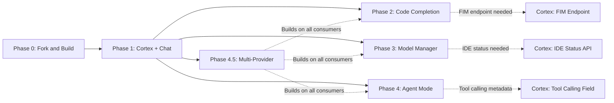
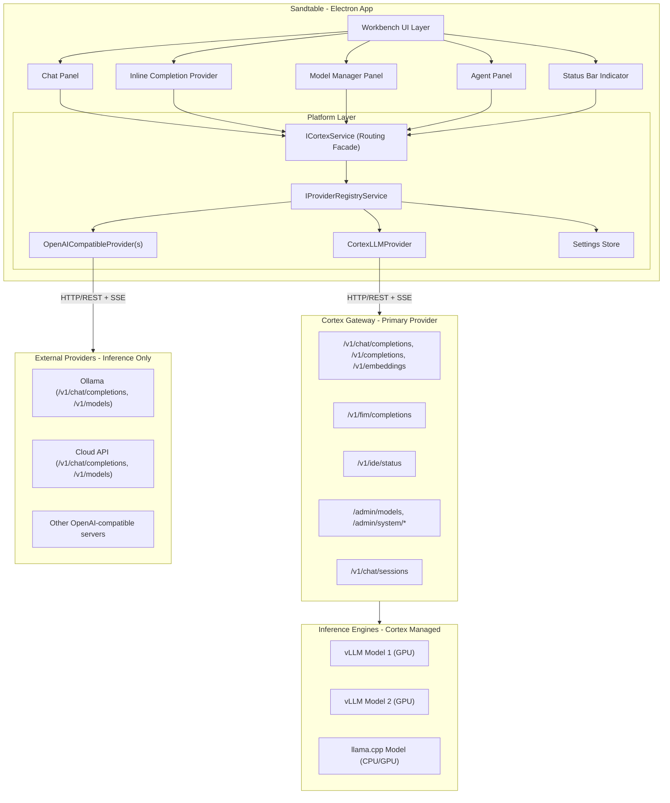

# Phase 4.5: Proposed Documentation Updates

This document contains the specific changes needed for existing project documentation to incorporate Phase 4.5 (Multi-Provider LLM Connection System). These updates should be applied when Phase 4.5 implementation begins or completes.

---

## 1. Proposed Changes to PROJECT-CHARTER.md

### Change 1: Update Constraint #3

**Location:** Section "Constraints", item 3

**Current text:**
```
3. **Cortex is the only LLM backend.** The IDE does not support direct connections to Ollama, raw llama.cpp, or cloud providers. Everything goes through Cortex's gateway.
```

**Proposed replacement:**
```
3. **Cortex is the primary LLM backend.** Cortex remains the recommended and most capable backend, providing full admin capabilities (model lifecycle, GPU monitoring, system metrics, FIM completion, chat session persistence). Starting with Phase 4.5, Sandtable also supports connections to additional OpenAI-compatible endpoints (Ollama, vLLM, LM Studio, cloud APIs) as secondary inference-only providers. All Cortex-specific features (model management, GPU dashboard, container logs) require a Cortex backend.
```

### Change 2: Update Non-Goals

**Location:** Section "Non-Goals"

**Current text:**
```
- **Cloud LLM support:** We are not building integration with OpenAI, Anthropic, or other cloud providers. All inference is local via Cortex.
```

**Proposed replacement:**
```
- **Cloud LLM as primary:** Sandtable is designed for self-hosted, offline-capable operation with Cortex as the primary backend. While Phase 4.5 enables connections to cloud providers (OpenAI, DeepSeek API, Together AI, etc.) as supplementary inference sources, cloud-dependent features (authentication flows, billing management, provider-specific optimizations) are out of scope. The cloud provider support uses the standard OpenAI-compatible API -- no provider-specific SDKs or integrations.
```

### Change 3: Update Goals Section

**Location:** Section "Goals", item 3

**Current text:**
```
3. **Cortex as the backend:** All LLM inference routes through Cortex's OpenAI-compatible gateway, which manages vLLM and llama.cpp engine containers. This gives us dual-engine support (GPU-optimized vLLM for standard models, llama.cpp for GGUF/exotic architectures like GPT-OSS Harmony).
```

**Proposed replacement:**
```
3. **Cortex as the primary backend:** Cortex is the recommended and richest backend, providing model lifecycle management, GPU monitoring, dual-engine support (vLLM + llama.cpp), FIM completion, and admin APIs. Starting with Phase 4.5, Sandtable supports multi-provider connections -- administrators can configure additional OpenAI-compatible endpoints (Ollama, LM Studio, cloud APIs) alongside Cortex for expanded model access and redundancy, while Cortex retains exclusive admin capabilities.
```

### Change 4: Update High-Level Timeline

**Location:** Section "High-Level Timeline"

**Insert after Phase 4 row:**

```
| 4.5 | Multi-Provider LLM System | Days 64-84 | Week 12-14 |
```

### Change 5: Update Risks Table

**Location:** Section "Risks and Mitigations"

**Add new row:**

```
| Multi-provider routing complexity | Medium | Low | Facade pattern preserves ICortexService interface; compound model IDs are backward-compatible with bare names |
```

---

## 2. Proposed Changes to MILESTONES.md

### Change 1: Update Phase Overview Table

**Location:** Section "Phase Overview"

**Insert new row after Phase 4:**

```
| 4.5 | Multi-Provider LLM System | 14-21 days | 64-84 | Multi-provider routing, unified model list, provider management UI | None (Cortex already exposes OpenAI-compatible API) | Low |
```

### Change 2: Update Dependency Chain

**Location:** Section "Dependency Chain"

**Replace the current mermaid diagram with:**



**Update the note below the diagram:**

```
Note: Phase 4.5 depends on Phase 1 (the platform service layer) and benefits from having 
Phases 2-4 complete (so all consumers can be updated together), but does not require the 
Cortex-side changes from Phases 2-4. It is recommended to implement Phase 4.5 after the 
IDE-side work of Phases 2-4 is complete to minimize rework.
```

### Change 3: Insert Phase 4.5 Detailed Milestones

**Location:** After the Phase 4 section, before "Post-MVP Roadmap"

**Insert:**

```markdown
---

### Phase 4.5: Multi-Provider LLM Connection System

**Duration:** 14-21 days
**Dependencies:** Phase 1 complete (needs `ICortexService`), Phases 2-4 IDE-side complete (recommended)
**Cortex changes:** None

| Milestone | Definition of Done |
|-----------|-------------------|
| `ILLMProvider` interface defined | Base provider interface with health, model listing, and inference methods |
| `OpenAICompatibleProvider` working | Can connect to Ollama and list its models |
| `CortexLLMProvider` working | Wraps existing CortexClient, implements both base and admin interfaces |
| `IProviderRegistryService` working | Manages multiple providers, aggregates models, independent health checking |
| `CortexService` routes correctly | Inference requests dispatched to correct provider based on model identity |
| Model selectors show grouped models | Chat, completion, and agent model selectors show provider-grouped dropdowns |
| Status bar shows aggregate info | "N providers, M models" with per-provider health awareness |
| Settings page has Providers section | Add/edit/remove providers with test-connection and model discovery |
| Model Manager shows external models | Read-only section for external provider models alongside Cortex admin controls |
| Backward compatibility verified | Single Cortex provider works identically to pre-4.5 behavior |
| Legacy settings migration works | `sandtable.cortex.*` settings auto-create default Cortex provider |
| `npm run compile` passes | Zero TypeScript compilation errors |

**Risk assessment:** LOW -- The facade pattern ensures all existing consumers work unchanged. The OpenAI chat completions API is a well-established standard, and most target servers (Ollama, vLLM, LM Studio) implement it reliably. No Cortex-side changes are required.
```

### Change 4: Update Post-MVP Phase Numbers

No renumbering needed -- Phases 5-9 remain unchanged. Phase 4.5 slots between 4 and 5 without affecting the numbering.

---

## 3. Proposed Changes to ARCHITECTURE.md

### Change 1: Update System Architecture Overview

**Location:** Section "System Architecture Overview", the mermaid diagram

**Replace the entire mermaid diagram with:**



**Update the paragraph above the diagram:**

```
Sandtable is a desktop application built on Electron (via the VS Code fork) that communicates 
with one or more LLM providers over HTTP/REST. The primary provider is Cortex, which manages 
inference engines (vLLM and llama.cpp containers) and provides an OpenAI-compatible API plus 
admin capabilities. Additional OpenAI-compatible providers (Ollama, vLLM direct, cloud APIs) 
can be configured as secondary inference-only endpoints. The `IProviderRegistryService` manages 
all providers, while `ICortexService` serves as a backward-compatible routing facade.
```

### Change 2: Add Multi-Provider Section

**Location:** After "New Platform Service: ICortexService" section

**Insert new section:**

```markdown
## Multi-Provider Architecture (Phase 4.5)

### Provider Layer

Below `ICortexService`, a provider abstraction layer handles the details of communicating with different LLM backends:

- **`ILLMProvider`** -- Base interface for all providers. Covers health checking, model listing, and chat inference. Every provider (Cortex and external) implements this.
- **`ICortexLLMProvider`** -- Extended interface for Cortex-specific capabilities: admin APIs, GPU monitoring, model lifecycle, FIM completion, chat sessions.
- **`IProviderRegistryService`** -- Manages the provider collection, reads configuration, handles per-provider health polling, and provides unified model listing.

### Provider Types

| Type | Interface | Capabilities | Examples |
|------|-----------|-------------|----------|
| `cortex` | `ICortexLLMProvider` | Inference + Admin + Monitoring + FIM + Sessions | Cortex gateway |
| `openai-compatible` | `ILLMProvider` | Inference only (chat completions + model listing) | Ollama, vLLM, LM Studio, DeepSeek API, Together AI |

### Model Identity

Models are identified by compound names: `"providerId::modelName"`. The `::` separator distinguishes the provider prefix from the model name. Bare model names (without `::`) are resolved against the default provider for backward compatibility.

### Routing

`ICortexService` acts as a routing facade:
1. Receives an inference request with a model name
2. Parses the model name to extract provider ID (or uses default)
3. Looks up the provider via `IProviderRegistryService`
4. Delegates the inference call to the correct provider
5. Returns the result to the consumer

Admin and monitoring methods are always delegated to the Cortex provider specifically.
```

### Change 3: Update Settings Schema

**Location:** Section "Settings Schema"

**Add to the existing settings list:**

```
// Providers (Phase 4.5)
'sandtable.providers'                // type: array,   default: [] (auto-created from legacy settings)
'sandtable.defaultProvider'          // type: string,  default: '' (first enabled provider)
```

### Change 4: Update File Structure

**Location:** Section "New File Structure Map"

**Add new section after Phase 4 Files:**

```markdown
### Phase 4.5 Files

\```
src/vs/platform/cortex/
  common/
    cortexProviderTypes.ts             # Provider config types, IUnifiedModel, IModelCapabilities
    llmProvider.ts                     # ILLMProvider base interface
    cortexLLMProvider.ts               # ICortexLLMProvider extended interface (Cortex-specific)
    providerRegistry.ts                # IProviderRegistryService interface + DI decorator
    openAICompatibleClient.ts          # HTTP client for OpenAI-compatible endpoints
    modelResolver.ts                   # Compound model ID parsing and resolution

  browser/
    providerRegistryService.ts         # ProviderRegistryService implementation
    cortexLLMProviderImpl.ts           # CortexLLMProvider wrapping existing CortexClient
    openAICompatibleProviderImpl.ts    # OpenAICompatibleProvider implementation

src/vs/workbench/contrib/sandtableSettings/
  browser/
    sandtableProviderEditor.ts         # Provider add/edit dialog
\```
```

### Change 5: Update Registration Entry Points

**Location:** Section "Registration Entry Points"

**Update the code block:**

```typescript
// Sandtable -- Platform services + contributions
import '../platform/cortex/browser/cortexService.js';
import '../platform/cortex/browser/providerRegistryService.js';   // NEW Phase 4.5
import './contrib/sandtableChat/browser/sandtableChat.contribution.js';
import './contrib/sandtableStatus/browser/sandtableStatus.contribution.js';
import './contrib/sandtableSettings/browser/sandtableSettings.contribution.js';
import './contrib/sandtableCompletion/browser/sandtableCompletion.contribution.js';
import './contrib/sandtableModels/browser/sandtableModels.contribution.js';
import './contrib/sandtableAgent/browser/sandtableAgent.contribution.js';
import './contrib/sandtableAppearance/browser/sandtableAppearance.contribution.js';
```

---

## 4. Proposed Changes to PROGRESS.md

### Change 1: Insert Phase 4.5 Section

**Location:** After the Phase 4 section, before "Cortex Enhancements"

**Insert:**

```markdown
---

## Phase 4.5: Multi-Provider LLM Connection System

**Status:** Not Started
**Target:** Days 64-84
**Docs:** [PHASE-4.5-MULTI-PROVIDER.md](phases/PHASE-4.5-MULTI-PROVIDER.md)

### Sub-Phase 4.5.1: Provider Abstraction Layer
- [ ] Create `src/vs/platform/cortex/common/cortexProviderTypes.ts` -- provider config types, IUnifiedModel
- [ ] Create `src/vs/platform/cortex/common/llmProvider.ts` -- ILLMProvider base interface
- [ ] Create `src/vs/platform/cortex/common/cortexLLMProvider.ts` -- ICortexLLMProvider extended interface
- [ ] Create `src/vs/platform/cortex/common/openAICompatibleClient.ts` -- HTTP client for OpenAI-compatible endpoints
- [ ] Create `src/vs/platform/cortex/common/modelResolver.ts` -- compound model ID parsing
- [ ] Create `src/vs/platform/cortex/browser/cortexLLMProviderImpl.ts` -- wraps existing CortexClient
- [ ] Create `src/vs/platform/cortex/browser/openAICompatibleProviderImpl.ts` -- OpenAI-compatible provider
- [ ] `npm run compile` passes with 0 errors

### Sub-Phase 4.5.2: Provider Registry Service
- [ ] Create `src/vs/platform/cortex/common/providerRegistry.ts` -- IProviderRegistryService interface
- [ ] Create `src/vs/platform/cortex/browser/providerRegistryService.ts` -- full implementation
- [ ] Add `sandtable.providers` array setting to `cortexConfiguration.ts`
- [ ] Add `sandtable.defaultProvider` setting to `cortexConfiguration.ts`
- [ ] Implement legacy settings migration (sandtable.cortex.* → providers array)
- [ ] Register singleton in DI system
- [ ] `npm run compile` passes with 0 errors

### Sub-Phase 4.5.3: Evolve ICortexService
- [ ] Add provider-aware methods to `ICortexService` interface in `cortex.ts`
- [ ] Inject `IProviderRegistryService` into `CortexService`
- [ ] Implement model routing in `chatCompletion()` and `chatCompletionStream()`
- [ ] Implement model routing in `fimCompletion()` and `fimCompletionStream()`
- [ ] Implement model routing in `textCompletion()` and `textCompletionStream()`
- [ ] Update `listRunningModels()` to aggregate from all providers
- [ ] Delegate admin methods to Cortex provider via registry
- [ ] Update health check to use aggregate provider health
- [ ] `npm run compile` passes with 0 errors

### Sub-Phase 4.5.4: Update Consumers
- [ ] Update `sandtableChatModelSelector.ts` -- group models by provider in dropdown
- [ ] Update `sandtableChatViewPane.ts` -- handle compound model IDs
- [ ] Update `sandtableInlineCompletionProvider.ts` -- route FIM across providers
- [ ] Update `sandtableAgentLoop.ts` -- scan all providers for tool-calling models
- [ ] Update `sandtableStatusBarItem.ts` -- aggregate provider/model count
- [ ] Update `sandtableStatus.contribution.ts` -- provider-grouped quick pick
- [ ] Update `sandtableModelsPanel.ts` -- add external models read-only section
- [ ] `npm run compile` passes with 0 errors

### Sub-Phase 4.5.5: Settings Page Providers Section
- [ ] Add "Providers" to settings page navigation
- [ ] Implement provider list with status cards
- [ ] Create `sandtableProviderEditor.ts` -- add/edit provider dialog
- [ ] Implement "Test Connection" with model discovery preview
- [ ] Provider enable/disable toggle
- [ ] Provider remove with confirmation
- [ ] Styling for provider cards and dialog
- [ ] `npm run compile` passes with 0 errors

### Sub-Phase 4.5.6: Migration and Testing
- [ ] Verify single Cortex provider backward compatibility
- [ ] Verify legacy settings auto-migration
- [ ] Test with Ollama as second provider
- [ ] Test chat with models from different providers
- [ ] Test completion routes FIM to correct provider
- [ ] Test agent selects tool-calling model across providers
- [ ] Test provider health independence
- [ ] Test status bar aggregate display
- [ ] Test model manager with Cortex + external models
- [ ] Register imports in `workbench.common.main.ts`
- [ ] Final `npm run compile` with 0 errors
```

### Change 2: Update Project Documentation Section

**Location:** Section "Project Documentation"

**Add new entry:**

```
- [x] `docs/project/phases/PHASE-4.5-MULTI-PROVIDER.md` -- Phase 4.5 plan
```

---

## 5. Proposed Changes to README.md (docs/project/README.md)

### Change 1: Update Phase Plans Table

**Location:** Section "Phase Plans"

**Insert new row after Phase 4:**

```
| Phase 4.5 | [PHASE-4.5-MULTI-PROVIDER.md](phases/PHASE-4.5-MULTI-PROVIDER.md) | Multi-provider routing, unified model list, OpenAI-compatible endpoints |
```

---

## Summary of All Changes

| Document | Number of Changes | Nature |
|----------|------------------|--------|
| `PROJECT-CHARTER.md` | 5 | Update constraint, non-goals, goals, timeline, risks |
| `MILESTONES.md` | 4 | Add phase row, update diagram, add milestones section |
| `ARCHITECTURE.md` | 5 | Update system diagram, add multi-provider section, update settings/files/registration |
| `PROGRESS.md` | 2 | Add Phase 4.5 checklist section, update doc index |
| `README.md` (docs/project) | 1 | Add phase plan link |

All changes are additive or modify existing text in-place. No structural reorganization is required for any document.
